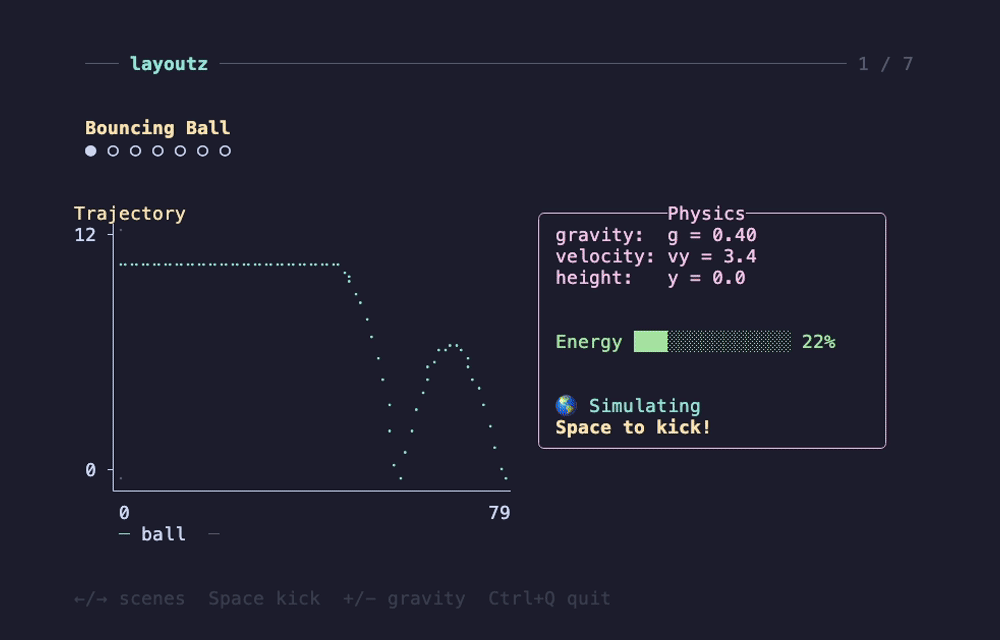
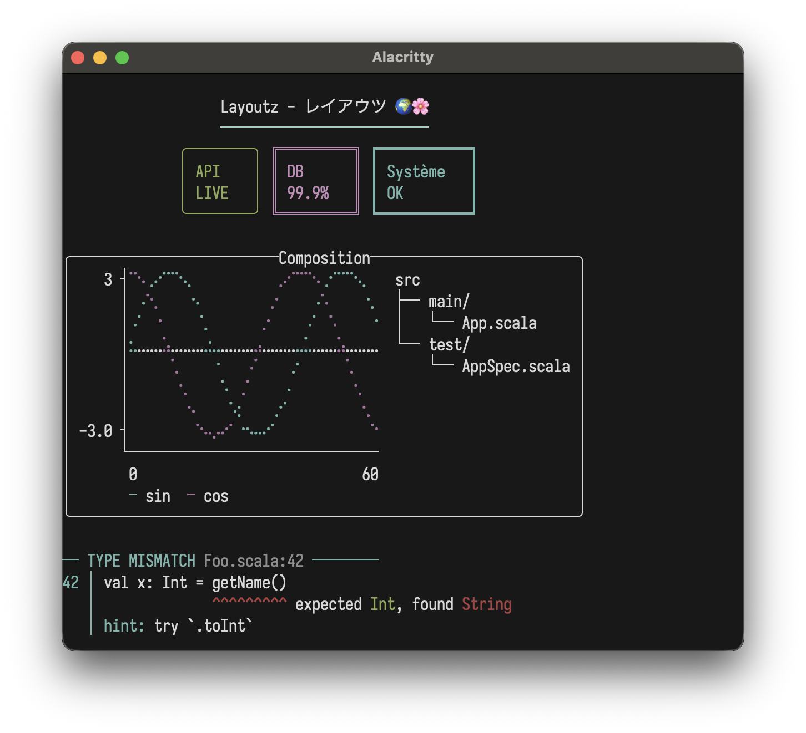
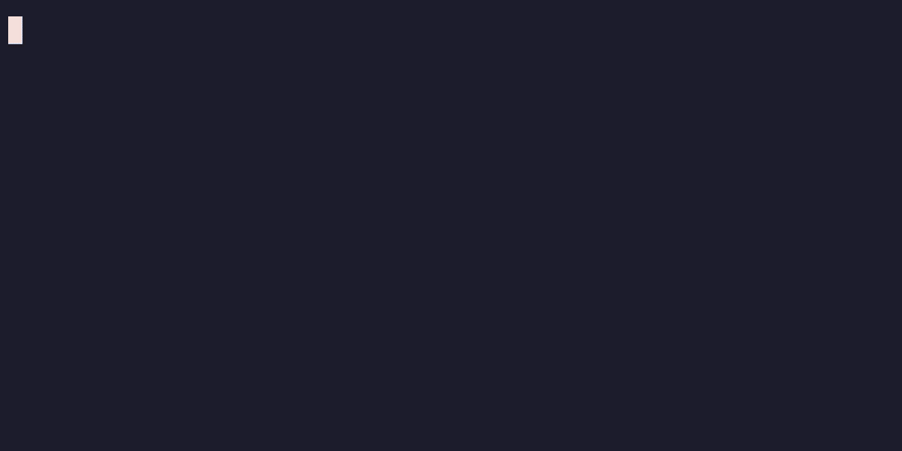

<p align="center">
  
</p>

#  layoutz
**Simple, beautiful CLI output 🪶**

A lightweight, zero-dep lib to build compositional ANSI strings, terminal plots, and interactive Elm-style TUI's in pure Scala. Easily create new primitives (no component-library limitations).

## Features
- Pure Scala, zero-dependencies
- Elm-style TUIs
- Layout primitives, tables, trees, lists, CJK-aware
- Colors, ANSI styles, rich formatting
- Terminal charts and plots
- Widgets: text input, spinners, progress bars
- Built-in commands (file I/O, HTTP requests, clipboard handling)

<p align="center">

<br>
<sub><a href="examples/ShowcaseApp.scala">ShowcaseApp.scala</a></sub>
</p>

## Table of Contents
- [Installation](#installation)
- [Quick Start](#quick-start)
- [Core Concepts](#core-concepts)
- [Elements](#elements)
- [Colors & Styles](#colors)
- [Border Styles](#border-styles)
- [Charts & Plots](#charts--plots)
- [Interactive Apps](#interactive-apps)
- [Examples](#examples)

## Installation
On MavenCentral, cross-built for Scala 2.12, 2.13, 3.x (JVM, JS and Native):
```scala
"xyz.matthieucourt" %% "layoutz" % "0.6.0"
```
```bash
scala-cli repl --scala 3 --dep xyz.matthieucourt:layoutz_3:0.6.0
```
```scala
import layoutz._
```

## Quick Start

There are two usage paths with this little package:

**(1/2) Static rendering**

Beautiful + compositional strings

<details>
<summary>show code</summary>

```scala
import layoutz._

/* Model your domain as usual */
case class TypeError(
    file: String,
    line: Int,
    prefix: String,
    bad: String,
    expected: String,
    found: String,
    hint: String
)

/* Bridge to layoutz with tiny pure functions using layoutz `Element`s */
def typeError(e: TypeError): Element = {
  val ln = e.line.toString
  val bar = "│".color(Color.Cyan)
  layout(
    rowTight(
      "── TYPE MISMATCH ".color(Color.Cyan),
      s"${e.file}:${e.line}".style(Style.Dim),
      " ────────".color(Color.Cyan)
    ),
    rowTight(ln.color(Color.Cyan), space, bar, space, e.prefix, e.bad),
    rowTight(
      space(ln.length + 1),
      bar,
      space,
      space(e.prefix.length),
      ("^" * e.bad.length + " ").color(Color.Red),
      "expected ",
      e.expected.color(Color.Green),
      ", found ",
      e.found.color(Color.Red)
    ),
    rowTight(
      space(ln.length + 1),
      bar,
      space,
      "hint: ".color(Color.Cyan),
      e.hint
    )
  )
}

/* Compose and nest at will */
val demo = layout(
  underline("─", Color.BrightCyan)("Layoutz - レイアウツ 🌍🌸").center(),
  row(
    statusCard("API", "LIVE").border(Border.Round).color(Color.Green),
    statusCard("DB", "99.9%").border(Border.Double).color(Color.BrightMagenta),
    statusCard("Système", "OK").border(Border.Thick).color(Color.Cyan)
  ).center(),
  "",
  box("Composition")(
    columns(
      plot(width = 30, height = 8)(
        Series((0 to 60).map(i => (i.toDouble, math.sin(i * 0.15) * 3)), "sin").color(Color.Cyan),
        Series((0 to 60).map(i => (i.toDouble, math.cos(i * 0.15) * 3)), "cos").color(Color.Magenta)
      ),
      tree("src")(
        tree("main")(
          tree("App.scala")
        ),
        tree("test")(
          tree("AppSpec.scala")
        )
      )
    )
  ).border(Border.Round).center(),
  "",
  typeError(
    TypeError(
      "Foo.scala",
      42,
      "val x: Int = ",
      "getName()",
      "Int",
      "String",
      "try `.toInt`"
    )
  )
)

/* Get pretty strings with `render` */
println(demo.render)
```

</details>
<p align="center">
  
</p>

**(2/2) Interactive apps**

Build Elm-style TUIs

```scala
import layoutz._

object CounterApp extends LayoutzApp[Int, String] {
  def init = 0

  def update(msg: String, count: Int) = msg match {
    case "inc" => count + 1
    case "dec" => count - 1
    case _     => count
  }

  def subscriptions(count: Int) =
    Sub.onKeyPress {
      case Key.Char('+') => Some("inc")
      case Key.Char('-') => Some("dec")
      case _             => None
    }

  def view(count: Int) = layout(
    section("Counter")(s"Count: $count"),
    br,
    ul("Press `+` or `-`")
  )
}

CounterApp.run
```
<p align="center">
  
</p>

## Why layoutz?
- We have `s"..."`, and [full-blown](https://github.com/oyvindberg/tui-scala) TUI libraries - but there is a gap in-between.
- With LLM's, boilerplate code that formats & "pretty-prints" is **_cheaper than ever_**...
- Thus, **_more than ever_**, "string formatting code" is spawning, and polluting domain logic
- Ultimately, **layoutz** is just a tiny, declarative DSL to combat this
- On the side, **layoutz** also has an Elm-style runtime to bring these arbitrary "Elements" to life: much like a flipbook.
   - The runtime has some little niceties built-in like common cmd's for file I/O, HTTP-requests, and a key input handler
- But at the end of the day, you can use **layoutz** merely to structure Strings (without any of the TUI stuff)

## Core Concepts

Every piece of content is an `Element`. Elements are immutable and composable.

```scala
layout(elem1, elem2, elem3)   // vertical
row(elem1, elem2)             // horizontal
elem.render                   // -> String
elem.putStrLn                 // render + print
```

Implement `Element` to create custom components that compose with all built-ins.

### Fluent API

Some typesetting elements work as both nouns ("an underline") and verbs ("to underline something").
For these, layoutz offers a fluent syntax with transformations available in infix position via dot-completion.
Both styles produce the same case classes and render identically:

Nested style:
```scala
margin(">>")(underline()("Hello\nWorld!"))
```

Fluent style:
```scala
"Hello\nWorld!".underline.margin(">>")
```

Both render:
```
>> Hello
>> World!
>> ──────
```

Available: `.center()`, `.pad()`, `.wrap()`, `.truncate()`, `.underline()`, `.margin()`, `.color()`, `.bg()`, `.style()`, `.border()`

## Elements

### Text, Layout & Spacing

```scala
"Simple text"                                // Implicit Text conversion
layout("First", "Second", "Third")           // Vertical join
row("Left", "Middle", "Right")               // Horizontal join
columns(layout("A", "B"), layout("C", "D"))  // Side-by-side columns
section("Config")(kv("env" -> "prod"))       // Titled section
br                                           // Line break
hr                                           // Horizontal rule ──────
hr.width(10).char("~")                       // ~~~~~~~~~~
space(10)                                    // Horizontal spacing
empty                                        // No-op (conditional rendering)
vr(3)                                        // Vertical rule │
```

### Key-Value Pairs, Tables

```scala
kv("name" -> "Alice", "role" -> "admin")

table(
  headers = Seq("Name", "Age", "City"),
  rows = Seq(
    Seq("Alice", "30", "New York"),
    Seq("Bob", "25"),
    Seq("Charlie", "35", "London", "Extra")
  )
)
```
```
name : Alice
role : admin

┌─────────┬─────┬─────────┐
│ Name    │ Age │ City    │
├─────────┼─────┼─────────┤
│ Alice   │ 30  │ New York│
│ Bob     │ 25  │         │
│ Charlie │ 35  │ London  │
└─────────┴─────┴─────────┘
```

### Lists

```scala
ol("Setup", ol("Install deps", ol("npm", "pip"), "Configure"), "Deploy")

ul("Backend", ul("API", ul("REST", "GraphQL"), "DB"), "Frontend")

ul("→")("Custom", "Bullets")
```
```
1. Setup
  a. Install deps
    i. npm
    ii. pip
  b. Configure
2. Deploy

• Backend
  ◦ API
    ▪ REST
    ▪ GraphQL
  ◦ DB
• Frontend

→ Custom
→ Bullets
```

### Trees

```scala
tree("Project")(
  tree("src")(
    tree("main")(tree("App.scala")),
    tree("test")(tree("AppSpec.scala"))
  )
)
```
```
Project
└── src/
    ├── main/
    │   └── App.scala
    └── test/
        └── AppSpec.scala
```

### Boxes, Cards & Banners

```scala
box("Summary")(kv("total" -> "42"))
box()(kv("total" -> "42"))
statusCard("CPU", "45%")
banner("System Dashboard").border(Border.Double)
```
```
┌──Summary───┐
│ total : 42 │
└────────────┘

┌────────────┐
│ total : 42 │
└────────────┘

┌───────┐
│ CPU   │
│ 45%   │
└───────┘

╔═══════════════════╗
║ System Dashboard  ║
╚═══════════════════╝
```

### Progress, Spinners & Form Widgets

```scala
inlineBar("Download", 0.75)
spinner("Loading...", frame = 3)
spinner("Work", frame = 0, SpinnerStyle.Line)

textInput("Username", "alice", "Enter name", active = true)
SingleChoice("Mood?", Seq("great", "okay", "meh"), selected = 0, active = true)
MultiChoice("Colors?", Seq("Red", "Blue"), selected = Set(0), cursor = 1, active = true)
```
```
Download [███████████████─────] 75%
⠸ Loading...
|| Work

> Username: alice_
> Mood?
  ► ● great
    ○ okay
    ○ meh
```
Spinner styles: `Dots` (default), `Line`, `Clock`, `Bounce`

### Underline, Margin, Padding & Truncation

```scala
"Title".underline()
"Custom".underline("=")

layout(
  "Ooops!",
  row("val result: Int = ", underline("^")("getString()")),
  "Expected Int, found String"
).margin("[error]")

"content".pad(2)

"Very long text that will be cut off".truncate(15)
"Custom ellipsis example text here".truncate(20, "…")
```
```
Title
─────
Custom
══════

[error] Ooops!
[error] val result: Int =  getString()
[error]                    ^^^^^^^^^^^
[error] Expected Int, found String

This is a ve...
Custom ellipsis ex…
```

### Text Formatting

```scala
"TITLE".center(20)
"Left".leftAlign(20)
"Right".rightAlign(20)
"Long text here that should wrap".wrap(20)
"Spread this out".justify(30)
```

### Custom Elements

Implement `Element` to create reusable components:
```scala
case class Square(size: Int) extends Element {
  def render: String = {
    if (size < 2) return ""
    val width = size * 2 - 2
    val top = "┌" + ("─" * width) + "┐"
    val middle = (1 to size - 2).map(_ => "│" + (" " * width) + "│")
    val bottom = "└" + ("─" * width) + "┘"
    (top +: middle :+ bottom).mkString("\n")
  }
}

row(Square(2), Square(4), Square(6))
```
```
┌──┐ ┌──────┐ ┌──────────┐
└──┘ │      │ │          │
     │      │ │          │
     └──────┘ │          │
              │          │
              └──────────┘
```

### Working with Collections
```scala
case class User(name: String, role: String)
val users = Seq(User("Alice", "Admin"), User("Bob", "User"), User("Tom", "User"))

section("Users by Role")(
  layout(
    users.groupBy(_.role).map { case (role, roleUsers) =>
      box(role)(ul(roleUsers.map(_.name): _*))
    }.toSeq: _*
  )
)
```

## Colors

Foreground with `.color`, background with `.bg`:

```scala
Color.Red("Error!")
"text".color(Color.BrightCyan)
"Error!".bg(Color.Red)
Color.Red.bg("Error!")
"ALERT".bg(Color.Red).color(Color.White).style(Style.Bold)
box()("warning").bg(Color.Yellow)
```

<p align="center">
  
</p>

```scala
Color.Black
Color.Red
Color.Green
Color.Yellow
Color.Blue
Color.Magenta
Color.Cyan
Color.White
Color.BrightBlack             // Bright 8
Color.BrightRed
Color.BrightGreen
Color.BrightYellow
Color.BrightBlue
Color.BrightMagenta
Color.BrightCyan
Color.BrightWhite
Color.Full(196)               // 256-color palette (0-255)
Color.True(255, 128, 0)       // 24-bit RGB
Color.NoColor                 // Conditional no-op
```

```scala
import layoutz._

/* 256-color palette gradient */
val palette = tightRow((16 to 231 by 7).map(i => "█".color(Color.Full(i))): _*)

/* RGB gradients */
val redToBlue = tightRow((0 to 255 by 8).map(i => "█".color(Color.True(i, 100, 255 - i))): _*)
val greenFade = tightRow((0 to 255 by 8).map(i => "█".color(Color.True(0, 255 - i, i))): _*)
val rainbow = tightRow((0 to 255 by 8).map { i =>
  val r = if (i < 128) i * 2 else 255
  val g = if (i < 128) 255 else (255 - i) * 2
  val b = if (i > 128) (i - 128) * 2 else 0
  "█".color(Color.True(r, g, b))
}: _*)

layout(palette, redToBlue, greenFade, rainbow)
```

<p align="center">
  
</p>

### Styles
```scala
"text".style(Style.Bold)
"text".color(Color.Red).style(Style.Bold)
"text".style(Style.Bold ++ Style.Italic ++ Style.Underline)
```

<p align="center">
  
</p>

```scala
Style.Bold
Style.Dim
Style.Italic
Style.Underline
Style.Blink
Style.Reverse
Style.Hidden
Style.Strikethrough
Style.NoStyle                 // conditional no-op
Style.Bold ++ Style.Italic    // combine with ++
```

<p align="center">
  
</p>

## Border Styles
```scala
Border.Single                              // ┌─┐ (default)
Border.Double                              // ╔═╗
Border.Thick                               // ┏━┓
Border.Round                               // ╭─╮
Border.Ascii                               // +-+
Border.Block                               // ███
Border.Dashed                              // ┌╌┐
Border.Dotted                              // ┌┈┐
Border.InnerHalfBlock                      // ▗▄▖
Border.OuterHalfBlock                      // ▛▀▜
Border.Markdown                            // |-|
Border.Custom(corner = "+", horizontal = "=", vertical = "|")
Border.None                                // no borders

// Applied via .border()
box("Title")("content").border(Border.Round)
table(h, r).border(Border.Thick)

// HasBorder typeclass for generic code
def makeThick[T: HasBorder](element: T): T = element.border(Border.Thick)
```

## Charts & Plots

#### Line Plot
```scala
val sinePoints = (0 to 100).map(i => (i.toDouble, math.sin(i * 0.1) * 10))
plot(width = 40, height = 10)(
  Series(sinePoints, "sine").color(Color.Cyan)
)
```
<p align="center">
  
</p>

Multiple series:
```scala
val sin = (0 to 50).map(i => (i.toDouble, math.sin(i * 0.15) * 5))
val cos = (0 to 50).map(i => (i.toDouble, math.cos(i * 0.15) * 5))

plot(width = 50, height = 12)(
  Series(sin, "sin(x)").color(Color.BrightCyan),
  Series(cos, "cos(x)").color(Color.BrightMagenta)
)
```

<p align="center">
  
</p>

Options: `width`, `height`, `showAxes`, `showOrigin`

#### Horizontal Chart
```scala
chart("Web" -> 10, "Mobile" -> 20, "API" -> 15)
```

#### Pie Chart
```scala
pie()(Slice(50, "A"), Slice(30, "B"), Slice(20, "C"))
```
<p align="center">
  
</p>

#### Bar Chart
```scala
bar(width = 40, height = 10)(
  Bar(85, "Mon"), Bar(120, "Tue"), Bar(95, "Wed")
)
```
<p align="center">
  
</p>

Custom colors:
```scala
bar()(
  Bar(100, "Sales").color(Color.Magenta),
  Bar(80, "Costs").color(Color.BrightRed),
  Bar(20, "Profit").color(Color.Cyan)
)
```
<p align="center">
  
</p>

#### Stacked Bar Chart
```scala
stackedBar(width = 40, height = 10)(
  StackedBar(Seq(Bar(30, "Q1"), Bar(20, "Q2"), Bar(25, "Q3")), "2022"),
  StackedBar(Seq(Bar(35, "Q1"), Bar(25, "Q2"), Bar(30, "Q3")), "2023"),
  StackedBar(Seq(Bar(40, "Q1"), Bar(30, "Q2"), Bar(35, "Q3")), "2024")
)
```
<p align="center">
  
</p>

#### Sparkline
```scala
sparkline(Seq(1, 4, 2, 8, 5, 7, 3, 6))
sparkline(Seq(10, 20, 15, 30, 25, 40, 35)).color(Color.Cyan)
```
<p align="center">
  
</p>

#### Box Plot
```scala
boxPlot(height = 12)(
  BoxData("A", min = 10, q1 = 25, median = 50, q3 = 75, max = 90).color(Color.Cyan),
  BoxData("B", min = 20, q1 = 40, median = 55, q3 = 70, max = 85).color(Color.Magenta),
  BoxData("C", min = 5, q1 = 30, median = 45, q3 = 60, max = 95).color(Color.Yellow)
)
```
<p align="center">
  
</p>

#### Heatmap
```scala
heatmap(Seq(
  Seq(1.0, 2.0, 3.0),
  Seq(4.0, 5.0, 6.0),
  Seq(7.0, 8.0, 9.0)
))

/* With labels and settings */
Heatmap(
  HeatmapData(
    rows = Seq(
      Seq(12.0, 15.0, 22.0, 28.0, 30.0, 25.0, 18.0),
      Seq(14.0, 18.0, 25.0, 32.0, 35.0, 28.0, 20.0),
      Seq(10.0, 13.0, 20.0, 26.0, 28.0, 22.0, 15.0)
    ),
    rowLabels = Seq("Mon", "Tue", "Wed"),
    colLabels = Seq("6am", "9am", "12pm", "3pm", "6pm", "9pm", "12am")
  ),
  cellWidth = 5
)
```
<p align="center">
  
</p>

Options: `cellWidth`, `cellHeight`, `showLegend`, row/column labels via `HeatmapData`.

## Interactive Apps

`LayoutzApp` uses the [Elm Architecture](https://guide.elm-lang.org/architecture/) where your
view is simply a `layoutz.Element`

```scala
trait LayoutzApp[State, Message] {
  def init: (State, Cmd[Message])
  def update(msg: Message, state: State): (State, Cmd[Message])
  def subscriptions(state: State): Sub[Message]
  def view(state: State): Element
}
```

Three daemon threads coordinate rendering (~50ms), tick/timers, and input capture. State updates flow through `update` synchronously. Rendering uses incremental line-diffing: only changed lines are redrawn, eliminating flicker.

```scala
app.run(
  tickIntervalMs   = 100,              // Subscription polling rate
  renderIntervalMs = 50,               // Screen refresh rate
  clearOnStart     = true,             // Clear screen on launch
  clearOnExit      = true,             // Clear screen on quit
  showQuitMessage  = false,            // Display quit hint
  quitMessage      = "Ctrl+Q to quit", // Custom quit text
  quitKey          = Key.Ctrl('Q'),    // Quit on this key
  alignment        = Alignment.Left    // Left | Center | Right
)
```

Apps can also run inline without clearing the screen, animating in place within existing output:

<p align="center">

<br>
<sub><a href="examples/InlineDemo.scala">InlineDemo.scala</a></sub>
</p>

Implicit conversion: return just state instead of `(state, Cmd.none)`:
```scala
def update(msg: Msg, state: State) = msg match {
  case Increment => state.copy(count = state.count + 1)
  case LoadData  => (state.copy(loading = true), Cmd.file.read("data.txt", DataLoaded))
}
```

### Key Types
```scala
// Printable
Key.Char(c: Char)

// Editing
Key.Enter
Key.Backspace
Key.Tab
Key.Escape
Key.Delete

// Navigation
Key.Up
Key.Down
Key.Left
Key.Right
Key.Home
Key.End
Key.PageUp
Key.PageDown

// Modifiers
Key.Ctrl(c: Char)                                // Ctrl+A, Ctrl+S, etc.
Key.Unknown(code: Int)                           // Unrecognized input
```

### Subscriptions

```scala
Sub.none                                           // No subscriptions
Sub.onKeyPress { case Key.Char('q') => Some(Quit)  // Keyboard input
                 case _ => None }
Sub.time.everyMs(intervalMs, msg)                  // Periodic ticks
Sub.file.watch(path, onChange)                     // File changes
Sub.http.pollMs(url, intervalMs, onResponse)       // HTTP polling
Sub.batch(sub1, sub2, ...)                         // Combine multiple
```

```scala
def subscriptions(state: State) = Sub.batch(
  Sub.time.everyMs(100, Tick),
  Sub.file.watch("config.json", ConfigChanged),
  Sub.onKeyPress { case Key.Char('q') => Some(Quit); case _ => None }
)
```

### Commands

```scala
Cmd.none                                         // No-op (default)
Cmd.exit                                         // Exit the application
Cmd.batch(cmd1, cmd2, ...)                       // Execute multiple commands
Cmd.task(expr)(toMsg)                            // Async task, result as Either
Cmd.fire(effect)                                 // Fire and forget
Cmd.afterMs(delayMs, msg)                        // One-shot delayed message
Cmd.showCursor                                   // Show terminal cursor
Cmd.hideCursor                                   // Hide terminal cursor
Cmd.setTitle(title)                              // Set terminal window title
Cmd.file.read(path, onResult)                    // Read file
Cmd.file.write(path, content, onResult)          // Write file
Cmd.file.ls(path, onResult)                      // List directory
Cmd.file.cwd(onResult)                           // Get working directory
Cmd.http.get(url, onResult, headers)             // HTTP GET
Cmd.http.post(url, body, onResult, headers)      // HTTP POST
Cmd.clipboard.read(onResult)                     // Read clipboard
Cmd.clipboard.write(content, onResult)           // Write clipboard
```

## Examples

Interactive TUI apps using `LayoutzApp` with built-in `Cmd` and `Sub`.

### Showcase TUI

<details>
<summary>Multi-scene feature showcase with navigation</summary>

A navigable TUI that cycles through 7 scenes demonstrating spinners, text input, lists, tables, charts, bar charts, and selections.

See [ShowcaseApp.scala](examples/ShowcaseApp.scala) for the full source.

Navigate with `←`/`→` arrow keys or number keys `1`-`7`. Each scene has its own interactive controls.
</details>

### Self-terminating loading bar

<details>
<summary>Auto-exit when tasks complete using <code>Cmd.exit</code></summary>

```scala
import layoutz._

case class State(progress: Double, done: Boolean)
sealed trait Msg
case object Tick extends Msg

object LoadingApp extends LayoutzApp[State, Msg] {
  def init = (State(0, false), Cmd.none)

  def update(msg: Msg, state: State) = msg match {
    case Tick =>
      if (state.done) (state, Cmd.exit)
      else {
        val next = state.progress + 0.02
        if (next >= 1.0) (State(1.0, true), Cmd.none)
        else (state.copy(progress = next), Cmd.none)
      }
  }

  def subscriptions(state: State) = Sub.time.everyMs(50, Tick)

  def view(state: State) = layout(
    inlineBar("Loading", state.progress),
    f"${state.progress * 100}%.0f%% complete"
  )
}

LoadingApp.run(clearOnExit = false, showQuitMessage = false)
println("Done!")
```

See [LoadingApp.scala](examples/LoadingApp.scala) for a multi-task version.

</details>

### File viewer

<details>
<summary>Watch and display file contents</summary>

```scala
import layoutz._

case class FileState(content: String, error: Option[String])
sealed trait Msg
case class FileLoaded(result: Either[String, String]) extends Msg

object FileViewer extends LayoutzApp[FileState, Msg] {
  val filename = "README.md"

  def init = (FileState("Loading...", None), Cmd.file.read(filename, FileLoaded))

  def update(msg: Msg, state: FileState) = msg match {
    case FileLoaded(Right(content)) =>
      (state.copy(content = content.take(500), error = None), Cmd.none)
    case FileLoaded(Left(err)) =>
      (state.copy(error = Some(err)), Cmd.none)
  }

  def subscriptions(state: FileState) =
    Sub.file.watch(filename, FileLoaded)

  def view(state: FileState) = {
    val display = state.error match {
      case Some(err) => Color.BrightRed(s"Error: $err")
      case None => wrap(state.content, 60)
    }

    layout(
      underlineColored("=", Color.BrightMagenta)("File Viewer").style(Style.Bold),
      kv("File" -> filename).color(Color.BrightBlue),
      box("Content")(display).border(Border.Round),
      "Auto-reloads on file change".color(Color.BrightBlack)
    )
  }
}

FileViewer.run
```
</details>

### Stopwatch timer

<details>
<summary>Custom timer using <code>Sub.time.everyMs</code></summary>

```scala
import layoutz._

case class TimerState(seconds: Int, running: Boolean)
sealed trait Msg
case object Tick extends Msg
case object ToggleTimer extends Msg
case object ResetTimer extends Msg

object StopwatchApp extends LayoutzApp[TimerState, Msg] {
  def init = (TimerState(0, false), Cmd.none)

  def update(msg: Msg, state: TimerState) = msg match {
    case Tick =>
      (state.copy(seconds = state.seconds + 1), Cmd.none)
    case ToggleTimer =>
      (state.copy(running = !state.running), Cmd.none)
    case ResetTimer =>
      (TimerState(0, running = false), Cmd.none)
  }

  def subscriptions(state: TimerState) = Sub.batch(
    if (state.running) Sub.time.everyMs(1000, Tick) else Sub.none,
    Sub.onKeyPress {
      case Key.Char(' ') => Some(ToggleTimer)
      case Key.Char('r') => Some(ResetTimer)
      case _ => None
    }
  )

  def view(state: TimerState) = {
    val minutes = state.seconds / 60
    val secs = state.seconds % 60
    val timeDisplay = f"$minutes%02d:$secs%02d"

    val statusColor = if (state.running) Color.BrightGreen else Color.BrightYellow
    val statusText = if (state.running) "RUNNING" else "PAUSED"

    layout(
      underlineColored("=", Color.BrightCyan)("Stopwatch").style(Style.Bold),
      "",
      box("Time")(
        timeDisplay.style(Style.Bold).center(20)
      ).color(statusColor).border(Border.Double),
      "",
      kv(
        "Status" -> statusText,
        "Elapsed" -> s"${state.seconds}s"
      ).color(Color.BrightBlue),
      "",
      ul(
        "space: start/pause",
        "r: reset"
      ).color(Color.BrightBlack)
    )
  }
}

StopwatchApp.run
```
</details>

### Custom side effects

<details>
<summary>Using <code>Cmd.task</code> for async operations</summary>

```scala
import layoutz._

case class TaskState(status: String = "idle", count: Int = 0)

sealed trait Msg
case object RunTask extends Msg
case class TaskDone(result: Either[String, String]) extends Msg

object SideEffectApp extends LayoutzApp[TaskState, Msg] {
  def init = (TaskState(), Cmd.none)

  def update(msg: Msg, state: TaskState) = msg match {
    case RunTask =>
      (state.copy(status = "running..."),
       Cmd.task {
         Thread.sleep(500)
         if (scala.util.Random.nextDouble() < 0.3)
           throw new Exception("Launch failure")
         "completed"
       }(TaskDone))

    case TaskDone(Right(_)) =>
      state.copy(status = "success", count = state.count + 1)

    case TaskDone(Left(err)) =>
      state.copy(status = s"error: $err")
  }

  def subscriptions(state: TaskState) = Sub.onKeyPress {
    case Key.Char('r') => Some(RunTask)
    case _ => None
  }

  def view(state: TaskState) = layout(
    section("Side Effect Demo")(
      kv("Status" -> state.status, "Count" -> state.count.toString)
    ),
    "r: run task".color(Color.BrightBlack)
  )
}

SideEffectApp.run
```

Use `Cmd.fire` for fire-and-forget effects (logging, analytics, etc.):
```scala
Cmd.fire(println("User clicked button"))
```
</details>

### API poller

<details>
<summary>Poll API endpoint and display JSON</summary>

```scala
import layoutz._

case class ApiState(response: String, lastUpdate: String, error: Option[String])
sealed trait Msg
case class ApiResponse(result: Either[String, String]) extends Msg

object ApiPoller extends LayoutzApp[ApiState, Msg] {
  val apiUrl = "https://api.github.com/zen"

  def init = (ApiState("Loading...", "Never", None), Cmd.none)

  def update(msg: Msg, state: ApiState) = msg match {
    case ApiResponse(Right(data)) =>
      val now = java.time.LocalTime.now().toString.take(8)
      (state.copy(response = data, lastUpdate = now, error = None), Cmd.none)
    case ApiResponse(Left(err)) =>
      (state.copy(error = Some(err)), Cmd.none)
  }

  def subscriptions(state: ApiState) =
    Sub.http.pollMs(apiUrl, 3000, ApiResponse)

  def view(state: ApiState) = {
    val display = state.error match {
      case Some(err) => Color.BrightRed(s"Error: $err")
      case None => wrap(state.response, 60).color(Color.BrightGreen)
    }

    layout(
      underlineColored("~", Color.BrightCyan)("API Poller").style(Style.Bold),
      kv("Endpoint" -> apiUrl, "Last Update" -> state.lastUpdate).color(Color.BrightBlue),
      box("Response")(display).border(Border.Round),
      "Polls every 3s".color(Color.BrightBlack)
    )
  }
}

ApiPoller.run
```
</details>

### Multi-endpoint monitor

<details>
<summary>Monitor multiple APIs with <code>Sub.batch</code></summary>

```scala
import layoutz._

case class MonitorState(
  github: String = "...",
  httpbin: String = "...",
  placeholder: String = "..."
)

sealed trait Msg
case class GithubResp(result: Either[String, String]) extends Msg
case class HttpbinResp(result: Either[String, String]) extends Msg
case class PlaceholderResp(result: Either[String, String]) extends Msg

object MultiMonitor extends LayoutzApp[MonitorState, Msg] {
  def init = (MonitorState(), Cmd.none)

  def update(msg: Msg, state: MonitorState) = msg match {
    case GithubResp(Right(data)) => (state.copy(github = data.take(20)), Cmd.none)
    case GithubResp(Left(e)) => (state.copy(github = s"ERROR: $e"), Cmd.none)
    case HttpbinResp(Right(_)) => (state.copy(httpbin = "UP"), Cmd.none)
    case HttpbinResp(Left(e)) => (state.copy(httpbin = s"ERROR: $e"), Cmd.none)
    case PlaceholderResp(Right(_)) => (state.copy(placeholder = "UP"), Cmd.none)
    case PlaceholderResp(Left(e)) => (state.copy(placeholder = s"ERROR: $e"), Cmd.none)
  }

  def subscriptions(state: MonitorState) = Sub.batch(
    Sub.http.pollMs("https://api.github.com/zen", 4000, GithubResp),
    Sub.http.pollMs("https://httpbin.org/get", 5000, HttpbinResp),
    Sub.http.pollMs("https://jsonplaceholder.typicode.com/posts/1", 6000, PlaceholderResp)
  )

  def view(state: MonitorState) = layout(
    underlineColored("~", Color.BrightGreen)("Multi-API Monitor").style(Style.Bold),
    br,
    table(
      Seq("Service", "Status"),
      Seq(
        Seq("GitHub", state.github),
        Seq("HTTPBin", state.httpbin),
        Seq("JSONPlaceholder", state.placeholder)
      )
    ).border(Border.Round),
    br,
    "Auto-polls all endpoints".color(Color.BrightBlack)
  )
}

MultiMonitor.run
```
</details>

### HTTP fetch on demand

<details>
<summary>Fetch data with <code>Cmd.http.get</code></summary>

```scala
import layoutz._

case class FetchState(data: String, loading: Boolean, count: Int)
sealed trait Msg
case object Fetch extends Msg
case class Response(result: Either[String, String]) extends Msg

object HttpFetcher extends LayoutzApp[FetchState, Msg] {
  def init = (FetchState("Press 'f' to fetch", false, 0), Cmd.none)

  def update(msg: Msg, state: FetchState) = msg match {
    case Fetch =>
      (state.copy(loading = true, count = state.count + 1),
       Cmd.http.get("https://api.github.com/zen", Response))
    case Response(Right(data)) =>
      (state.copy(data = data, loading = false), Cmd.none)
    case Response(Left(err)) =>
      (state.copy(data = s"Error: $err", loading = false), Cmd.none)
  }

  def subscriptions(state: FetchState) = Sub.onKeyPress {
    case Key.Char('f') => Some(Fetch)
    case _ => None
  }

  def view(state: FetchState) = {
    val status: Element = if (state.loading) spinner("Fetching", state.count % 10)
                          else Text(s"Fetched ${state.count} times")

    layout(
      underlineColored("=", Color.BrightCyan)("HTTP Fetcher").style(Style.Bold),
      box("Zen Quote")(wrap(state.data, 50)).border(Border.Round).color(Color.BrightGreen),
      status,
      "f: fetch".color(Color.BrightBlack)
    )
  }
}

HttpFetcher.run
```
</details>

### Complex task manager

<p align="center">
  
</p>

<details>
<summary>Navigation, progress tracking, and stateful emojis</summary>

```scala
import layoutz._

case class TaskState(
    tasks: List[String],
    selected: Int,
    isLoading: Boolean,
    completed: Set[Int],
    progress: Double,
    startTime: Long,
    spinnerFrame: Int
)

sealed trait TaskMessage
case object MoveUp extends TaskMessage
case object MoveDown extends TaskMessage
case object StartTask extends TaskMessage
case object UpdateTick extends TaskMessage

object TaskApp extends LayoutzApp[TaskState, TaskMessage] {
  def init = (TaskState(
    tasks = List("Process data", "Generate reports", "Backup files"),
    selected = 0,
    isLoading = false,
    completed = Set.empty,
    progress = 0.0,
    startTime = 0,
    spinnerFrame = 0
  ), Cmd.none)

  def update(msg: TaskMessage, state: TaskState) = msg match {
    case MoveUp if !state.isLoading =>
      val newSelected =
        if (state.selected > 0) state.selected - 1 else state.tasks.length - 1
      (state.copy(selected = newSelected), Cmd.none)

    case MoveDown if !state.isLoading =>
      val newSelected =
        if (state.selected < state.tasks.length - 1) state.selected + 1 else 0
      (state.copy(selected = newSelected), Cmd.none)

    case StartTask if !state.isLoading =>
      (state.copy(
        isLoading = true,
        progress = 0.0,
        startTime = System.currentTimeMillis()
      ), Cmd.none)

    case UpdateTick if state.isLoading =>
      val elapsed = System.currentTimeMillis() - state.startTime
      val newProgress = math.min(1.0, elapsed / 3000.0)

      val newState = if (newProgress >= 1.0) {
        state.copy(
          isLoading = false,
          completed = state.completed + state.selected,
          progress = 1.0
        )
      } else {
        state.copy(progress = newProgress)
      }

      (newState.copy(spinnerFrame = newState.spinnerFrame + 1), Cmd.none)

    case UpdateTick => (state.copy(spinnerFrame = state.spinnerFrame + 1), Cmd.none)
    case _           => (state, Cmd.none)
  }

  def subscriptions(state: TaskState) = Sub.batch(
    Sub.time.everyMs(100, UpdateTick),
    Sub.onKeyPress {
      case Key.Char('w') | Key.Up   => Some(MoveUp)
      case Key.Char('s') | Key.Down => Some(MoveDown)
      case Key.Char(' ') | Key.Enter     => Some(StartTask)
      case _                           => None
    }
  )

  def view(state: TaskState) = {
    val taskList = state.tasks.zipWithIndex.map { case (task, index) =>
      val emoji =
        if (state.completed.contains(index)) "✅"
        else if (state.isLoading && index == state.selected) "⚡"
        else "📋"
      val marker = if (index == state.selected) "►" else " "
      s"$marker $emoji $task"
    }

    val status = if (state.isLoading) {
      layout(
        spinner("Processing", state.spinnerFrame),
        inlineBar("Progress", state.progress),
        f"${state.progress * 100}%.0f%% complete"
      )
    } else {
      layout("Press SPACE to start, W/S to navigate")
    }

    layout(
      section("Tasks")(Layout(taskList.map(Text))),
      section("Status")(status)
    )
  }
}

TaskApp.run
```
</details>

### Form input widgets

<details>
<summary>Interactive forms with choice widgets</summary>

```scala
import layoutz._

case class FormState(
    name: String = "",
    mood: Int = 0,
    letters: Set[Int] = Set.empty,
    cursor: Int = 0,
    field: Int = 0
)

sealed trait Msg
case class TypeChar(c: Char) extends Msg
case object Backspace extends Msg
case object NextField extends Msg
case object MoveUp extends Msg
case object MoveDown extends Msg
case object Toggle extends Msg

object FormApp extends LayoutzApp[FormState, Msg] {
  val moods = Seq("great", "okay", "meh")
  val options = ('A' to 'F').map(_.toString).toSeq

  def init = (FormState(), Cmd.none)

  def update(msg: Msg, state: FormState) = msg match {
    case TypeChar(c) if state.field == 0 =>
      (state.copy(name = state.name + c), Cmd.none)
    case Backspace if state.field == 0 && state.name.nonEmpty =>
      (state.copy(name = state.name.dropRight(1)), Cmd.none)
    case MoveUp if state.field == 1 =>
      (state.copy(mood = (state.mood - 1 + moods.length) % moods.length), Cmd.none)
    case MoveDown if state.field == 1 =>
      (state.copy(mood = (state.mood + 1) % moods.length), Cmd.none)
    case MoveUp if state.field == 2 =>
      (state.copy(cursor = (state.cursor - 1 + options.length) % options.length), Cmd.none)
    case MoveDown if state.field == 2 =>
      (state.copy(cursor = (state.cursor + 1) % options.length), Cmd.none)
    case Toggle if state.field == 2 =>
      val newLetters = if (state.letters.contains(state.cursor))
        state.letters - state.cursor else state.letters + state.cursor
      (state.copy(letters = newLetters), Cmd.none)
    case NextField =>
      (state.copy(field = (state.field + 1) % 3), Cmd.none)
    case _ => (state, Cmd.none)
  }

  def subscriptions(state: FormState) = Sub.onKeyPress {
    case Key.Char(' ') if state.field == 2 => Some(Toggle)
    case Key.Char(c) if c.isLetterOrDigit || c == ' ' => Some(TypeChar(c))
    case Key.Backspace => Some(Backspace)
    case Key.Up => Some(MoveUp)
    case Key.Down => Some(MoveDown)
    case Key.Tab | Key.Enter => Some(NextField)
    case _ => None
  }

  def view(state: FormState) = layout(
    textInput("Name", state.name, "Type here", state.field == 0),
    SingleChoice("How was your day?", moods, state.mood, state.field == 1),
    MultiChoice("Favorite letters?", options, state.letters, state.cursor, state.field == 2)
  )
}
```

See [FormExample.scala](examples/FormExample.scala) for a complete working example.

</details>

### Clipboard read/write

<details>
<summary>Copy/paste with <code>Cmd.clipboard</code></summary>

```scala
import layoutz._

case class ClipState(content: String = "", status: String = "Press 'r' to read clipboard")
sealed trait Msg
case class ClipRead(result: Either[String, String]) extends Msg
case class ClipWritten(result: Either[String, Unit]) extends Msg
case object ReadClip extends Msg
case object WriteClip extends Msg

object ClipboardApp extends LayoutzApp[ClipState, Msg] {
  def init = (ClipState(), Cmd.none)

  def update(msg: Msg, state: ClipState) = msg match {
    case ReadClip =>
      (state.copy(status = "Reading..."), Cmd.clipboard.read(ClipRead))
    case ClipRead(Right(text)) =>
      (state.copy(content = text.take(200), status = "Read OK"), Cmd.none)
    case ClipRead(Left(err)) =>
      (state.copy(status = s"Error: $err"), Cmd.none)
    case WriteClip =>
      (state.copy(status = "Writing..."),
       Cmd.clipboard.write("Hello from layoutz!", ClipWritten))
    case ClipWritten(Right(_)) =>
      (state.copy(status = "Written to clipboard!"), Cmd.none)
    case ClipWritten(Left(err)) =>
      (state.copy(status = s"Error: $err"), Cmd.none)
  }

  def subscriptions(state: ClipState) = Sub.onKeyPress {
    case Key.Char('r') => Some(ReadClip)
    case Key.Char('w') => Some(WriteClip)
    case _ => None
  }

  def view(state: ClipState) = layout(
    section("Clipboard Demo")(
      kv("Status" -> state.status),
      box("Content")(wrap(state.content, 60)).border(Border.Round)
    ),
    ul("r: read clipboard", "w: write to clipboard").color(Color.BrightBlack)
  )
}

ClipboardApp.run
```
</details>

### Wizard game

<p align="center">
  
</p>

<details>
<summary>Collect gems, avoid enemies</summary>

See [SimpleGame.scala](examples/SimpleGame.scala) for the full source.

</details>

## Inspiration
- [ScalaTags](https://github.com/com-lihaoyi/scalatags) by Li Haoyi
- Go's [bubbletea](https://github.com/charmbracelet/bubbletea)
- Countless templating libs via osmosis
