<p align="center">
  
</p>

#  layoutz
**Simple, beautiful CLI output 🪶**

Build declarative and composable sections, trees, tables, dashboards, and interactive Elm-style TUIs.
Easily create new primitives (no component-library limitations).

Part of [d4](https://github.com/mattlianje/d4) • Also in: [JavaScript](https://github.com/mattlianje/layoutz/tree/master/layoutz-ts), [Haskell](https://github.com/mattlianje/layoutz/tree/master/layoutz-hs)

<p align="center">
  <sub>Supported by</sub><br>
  <a href="https://www.bitcomplete.io/" target="_blank" rel="noopener noreferrer">
    
  </a>
</p>

## Features
- **Zero dependencies** - pure Scala, works on JVM and Native
- Use **Layoutz.scala** like a header-file
- Effortless composition of elements
- Rich text formatting: alignment, wrapping, justification, underlines, padding, truncation
- ANSI colors and wide character support
- Lists, trees, tables, charts, plots, progress bars, spinners...
- Easy creation of custom elements
- Thread-safe, purely functional rendering
- [`LayoutzApp`](#layoutzappstate-message) for Elm-style TUIs

<p align="center">

<br>
<sub><a href="examples/NavLoadApp.scala">interactive task list</a> • <a href="examples/SimpleGame.scala">simple game</a></sub>
</p>

## Table of Contents
- [Features](#features)
- [Installation](#installation)
- [Quickstart](#quickstart)
- [Why layoutz?](#why-layoutz)
- [Core Concepts](#core-concepts)
- [Fluent API](#fluent-api)
- [Elements](#elements)
  - [Text, Sections, Layouts & Rows](#text-text)
  - [Lists, Tables & Trees](#ordered-lists-ol)
  - [Boxes, Cards & Borders](#box-box)
  - [Progress Bars & Spinners](#progress-bar-inlinebar)
  - [Charts & Plots](#chart-chart)
    - [Horizontal Charts](#chart-chart)
    - [Terminal Plots](#terminal-plots-plot)
    - [Pie Charts](#pie-charts-pie)
    - [Bar Charts](#bar-charts-bar)
    - [Stacked Bar Charts](#stacked-bar-charts-stackedbar)
  - [Colors & Styles](#colors-color)
  - [Custom Elements](#create-your-custom-elements)
- [Text Formatting & Layout](#text-formatting--layout)
- [Working with Collections](#working-with-collections)
- [Interactive Apps](#interactive-apps)
  - [LayoutzApp Architecture](#layoutzappstate-message)
  - [Subscriptions & Commands](#subscriptions)
- [Examples](#examples)
  - [Self-terminating loading bar](#self-terminating-loading-bar)
  - [File viewer](#file-viewer)
  - [Stopwatch timer](#stopwatch-timer)
  - [Custom side effects](#custom-side-effects)
  - [API poller](#api-poller)
  - [Multi-endpoint monitor](#multi-endpoint-monitor)
  - [HTTP fetch on demand](#http-fetch-on-demand)
  - [Complex task manager](#complex-task-manager)
  - [Form input widgets](#form-input-widgets)
- [Inspiration](#inspiration)

## Installation
**layoutz** is on MavenCentral and cross-built for Scala 2.13 and 3.x (JVM and Native)
```scala
"xyz.matthieucourt" %% "layoutz" % "0.5.0"
```
Or try in REPL:
```bash
scala-cli repl --scala 3 --dep xyz.matthieucourt:layoutz_3:0.5.0
```

All you need:
```scala
import layoutz._
```

## Quickstart
There are two usage paths with this little package:
  
**(1/2) Static rendering**

Beautiful + compositional strings

<details>
<summary>example</summary>

```scala
import layoutz._

/* Model your domain as usual */
case class TypeError(
    file: String,
    line: Int,
    prefix: String,
    bad: String,
    expected: String,
    found: String,
    hint: String
)

/* Bridge to layoutz with tiny pure functions using `Element`s */
def typeError(e: TypeError): Element = {
  val ln = e.line.toString
  val bar = "│".color(Color.Cyan)
  layout(
    rowTight(
      "── TYPE MISMATCH ".color(Color.Cyan),
      s"${e.file}:${e.line}".style(Style.Dim),
      " ────────".color(Color.Cyan)
    ),
    rowTight(ln.color(Color.Cyan), space, bar, space, e.prefix, e.bad),
    rowTight(
      space(ln.length + 1),
      bar,
      space,
      space(e.prefix.length),
      ("^" * e.bad.length + " ").color(Color.Red),
      "expected ",
      e.expected.color(Color.Green),
      ", found ",
      e.found.color(Color.Red)
    ),
    rowTight(
      space(ln.length + 1),
      bar,
      space,
      "hint: ".color(Color.Cyan),
      e.hint
    )
  )
}

val demo = layout(
  underline("═", Color.BrightCyan)("Layoutz - レイアウツ 🌍🌸").center(),
  row(
    statusCard("API", "LIVE").border(Border.Round).color(Color.Green),
    statusCard("DB", "99.9%").border(Border.Double).color(Color.BrightMagenta),
    statusCard("Système", "OK").border(Border.Thick).color(Color.Cyan)
  ).center(),
  box("Services")(
    ul("Production", "Staging", ul("test-api")),
    inlineBar("Health", 0.72)
  ).border(Border.Round).color(Color.BrightYellow).center(),
  "",
  typeError(
    TypeError(
      "Foo.scala",
      42,
      "val x: Int = ",
      "getName()",
      "Int",
      "String",
      "try `.toInt`"
    )
  ),
  "",
  "xyz.matthieucourt".style(Style.Dim)
)
println(demo.render)
```

</details>
<p align="center">
  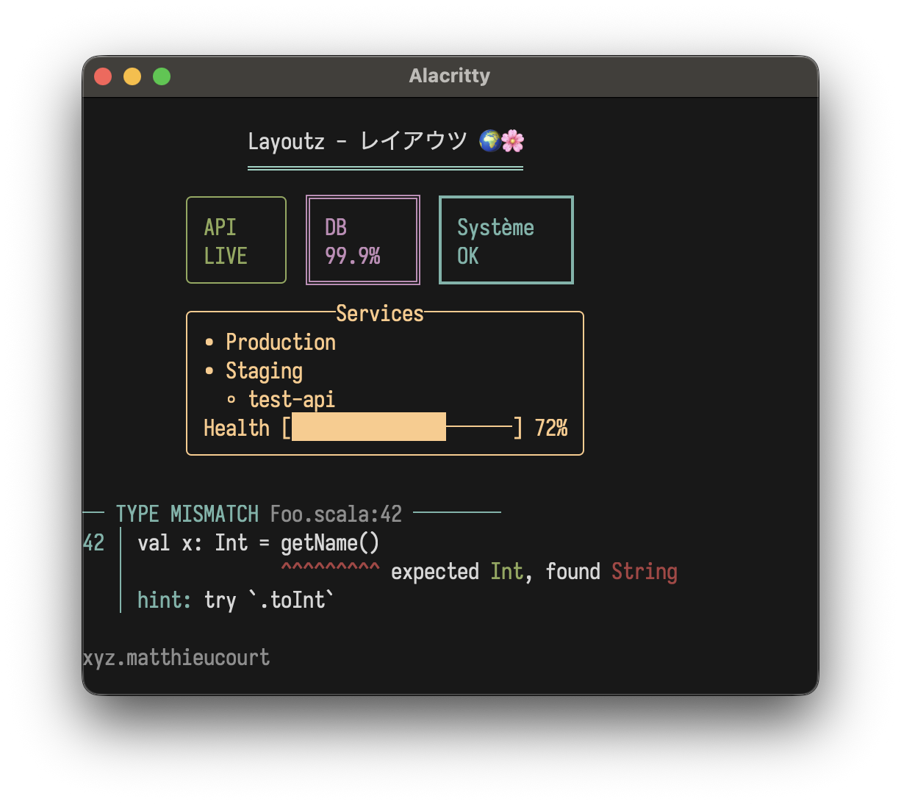
</p>

**(2/2) Interactive apps**

Build Elm-style TUIs

```scala
import layoutz._

object CounterApp extends LayoutzApp[Int, String] {
  def init = 0

  def update(msg: String, count: Int) = msg match {
    case "inc" => count + 1
    case "dec" => count - 1
    case _     => count
  }

  def subscriptions(count: Int) = 
    Sub.onKeyPress {
      case CharKey('+') => Some("inc")
      case CharKey('-') => Some("dec")
      case _            => None
    }

  def view(count: Int) = layout(
    section("Counter")(s"Count: $count"),
    br,
    ul("Press `+` or `-`")
  )
}

CounterApp.run
```
<p align="center">
  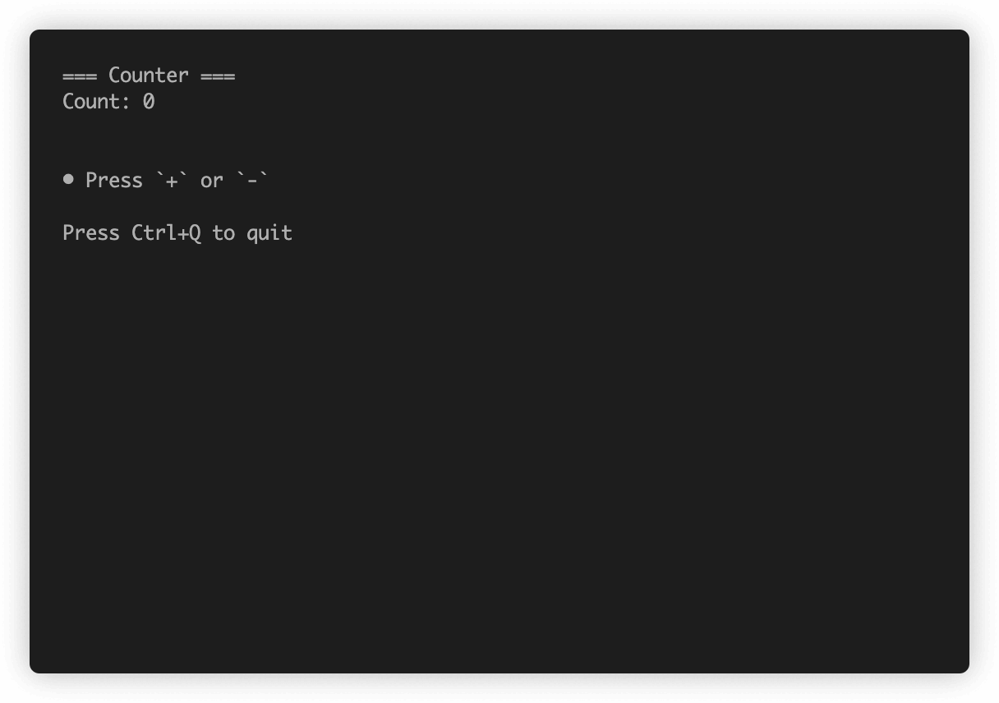
</p>

## Why layoutz?
- We have `s"..."`, and [full-blown](https://github.com/oyvindberg/tui-scala) TUI libraries - but there is a gap in-between.
- With LLM's, boilerplate code that formats & "pretty-prints" is **_cheaper than ever_**...
- Thus, **_more than ever_**, "string formatting code" is spawning, and polluting domain logic
- Ultimately, **layoutz** is just a tiny, declarative DSL to combat this
- One the side, **layoutz** also has a Elm-style runtime to bring these arbitrary "Elements" to life: much like a flipbook.
   - The runtime has some little niceties built-in like common cmd's like file I/O, HTTP-requests, and a key input handler
- But at the end of the day, you can use **layoutz** merely to structure Strings (without any of the TUI stuff)

## Core concepts
- Every piece of content is an `Element`
- Elements are **immutable** and **composable** - you build complex layouts by combining simple elements.
- A `layout` is just a special element that arranges other elements **vertically** with consistent spacing:
```scala
layout(elem1, elem2, elem3)  /* Joins with "\n" */
```
- Call `.render` on an element to get a String or `.putStrLn` to render and print in one call.
- The power comes from **uniform composition**, since everything is an `Element`, everything can be combined with everything else.
- Since you can extend this `Element` interface, you can create any `Element`s you can imagine... and they will compose with all the other
**layoutz** built-in `Element`s ... and don't need to rely on a [side-car component library](https://github.com/charmbracelet/bubbles).

## Fluent API
Some typesetting elements work as both nouns ("an underline") and verbs ("to underline something").

For these, layoutz offers a so-called "fluent" syntax with transformations avaible in infix
position via dot-completion (They boil down to the same case classes and render the same thing under the hood... 
it is just a matter of taste and how your brain works).

Nested style:
```scala
margin(">>")(underline()("Hello\nWorld!"))
```

Fluent style:
```scala
"Hello\nWorld!".underline.margin(">>")
```

Both fluent and nested will render:
```
>> Hello
>> World!
>> ──────
```

**Available:** `.center()`, `.pad()`, `.wrap()`, `.truncate()`, `.underline()`, `.margin()`

## Elements
All the building blocks you can use in your layouts:

### Text: `Text`
**layoutz** implicitly converts Strings to `Text` elements:
```scala
"Simple text"
Text("Simple text") /* <- you don't need to do this */
```

### Line Break: `br`
Add extra line-break "\n" with `br`:
```scala
layout("Line 1", br, "Line 2")
```

### Section: `section`
```scala
section("Config")(kv("env" -> "prod"))
section("Status", "-")(kv("health" -> "ok"))
section("Report", "#", 5)(kv("items" -> "42"))
```
```
=== Config ===
env : prod

--- Status ---
health : ok

##### Report #####
items : 42
```

### Layout (vertical): `layout`
```scala
layout("First", "Second", "Third")
```
```
First
Second
Third
```

### Row (horizontal): `row`
```scala
row("Left", "Middle", "Right")
```
```
Left Middle Right
```

### Columns: `columns`

```scala
columns(
  layout("Tasks", ul("Setup", "Code", ul("more stuff"))),
  layout("Status", "foo", "bar", "baz")
)

```
```
Tasks           Status
• Setup         foo
• Code          bar
  ◦ more stuff  baz
```

### Horizontal rule: `hr`
```scala
hr
hr.width(10).char("~")
```
```
──────────────────────────────────────────────────
~~~~~~~~~~
```

### Key-value pairs: `kv`
```scala
kv("name" -> "Alice", "role" -> "admin")
```
```
name : Alice
role : admin
```

### Table: `table`
Tables automatically normalize row lengths - truncating long rows and padding short ones:
```scala
table(
  headers = Seq("Name", "Age", "City"),
  rows = Seq(
    Seq("Alice", "30", "New York"),
    Seq("Bob", "25"),                          /* Short row - auto-padded */
    Seq("Charlie", "35", "London", "Extra")    /* Long row - auto-truncated */
  )
)
```
```
┌─────────┬─────┬─────────┐
│ Name    │ Age │ City    │
├─────────┼─────┼─────────┤
│ Alice   │ 30  │ New York│
│ Bob     │ 25  │         │
│ Charlie │ 35  │ London  │
└─────────┴─────┴─────────┘
```


### Ordered Lists: `ol`
Automatically numbered lists
```scala
ol("First step", "Second step", "Third step")
```
```
1. First step
2. Second step
3. Third step
```

Hierarchical nested numbering
```scala
ol(
  "Setup",
  ol("Install tools", "Configure IDE"),
  "Development",
  ol("Write code", ol("Unit tests", "Integration tests")),
  "Deploy"
)
```
```
1. Setup
  a. Install tools
  b. Configure IDE
2. Development
  a. Write code
    i. Unit tests
    ii. Integration tests
3. Deploy
```

Mix with other elements
```scala
ol(
  "Initialize project",
  ul("Create repo", "Setup CI/CD"),
  inlineBar("Progress", 0.6)
)
```
```
1. Initialize project
2. • Create repo
   • Setup CI/CD
3. Progress [████████████────────] 60%
```

### Unordered Lists: `ul`
Clean unordered lists with custom bullets
```scala
ul("Feature A", "Feature B", "Feature C")
ul("→")("Item 1", "Item 2")
```
```
• Feature A
• Feature B
• Feature C

→ Item 1
→ Item 2
```

Nested lists with auto-styling
```scala
ul(
  "Backend",
  ul("API", "Database"),
  "Frontend",
  ul("Components", ul("Header", ul("Footer")))
)
```
```
• Backend
  ◦ API
  ◦ Database
• Frontend
  ◦ Components
    ▪ Header
      • Footer
```

### Underline: `underline`
Add underlines to any element
```scala
/* Fluent syntax */
"Important Title".underline()
"Custom".underline("=")

underline()("Important Title")
underline("=")("Custom")
```
```
Important Title
───────────────

Custom
══════
```

### Colors: `Color`
Just add ANSI coloring with `.color` and `Color.<...>` to see what is available

```scala
Color.Red("The quick brown fox...")
"The quick brown fox...".color(Color.BrightCyan)
"The quick brown fox...".underlineColored("~", Color.Red)
"The quick brown fox...".marginColored("[INFO]", Color.Cyan)
```

<p align="center">
  
</p>

**Colors:**
- `Black` `Red` `Green` `Yellow` `Blue` `Magenta` `Cyan` `White`
- `BrightBlack` `BrightRed` `BrightGreen` `BrightYellow` `BrightBlue` `BrightMagenta` `BrightCyan` `BrightWhite`
- `NoColor` *(for conditional formatting)*

**Extended colors:**
- `Color.Full(n)` - 256-color palette (0-255)
- `Color.True(r, g, b)` - 24-bit RGB true color

```scala
import layoutz._

/* 256-color palette gradient */
val palette = tightRow((16 to 231 by 7).map(i => "█".color(Color.Full(i))): _*)

/* RGB gradients */
val redToBlue = tightRow((0 to 255 by 8).map(i => "█".color(Color.True(i, 100, 255 - i))): _*)
val greenFade = tightRow((0 to 255 by 8).map(i => "█".color(Color.True(0, 255 - i, i))): _*)
val rainbow = tightRow((0 to 255 by 8).map { i =>
  val r = if (i < 128) i * 2 else 255
  val g = if (i < 128) 255 else (255 - i) * 2
  val b = if (i > 128) (i - 128) * 2 else 0
  "█".color(Color.True(r, g, b))
}: _*)

layout(palette, redToBlue, greenFade, rainbow)
```

<p align="center">
  
</p>


### Styles: `Style`
ANSI styles are added the same way with `.style` and `Style.<...>`
```scala
"The quick brown fox...".style(Style.Bold)
"The quick brown fox...".color(Color.Red).style(Style.Bold)
"The quick brown fox...".style(Style.Reverse).style(Style.Italic)
```
<p align="center">
  
</p>

**Styles:**
- `Bold` `Dim` `Italic` `Underline`
- `Blink` `Reverse` `Hidden` `Strikethrough`
- `NoStyle` *(for conditional formatting)*

**Combining styles:**
Use `++` to combine multiple styles at once:
```scala
"Fancy!".style(Style.Bold ++ Style.Italic ++ Style.Underline)
table(<???>).border(Border.Thick).style(Style.Bold ++ Style.Reverse)
```

<p align="center">
  
</p>

### Create your Custom Elements

Create your own components by implementing the `Element` trait

For example lets create a square we can re-use:
```scala
case class Square(size: Int) extends Element {
  def render: String = {
    if (size < 2) return ""
    val width = size * 2 - 2
    val top = "┌" + ("─" * width) + "┐"
    val middle = (1 to size - 2).map(_ => "│" + (" " * width) + "│")
    val bottom = "└" + ("─" * width) + "┘"
    (top +: middle :+ bottom).mkString("\n")
  }
}
```

Then re-use it like any element:
```scala
row(Square(2), Square(4), Square(6))
```
```
┌──┐ ┌──────┐ ┌──────────┐
└──┘ │      │ │          │
     │      │ │          │
     └──────┘ │          │
              │          │
              └──────────┘
```

### Box: `box`
With title:
```scala
box("Summary")(kv("total" -> "42"))
```
```
┌──Summary───┐
│ total : 42 │
└────────────┘
```

Without title:
```scala
box(kv("total" -> "42"))
```
```
┌────────────┐
│ total : 42 │
└────────────┘
```

### Status card: `statusCard`
```scala
statusCard("CPU", "45%")
```
```
┌───────┐
│ CPU   │
│ 45%   │
└───────┘
```

### Progress bar: `inlineBar`
```scala
inlineBar("Download", 0.75)
```
```
Download [███████████████─────] 75%
```

### Spinner: `spinner`
```scala
spinner("Loading...", frame = 3)
spinner("Processing", frame = 0, SpinnerStyle.Line)
```
```
⠸ Loading...
|| Processing
```
Styles: `Dots` (default), `Line`, `Clock`, `Bounce`


### Tree: `tree`
```scala
tree("Project")(
  tree("src")(
    tree("main")(tree("App.scala")),
    tree("test")(tree("AppSpec.scala"))
  )
)
```
```
Project
└── src/
    ├── main/
    │   └── App.scala
    └── test/
        └── AppSpec.scala
```

### Banner: `banner`
```scala
banner("System Dashboard").border(Border.Double)
```
```
╔═══════════════════╗
║ System Dashboard  ║
╚═══════════════════╝
```

### Chart: `chart`
```scala
chart(
  "Web" -> 10,
  "Mobile" -> 20,
  "API" -> 15
)
```
```
Web            │████████████████ 10.0
Mobile         │████████████████████████████████ 20.0
API            │███████████████████████████ 15.0
```

### Terminal Plots: `plot`

```scala
/* Simple sine wave */
val sinePoints = (0 to 100).map(i => (i.toDouble, math.sin(i * 0.1) * 10))
plot(width = 40, height = 10)(
  Series(sinePoints, "sine").color(Color.Cyan)
)
```
<p align="center">
  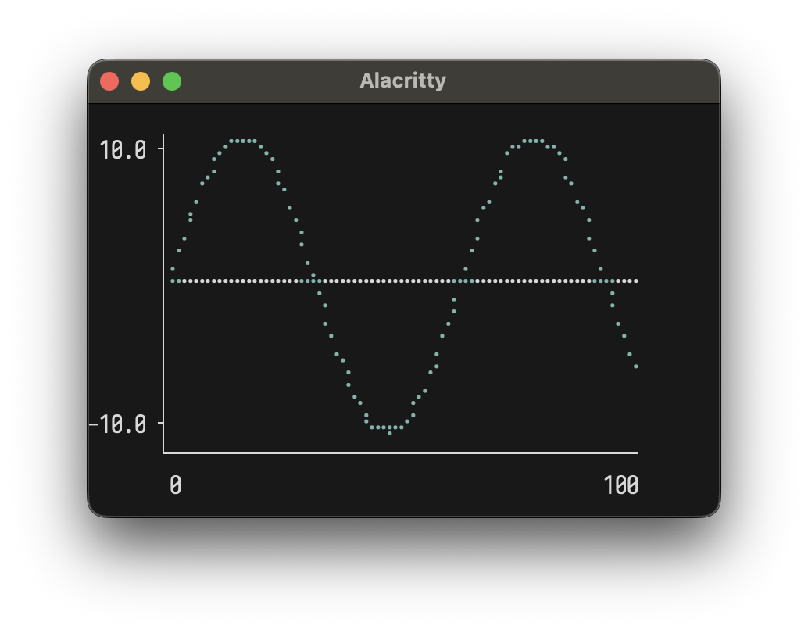
</p>

**Multiple series with legend:**
```scala
val sin = (0 to 50).map(i => (i.toDouble, math.sin(i * 0.15) * 5))
val cos = (0 to 50).map(i => (i.toDouble, math.cos(i * 0.15) * 5))

plot(width = 50, height = 12)(
  Series(sin, "sin(x)").color(Color.BrightCyan),
  Series(cos, "cos(x)").color(Color.BrightMagenta)
)
```

<p align="center">
  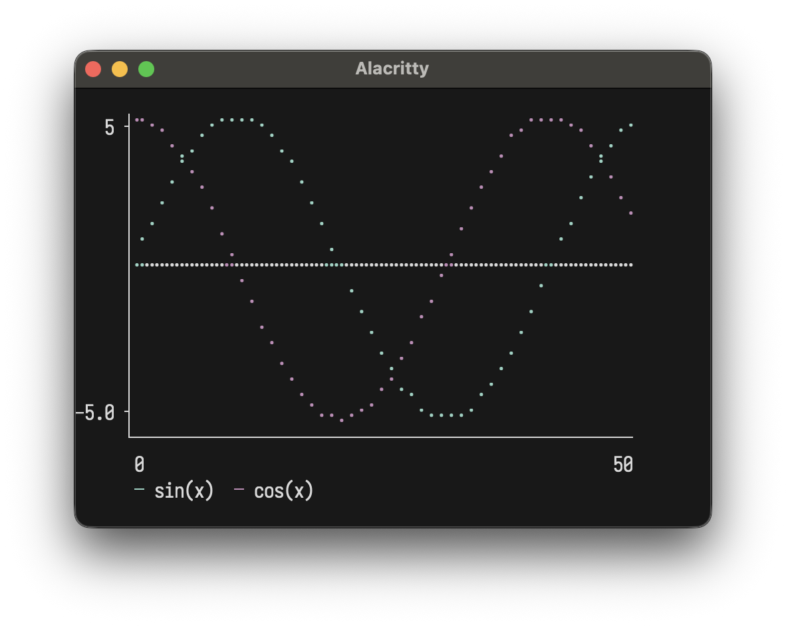
</p>

Shows both curves in different colors with an auto-generated legend.

`width`/`height` set dimensions. `showAxes` toggles axis labels. `showOrigin` draws x=0/y=0 lines.

### Pie Charts: `pie`

```scala
pie()(
  Slice(50, "Liquor"),
  Slice(20, "Protein"),
  Slice(10, "Water"),
  Slice(20, "Fun")
)
```
<p align="center">
  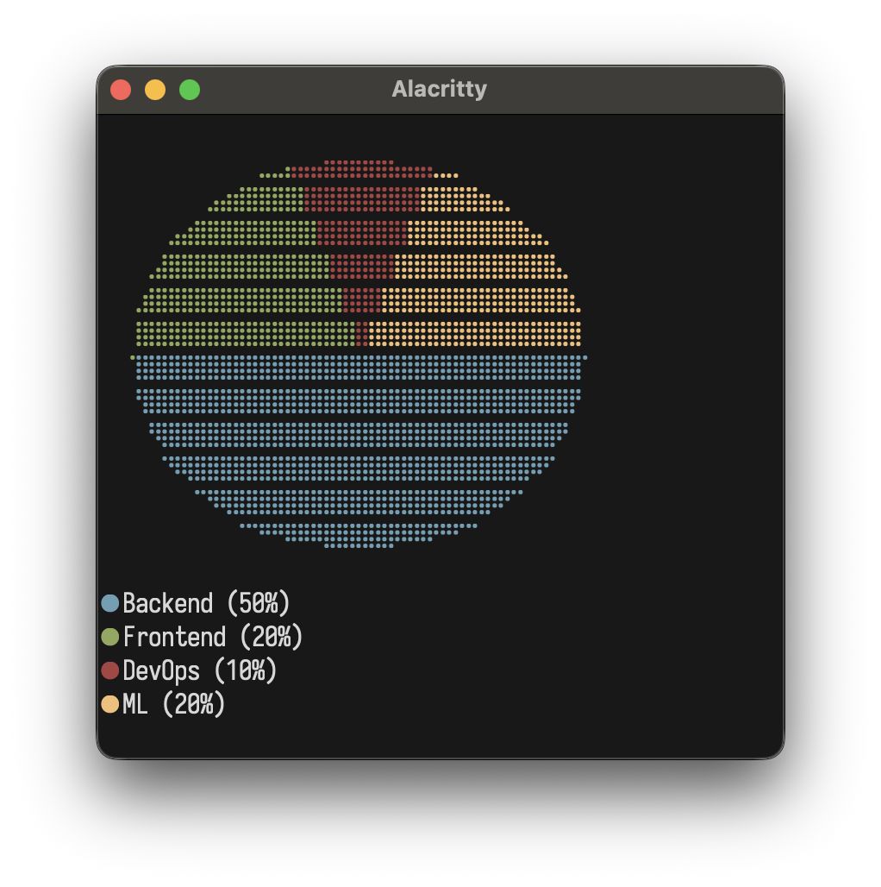
</p>

Slices are automatically colored from the default palette, with a legend showing percentages.

Use `width` and `height` for larger/smaller charts. Intuitively,
largely dimensions render smoother curves

### Bar Charts: `bar`

```scala
bar(width = 40, height = 10)(
  Bar(85, "Mon"),
  Bar(120, "Tue"),
  Bar(95, "Wed"),
  Bar(70, "Thu"),
  Bar(110, "Fri")
)
```
<p align="center">
  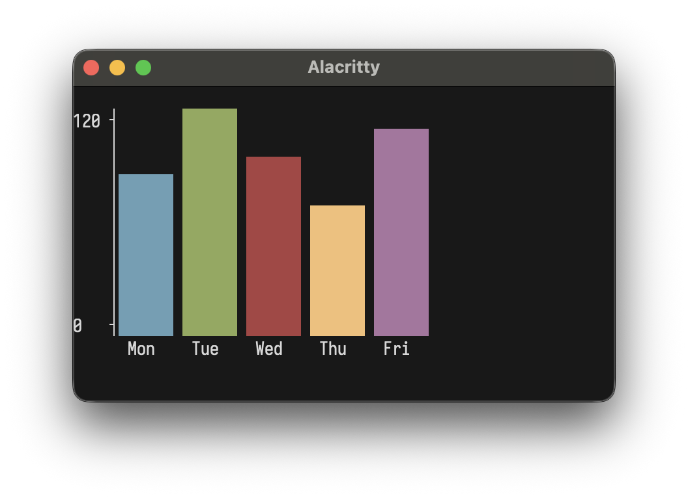
</p>

**Custom colors:**
```scala
bar()(
  Bar(100, "Sales").color(Color.Magenta),
  Bar(80, "Costs").color(Color.BrightRed),
  Bar(20, "Profit").color(Color.Cyan)
)
```
<p align="center">
  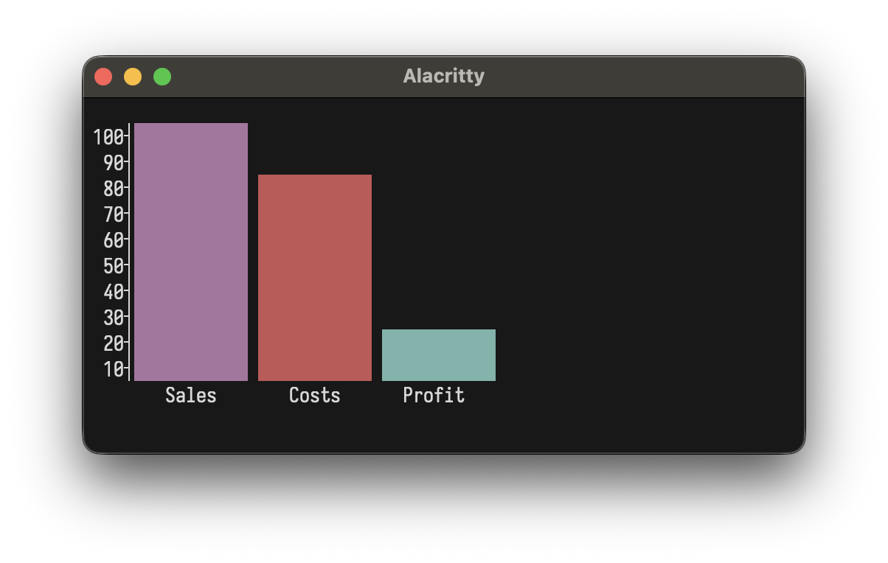
</p>

### Stacked Bar Charts: `stackedBar`

```scala
stackedBar(width = 40, height = 10)(
  StackedBar(Seq(Bar(30, "Q1"), Bar(20, "Q2"), Bar(25, "Q3")), "2022"),
  StackedBar(Seq(Bar(35, "Q1"), Bar(25, "Q2"), Bar(30, "Q3")), "2023"),
  StackedBar(Seq(Bar(40, "Q1"), Bar(30, "Q2"), Bar(35, "Q3")), "2024")
)
```
<p align="center">
  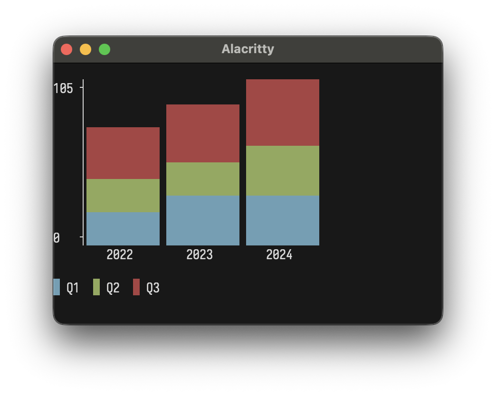
</p>

Segments with the same label share colors automatically.

### Sparklines: `sparkline`

Tiny inline charts using block characters:

```scala
sparkline(Seq(1, 4, 2, 8, 5, 7, 3, 6))
sparkline(Seq(10, 20, 15, 30, 25, 40, 35)).color(Color.Cyan)
```
<p align="center">
  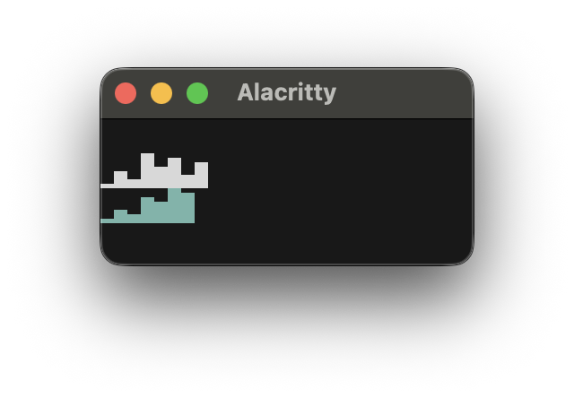
</p>

### Box Plots: `boxPlot`

Visualize data distribution with box and whisker plots:

```scala
boxPlot(height = 12)(
  BoxData("A", min = 10, q1 = 25, median = 50, q3 = 75, max = 90).color(Color.Cyan),
  BoxData("B", min = 20, q1 = 40, median = 55, q3 = 70, max = 85).color(Color.Magenta),
  BoxData("C", min = 5, q1 = 30, median = 45, q3 = 60, max = 95).color(Color.Yellow)
)
```
<p align="center">
  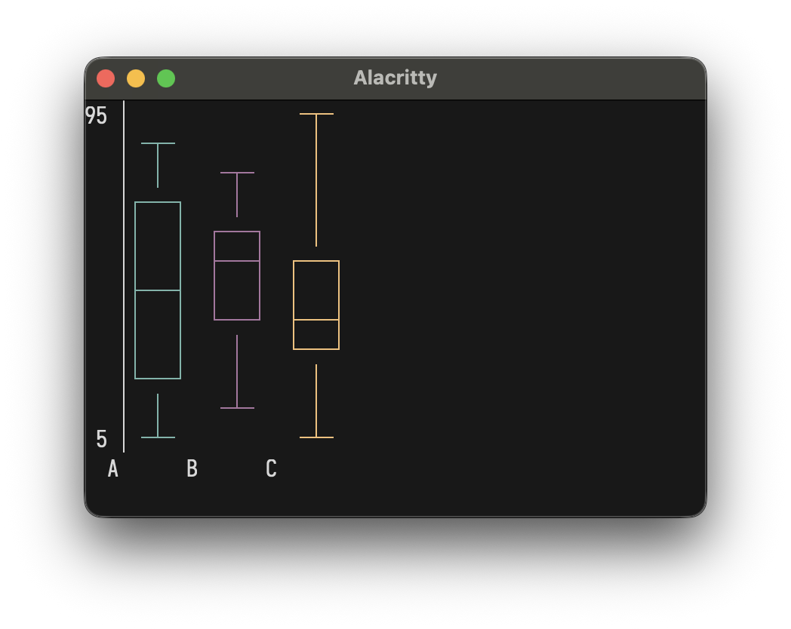
</p>

### Heatmaps: `heatmap`

2D grid with color intensity:

```scala
heatmap(Seq(
  Seq(1.0, 2.0, 3.0),
  Seq(4.0, 5.0, 6.0),
  Seq(7.0, 8.0, 9.0)
))

// With labels and settings
Heatmap(
  HeatmapData(
    rows = Seq(
      Seq(12.0, 15.0, 22.0, 28.0, 30.0, 25.0, 18.0),
      Seq(14.0, 18.0, 25.0, 32.0, 35.0, 28.0, 20.0),
      Seq(10.0, 13.0, 20.0, 26.0, 28.0, 22.0, 15.0)
    ),
    rowLabels = Seq("Mon", "Tue", "Wed"),
    colLabels = Seq("6am", "9am", "12pm", "3pm", "6pm", "9pm", "12am")
  ),
  cellWidth = 5
)
```
<p align="center">
  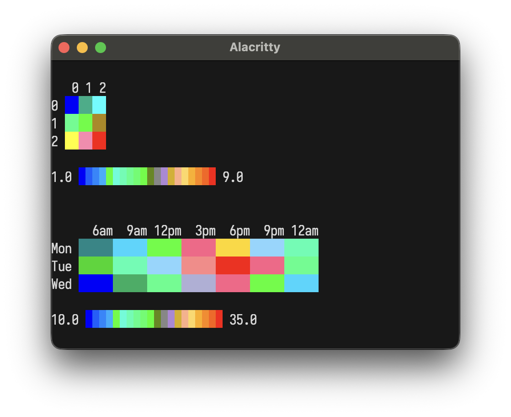
</p>

Options: `cellWidth`, `cellHeight`, `showLegend`.

### Text Input: `textInput`
```scala
textInput("Username", "alice", "Enter your username", active = true)
textInput("Password", "", "Enter password", active = false)
```
```
> Username: alice_
  Password: Enter password
```

### Single Choice: `SingleChoice`
Pick one option from a list:
```scala
SingleChoice(
  label = "How was your day?",
  options = Seq("great", "okay", "meh"),
  selected = 0,
  active = true
)
```
```
> How was your day?
  ► ● great
    ○ okay
    ○ meh
```

### Multi Choice: `MultiChoice`
Pick multiple options from a list:
```scala
MultiChoice(
  label = "Favorite colors?",
  options = Seq("Red", "Blue", "Green"),
  selected = Set(0, 2),
  cursor = 1,
  active = true
)
```
```
> Favorite colors? (space to toggle, enter to confirm)
    ☑ Red
  ► ☐ Blue
    ☑ Green
```

### Space: `space`
Add horizontal spacing
```scala
layout("Left", space(10), "Right")
```
```
Left          Right
```

### Padding: `pad`
Add uniform padding around any element
```scala
/* Fluent */
"content".pad(2)
box(kv("cpu" -> "45%")).pad(1)

/* Nested */
pad(2)("content")
pad(1)(box(kv("cpu" -> "45%")))
```
```
      
  content  
      
```

### Truncation: `truncate`
Truncate long text with ellipsis
```scala
/* Fluent */
"This is a very long text that will be cut off".truncate(15)
"Custom ellipsis example text here".truncate(20, "…")

/* Nested */
truncate(15)("This is a very long text that will be cut off")
truncate(20, "…")("Custom ellipsis example text here")
```
```
This is a ve...
Custom ellipsis ex…
```

### Empty Element: `empty`
Useful for conditional rendering
```scala
layout(
  "Always shown",
  if (hasError) "Something failed!".margin("[error]") else empty,
  "Also always shown"
)
```

### Vertical Rule: `vr`
Vertical separators to complement horizontal rules
```scala
vr(3)           // 3-line vertical separator
vr(5, "┃")      // Custom character
```
```
│
│
│
```

### Margin: `margin`
Add prefix margins to elements for compiler-style error messages:

```scala
layout(
  "Ooops!",
  row("val result: Int = ", underline("^")("getString()")),
  "Expected Int, found String"
).margin("[error]")
```
```
[error] Ooops!
[error] val result: Int =  getString()
[error]                    ^^^^^^^^^^^
[error] Expected Int, found String

```

Available in both fluent (`.margin()`) and nested syntax (`margin("prefix")()`).

## Text Formatting & Layout

### Alignment: `center`,`leftAlign`,`rightAlign`
Align text within a specified width
```scala
/* Fluent */
"TITLE".center(20)
"Left side".leftAlign(20)
"Right side".rightAlign(20)

/* Nested */
center("TITLE", 20)
leftAlign("Left side", 20)
rightAlign("Right side", 20)
```
```
        TITLE  
Left side           
          Right side
```

Works with multiline text:
```scala
"Line 1\nLine 2".center(15)
```
```
   Line 1   
   Line 2   
```

### Text Wrapping: `wrap`
Wrap long text at word boundaries
```scala
/* Fluent */
"This is a very long line that should be wrapped at word boundaries".wrap(20)

/* Nested */
wrap("This is a very long line that should be wrapped at word boundaries", 20)
```
```
This is a very long
line that should be
wrapped at word
boundaries
```

### Text Justification: `justify`,`justifyAll`
Distribute spaces to fit exact width
```scala
"All the lines\nmaybe the last".justify(20).render
"All the lines\nmaybe the last".justifyAll(20).render

/* Nested syntax normal */
justify("All the lines\nmaybe the last", 20).render
justifyAll("All the lines\nmaybe the last", 20).render
```
```
All     the    lines
maybe the last

All     the    lines
maybe    the    last
```

### Border Styles
Elements like `box`, `table`, `statusCard`, and `banner` support different `Border` options using the typeclass-based `.border()` method:

**Single** (default):
```scala
box("Title")("").border(Border.Single)
/* default style is Border.Single, so same as: box("Title")("") */
```
```
┌─Title─┐
│       │
└───────┘
```

**Double**:
```scala
banner("Welcome").border(Border.Double)
```
```
╔═════════╗
║ Welcome ║
╚═════════╝
```

**Thick**:
```scala
table(headers, rows).border(Border.Thick)
```
```
┏━━━━━━━┳━━━━━━━━┓
┃ Name  ┃ Status ┃
┣━━━━━━━╋━━━━━━━━┫
┃ Alice ┃ Online ┃
┗━━━━━━━┻━━━━━━━━┛
```

**Round**:
```scala
box("Info")("").border(Border.Round)
```
```
╭─Info─╮
│      │
╰──────╯
```

**Custom**:
```scala
box("Hello hello")("World!").border(
  Border.Custom(
    corner = "+",
    horizontal = "=",
    vertical = "|"
  )
)
```
```
+==Hello hello==+
| World!        |
+===============+
```

#### Border.None
You can also disable borders entirely, which can be quite nice especially for tables:
```scala
val t = table(
    Seq("Name", "Role", "Status"),
    Seq(
      Seq("Alice", "Engineer", "Online"),
      Seq("Eve", "QA", "Away"),
      Seq(
        ul("Gegard", ul("Mousasi", ul("was a BAD man"))),
        "Fighter",
        "Nasty"
      )
    )
  ).border(Border.Round)
```
```
  Name                  Role       Status

  Alice                 Engineer   Online
  Eve                   QA         Away
  • Gegard              Fighter    Nasty
    ◦ Mousasi
      ▪ was a BAD man
```

#### HasBorder Typeclass
All border styling is done via the `HasBorder` typeclass, which allows you to write generic code that works with any bordered element:

Knowing about this typeclass can be of use as you extend the `Element` interface to make your own elements. For
example this function that would work with any implementer of `HasBorder`
```scala
def makeThick[T: HasBorder](element: T): T = element.border(Border.Thick)
```

## Working with collections
The full power of Scala functional collections is at your fingertips to render your strings with **layoutz**
```scala
case class User(name: String, role: String)
val users = Seq(User("Alice", "Admin"), User("Bob", "User"), User("Tom", "User"))

val usersByRole = users.groupBy(_.role)
section("Users by Role")(
  layout(
    usersByRole.map { case (role, roleUsers) =>
      box(role)(
        ul(roleUsers.map(_.name): _*)
      )
    }.toSeq: _*
  )
)
```
```
=== Users by Role ===
┌──Admin──┐
│ • Alice │
└─────────┘

┌──User──┐
│ • Bob  │
│ • Tom  │
└────────┘
```

## Interactive Apps
Build **Elm-style terminal applications** with the `LayoutzApp` architecture.
The [Elm Architecture](https://guide.elm-lang.org/architecture/) creates unidirectional data flow from inputs to view (re)rendering

### `LayoutzApp[State, Message]`
Implement this trait:
```scala
trait LayoutzApp[State, Message] {
  def init: (State, Cmd[Message])                                   /* Initial state and startup commands */
  def update(message: Message, state: State): (State, Cmd[Message]) /* Apply message to state */
  def subscriptions(state: State): Sub[Message]                     /* Declare event listeners */
  def view(state: State): Element                                   /* Render state to UI */
}
```

The `.run` method handles the event loop, terminal management, and threading automatically.

You can customize runtime behavior with named parameters:
```scala
app.run(
  clearOnStart = false,  // Don't clear screen on startup (default: true)
  clearOnExit = false,   // Keep output visible after exit (default: true)
  showQuitMessage = true, // Show "Press Ctrl+Q to quit" (default: false)
  alignment = Alignment.Center // Center app in terminal (default: Left)
)
```

The **layoutz** runtime spawns three daemon threads:
- **Render thread** - Continuously renders your `view` to the terminal (~50ms intervals)
- **Tick thread** - Handles time-based subscriptions and file/HTTP polling (~10ms intervals)
- **Input thread** - Blocks on terminal input, converts keys to messages via `subscriptions`

All state updates happen synchronously through `update`, keeping your app logic simple and predictable.

### Key Types
**layoutz** comes with a built-in little ADT to handle keyboard input
```scala
CharKey(c: Char)           /* 'a', '1', ' ', etc. */
EnterKey, BackspaceKey, TabKey, EscapeKey, DeleteKey
ArrowUpKey, ArrowDownKey, ArrowLeftKey, ArrowRightKey
SpecialKey(name: String)   /* Ctrl+Q, Ctrl+S, etc. */
```

### Subscriptions
Listen to ongoing events or create timers:

| Subscription | Description |
|--------------|-------------|
| `Sub.none` | No subscriptions |
| `Sub.onKeyPress(handler)` | Keyboard input |
| `Sub.time.every(intervalMs, msg)` | Timers, animations, periodic ticks |
| `Sub.file.watch(path, onChange)` | File changes |
| `Sub.http.poll(url, intervalMs, onResponse, headers)` | HTTP polling |
| `Sub.batch(sub1, sub2, ...)` | Multiple subscriptions |

Example:
```scala
import layoutz._

sealed trait Msg
case object Tick extends Msg
case class ConfigChanged(content: Either[String, String]) extends Msg
case object Quit extends Msg

def subscriptions(state: State) = Sub.batch(
  Sub.time.every(100, Tick),
  Sub.file.watch("config.json", cfg => ConfigChanged(cfg)),
  Sub.onKeyPress { case CharKey('q') => Some(Quit); case _ => None }
)
```

### Commands
**Layoutz** comes with some helpers for common side effects. Use `Cmd.task` for custom async operations:

| Command | Result Type | Description |
|---------|-------------|-------------|
| `Cmd.none` | - | No command to execute (default) |
| `Cmd.exit` | - | Exit the application (self-terminating apps) |
| `Cmd.batch(cmd1, cmd2, ...)` | - | Execute multiple commands |
| `Cmd.task(expr)(toMsg)` | `Either[String, A]` | Run any async task with error handling |
| `Cmd.fire(effect)` | - | Fire and forget, no message back |
| `Cmd.file.read(path, onResult)` | `Either[String, String]` | Read file contents |
| `Cmd.file.write(path, content, onResult)` | `Either[String, Unit]` | Write to file |
| `Cmd.file.ls(path, onResult)` | `Either[String, List[String]]` | List directory contents |
| `Cmd.file.cwd(onResult)` | `Either[String, String]` | Get current working directory |
| `Cmd.http.get(url, onResult, headers)` | `Either[String, String]` | HTTP GET request |
| `Cmd.http.post(url, body, onResult, headers)` | `Either[String, String]` | HTTP POST request |

**Note:** With the implicit conversion, you can return just the state instead of `(state, Cmd.none)`:
```scala
def update(msg: Msg, state: State) = msg match {
  case Increment => state.copy(count = state.count + 1)  // Automatically becomes (state, Cmd.none)
  case LoadData => (state.copy(loading = true), Cmd.file.read("data.txt", DataLoaded))
}
```


## Examples

Small interactive TUI apps using built-in `Cmd` and `Sub` features.

### Self-terminating loading bar

<details>
<summary>Auto-exit when tasks complete using `Cmd.exit`</summary>

```scala
import layoutz._

case class State(progress: Double, done: Boolean)
sealed trait Msg
case object Tick extends Msg

object LoadingApp extends LayoutzApp[State, Msg] {
  def init = (State(0, false), Cmd.none)

  def update(msg: Msg, state: State) = msg match {
    case Tick =>
      if (state.done) (state, Cmd.exit)  // Exit on tick after done (ensures 100% renders)
      else {
        val next = state.progress + 0.02
        if (next >= 1.0) (State(1.0, true), Cmd.none)  // Mark done, exit next tick
        else (state.copy(progress = next), Cmd.none)
      }
  }

  def subscriptions(state: State) = Sub.time.every(50, Tick)

  def view(state: State) = layout(
    inlineBar("Loading", state.progress),
    f"${state.progress * 100}%.0f%% complete"
  )
}

// Keep output visible after exit
LoadingApp.run(clearOnExit = false, showQuitMessage = false)
println("Done!")
```

See [LoadingApp.scala](examples/LoadingApp.scala) for a multi-task version.

</details>

### File viewer

<details>
<summary>Watch and display file contents</summary>

```scala
import layoutz._

case class FileState(content: String, error: Option[String])
sealed trait Msg
case class FileLoaded(result: Either[String, String]) extends Msg

object FileViewer extends LayoutzApp[FileState, Msg] {
  val filename = "README.md"
  
  def init = (FileState("Loading...", None), Cmd.file.read(filename, FileLoaded))
  
  def update(msg: Msg, state: FileState) = msg match {
    case FileLoaded(Right(content)) => 
      (state.copy(content = content.take(500), error = None), Cmd.none)
    case FileLoaded(Left(err)) => 
      (state.copy(error = Some(err)), Cmd.none)
  }
  
  def subscriptions(state: FileState) = 
    Sub.file.watch(filename, FileLoaded)
  
  def view(state: FileState) = {
    val display = state.error match {
      case Some(err) => Color.BrightRed(s"Error: $err")
      case None => wrap(state.content, 60)
    }
    
    layout(
      underlineColored("=", Color.BrightMagenta)("File Viewer").style(Style.Bold),
      kv("File" -> filename).color(Color.BrightBlue),
      box("Content")(display).border(Border.Round),
      "Auto-reloads on file change".color(Color.BrightBlack)
    )
  }
}

FileViewer.run
```
</details>

### Stopwatch timer

<details>
<summary>Custom timer using `Sub.time.every`</summary>

```scala
import layoutz._

case class TimerState(seconds: Int, running: Boolean)
sealed trait Msg
case object Tick extends Msg
case object ToggleTimer extends Msg
case object ResetTimer extends Msg

object StopwatchApp extends LayoutzApp[TimerState, Msg] {
  def init = (TimerState(0, false), Cmd.none)
  
  def update(msg: Msg, state: TimerState) = msg match {
    case Tick => 
      (state.copy(seconds = state.seconds + 1), Cmd.none)
    case ToggleTimer => 
      (state.copy(running = !state.running), Cmd.none)
    case ResetTimer => 
      (TimerState(0, running = false), Cmd.none)
  }
  
  def subscriptions(state: TimerState) = Sub.batch(
    if (state.running) Sub.time.every(1000, Tick) else Sub.none,
    Sub.onKeyPress {
      case CharKey(' ') => Some(ToggleTimer)
      case CharKey('r') => Some(ResetTimer)
      case _ => None
    }
  )
  
  def view(state: TimerState) = {
    val minutes = state.seconds / 60
    val secs = state.seconds % 60
    val timeDisplay = f"$minutes%02d:$secs%02d"
    
    val statusColor = if (state.running) Color.BrightGreen else Color.BrightYellow
    val statusText = if (state.running) "RUNNING" else "PAUSED"
    
    layout(
      underlineColored("=", Color.BrightCyan)("Stopwatch").style(Style.Bold),
      "",
      box("Time")(
        timeDisplay.style(Style.Bold).center(20)
      ).color(statusColor).border(Border.Double),
      "",
      kv(
        "Status" -> statusText,
        "Elapsed" -> s"${state.seconds}s"
      ).color(Color.BrightBlue),
      "",
      ul(
        "space: start/pause",
        "r: reset"
      ).color(Color.BrightBlack)
    )
  }
}

StopwatchApp.run
```
</details>

### Custom side effects

<details>
<summary>Using `Cmd.task` for async operations</summary>

```scala
import layoutz._

case class TaskState(status: String = "idle", count: Int = 0)

sealed trait Msg
case object RunTask extends Msg
case class TaskDone(result: Either[String, String]) extends Msg

object SideEffectApp extends LayoutzApp[TaskState, Msg] {
  def init = (TaskState(), Cmd.none)

  def update(msg: Msg, state: TaskState) = msg match {
    case RunTask =>
      (state.copy(status = "running..."),
       Cmd.task {
         Thread.sleep(500)
         if (scala.util.Random.nextDouble() < 0.3)
           throw new Exception("Launch failure")
         "completed"
       }(TaskDone))

    case TaskDone(Right(_)) =>
      state.copy(status = "success", count = state.count + 1)

    case TaskDone(Left(err)) =>
      state.copy(status = s"error: $err")
  }

  def subscriptions(state: TaskState) = Sub.onKeyPress {
    case CharKey('r') => Some(RunTask)
    case _ => None
  }

  def view(state: TaskState) = layout(
    section("Side Effect Demo")(
      kv("Status" -> state.status, "Count" -> state.count.toString)
    ),
    "r: run task".color(Color.BrightBlack)
  )
}

SideEffectApp.run
```

Use `Cmd.fire` for fire-and-forget effects (logging, analytics, etc.):
```scala
Cmd.fire(println("User clicked button"))
```
</details>

### API poller

<details>
<summary>Poll API endpoint and display JSON</summary>

```scala
import layoutz._

case class ApiState(response: String, lastUpdate: String, error: Option[String])
sealed trait Msg
case class ApiResponse(result: Either[String, String]) extends Msg

object ApiPoller extends LayoutzApp[ApiState, Msg] {
  val apiUrl = "https://api.github.com/zen"
  
  def init = (ApiState("Loading...", "Never", None), Cmd.none)
  
  def update(msg: Msg, state: ApiState) = msg match {
    case ApiResponse(Right(data)) =>
      val now = java.time.LocalTime.now().toString.take(8)
      (state.copy(response = data, lastUpdate = now, error = None), Cmd.none)
    case ApiResponse(Left(err)) =>
      (state.copy(error = Some(err)), Cmd.none)
  }
  
  def subscriptions(state: ApiState) =
    Sub.http.poll(apiUrl, 3000, ApiResponse)
  
  def view(state: ApiState) = {
    val display = state.error match {
      case Some(err) => Color.BrightRed(s"Error: $err")
      case None => wrap(state.response, 60).color(Color.BrightGreen)
    }
    
    layout(
      underlineColored("~", Color.BrightCyan)("API Poller").style(Style.Bold),
      kv("Endpoint" -> apiUrl, "Last Update" -> state.lastUpdate).color(Color.BrightBlue),
      box("Response")(display).border(Border.Round),
      "Polls every 3s".color(Color.BrightBlack)
    )
  }
}

ApiPoller.run
```
</details>

### Multi-endpoint monitor

<details>
<summary>Monitor multiple APIs with `Sub.batch`</summary>

```scala
import layoutz._

case class MonitorState(
  github: String = "...",
  httpbin: String = "...",
  placeholder: String = "..."
)

sealed trait Msg
case class GithubResp(result: Either[String, String]) extends Msg
case class HttpbinResp(result: Either[String, String]) extends Msg
case class PlaceholderResp(result: Either[String, String]) extends Msg

object MultiMonitor extends LayoutzApp[MonitorState, Msg] {
  def init = (MonitorState(), Cmd.none)
  
  def update(msg: Msg, state: MonitorState) = msg match {
    case GithubResp(Right(data)) => (state.copy(github = data.take(20)), Cmd.none)
    case GithubResp(Left(e)) => (state.copy(github = s"ERROR: $e"), Cmd.none)
    case HttpbinResp(Right(_)) => (state.copy(httpbin = "UP"), Cmd.none)
    case HttpbinResp(Left(e)) => (state.copy(httpbin = s"ERROR: $e"), Cmd.none)
    case PlaceholderResp(Right(_)) => (state.copy(placeholder = "UP"), Cmd.none)
    case PlaceholderResp(Left(e)) => (state.copy(placeholder = s"ERROR: $e"), Cmd.none)
  }
  
  def subscriptions(state: MonitorState) = Sub.batch(
    Sub.http.poll("https://api.github.com/zen", 4000, GithubResp),
    Sub.http.poll("https://httpbin.org/get", 5000, HttpbinResp),
    Sub.http.poll("https://jsonplaceholder.typicode.com/posts/1", 6000, PlaceholderResp)
  )
  
  def view(state: MonitorState) = layout(
    underlineColored("~", Color.BrightGreen)("Multi-API Monitor").style(Style.Bold),
    br,
    table(
      Seq("Service", "Status"),
      Seq(
        Seq("GitHub", state.github),
        Seq("HTTPBin", state.httpbin),
        Seq("JSONPlaceholder", state.placeholder)
      )
    ).border(Border.Round),
    br,
    "Auto-polls all endpoints".color(Color.BrightBlack)
  )
}

MultiMonitor.run
```
</details>

### HTTP fetch on demand

<details>
<summary>Fetch data with `Cmd.http.get`</summary>

```scala
import layoutz._

case class FetchState(data: String, loading: Boolean, count: Int)
sealed trait Msg
case object Fetch extends Msg
case class Response(result: Either[String, String]) extends Msg

object HttpFetcher extends LayoutzApp[FetchState, Msg] {
  def init = (FetchState("Press 'f' to fetch", false, 0), Cmd.none)
  
  def update(msg: Msg, state: FetchState) = msg match {
    case Fetch =>
      (state.copy(loading = true, count = state.count + 1), 
       Cmd.http.get("https://api.github.com/zen", Response))
    case Response(Right(data)) =>
      (state.copy(data = data, loading = false), Cmd.none)
    case Response(Left(err)) =>
      (state.copy(data = s"Error: $err", loading = false), Cmd.none)
  }
  
  def subscriptions(state: FetchState) = Sub.onKeyPress {
    case CharKey('f') => Some(Fetch)
    case _ => None
  }
  
  def view(state: FetchState) = {
    val status: Element = if (state.loading) spinner("Fetching", state.count % 10)
                          else Text(s"Fetched ${state.count} times")
    
    layout(
      underlineColored("=", Color.BrightCyan)("HTTP Fetcher").style(Style.Bold),
      box("Zen Quote")(wrap(state.data, 50)).border(Border.Round).color(Color.BrightGreen),
      status,
      "f: fetch".color(Color.BrightBlack)
    )
  }
}

HttpFetcher.run
```
</details>

### Complex task manager

<details>
<summary>Task manager with navigation, progress tracking, and stateful emojis</summary>

<p align="center">
  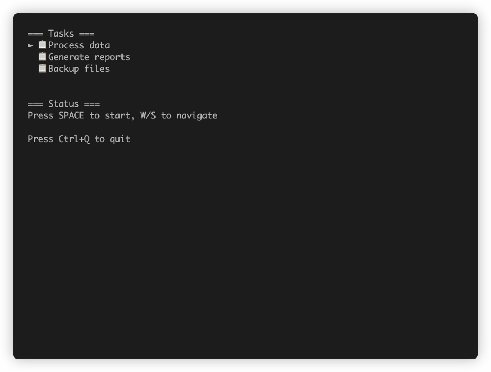
</p>

```scala
import layoutz._

case class TaskState(
    tasks: List[String],
    selected: Int,
    isLoading: Boolean,
    completed: Set[Int],
    progress: Double,
    startTime: Long,
    spinnerFrame: Int
)

sealed trait TaskMessage
case object MoveUp extends TaskMessage
case object MoveDown extends TaskMessage
case object StartTask extends TaskMessage
case object UpdateTick extends TaskMessage

object TaskApp extends LayoutzApp[TaskState, TaskMessage] {
  def init = (TaskState(
    tasks = List("Process data", "Generate reports", "Backup files"),
    selected = 0,
    isLoading = false,
    completed = Set.empty,
    progress = 0.0,
    startTime = 0,
    spinnerFrame = 0
  ), Cmd.none)

  def update(msg: TaskMessage, state: TaskState) = msg match {
    case MoveUp if !state.isLoading =>
      val newSelected =
        if (state.selected > 0) state.selected - 1 else state.tasks.length - 1
      (state.copy(selected = newSelected), Cmd.none)

    case MoveDown if !state.isLoading =>
      val newSelected =
        if (state.selected < state.tasks.length - 1) state.selected + 1 else 0
      (state.copy(selected = newSelected), Cmd.none)

    case StartTask if !state.isLoading =>
      (state.copy(
        isLoading = true,
        progress = 0.0,
        startTime = System.currentTimeMillis()
      ), Cmd.none)

    case UpdateTick if state.isLoading =>
      val elapsed = System.currentTimeMillis() - state.startTime
      val newProgress = math.min(1.0, elapsed / 3000.0)

      val newState = if (newProgress >= 1.0) {
        state.copy(
          isLoading = false,
          completed = state.completed + state.selected,
          progress = 1.0
        )
      } else {
        state.copy(progress = newProgress)
      }
      
      // Also update spinner frame
      (newState.copy(spinnerFrame = newState.spinnerFrame + 1), Cmd.none)

    case UpdateTick => (state.copy(spinnerFrame = state.spinnerFrame + 1), Cmd.none)
    case _           => (state, Cmd.none)
  }

  def subscriptions(state: TaskState) = Sub.batch(
    Sub.time.every(100, UpdateTick),
    Sub.onKeyPress {
      case CharKey('w') | ArrowUpKey   => Some(MoveUp)
      case CharKey('s') | ArrowDownKey => Some(MoveDown)
      case CharKey(' ') | EnterKey     => Some(StartTask)
      case _                           => None
    }
  )

  def view(state: TaskState) = {
    val taskList = state.tasks.zipWithIndex.map { case (task, index) =>
      val emoji =
        if (state.completed.contains(index)) "✅"
        else if (state.isLoading && index == state.selected) "⚡"
        else "📋"
      val marker = if (index == state.selected) "►" else " "
      s"$marker $emoji $task"
    }

    val status = if (state.isLoading) {
      layout(
        spinner("Processing", state.spinnerFrame),
        inlineBar("Progress", state.progress),
        f"${state.progress * 100}%.0f%% complete"
      )
    } else {
      layout("Press SPACE to start, W/S to navigate")
    }

    layout(
      section("Tasks")(Layout(taskList.map(Text))),
      section("Status")(status)
    )
  }
}

TaskApp.run
```
</details>

### Form input widgets

<details>
<summary>Build interactive forms with choice widgets</summary>

```scala
import layoutz._

case class FormState(
    name: String = "",
    mood: Int = 0,
    letters: Set[Int] = Set.empty,
    cursor: Int = 0,
    field: Int = 0
)

sealed trait Msg
case class TypeChar(c: Char) extends Msg
case object Backspace extends Msg
case object NextField extends Msg
case object MoveUp extends Msg
case object MoveDown extends Msg
case object Toggle extends Msg

object FormApp extends LayoutzApp[FormState, Msg] {
  val moods = Seq("great", "okay", "meh")
  val options = ('A' to 'F').map(_.toString).toSeq
  
  def init = (FormState(), Cmd.none)
  
  def update(msg: Msg, state: FormState) = msg match {
    case TypeChar(c) if state.field == 0 => 
      (state.copy(name = state.name + c), Cmd.none)
    case Backspace if state.field == 0 && state.name.nonEmpty =>
      (state.copy(name = state.name.dropRight(1)), Cmd.none)
    case MoveUp if state.field == 1 =>
      (state.copy(mood = (state.mood - 1 + moods.length) % moods.length), Cmd.none)
    case MoveDown if state.field == 1 =>
      (state.copy(mood = (state.mood + 1) % moods.length), Cmd.none)
    case MoveUp if state.field == 2 =>
      (state.copy(cursor = (state.cursor - 1 + options.length) % options.length), Cmd.none)
    case MoveDown if state.field == 2 =>
      (state.copy(cursor = (state.cursor + 1) % options.length), Cmd.none)
    case Toggle if state.field == 2 =>
      val newLetters = if (state.letters.contains(state.cursor))
        state.letters - state.cursor else state.letters + state.cursor
      (state.copy(letters = newLetters), Cmd.none)
    case NextField =>
      (state.copy(field = (state.field + 1) % 3), Cmd.none)
    case _ => (state, Cmd.none)
  }
  
  def subscriptions(state: FormState) = Sub.onKeyPress {
    case CharKey(' ') if state.field == 2 => Some(Toggle)
    case CharKey(c) if c.isLetterOrDigit || c == ' ' => Some(TypeChar(c))
    case BackspaceKey => Some(Backspace)
    case ArrowUpKey => Some(MoveUp)
    case ArrowDownKey => Some(MoveDown)
    case TabKey | EnterKey => Some(NextField)
    case _ => None
  }
  
  def view(state: FormState) = layout(
    textInput("Name", state.name, "Type here", state.field == 0),
    SingleChoice("How was your day?", moods, state.mood, state.field == 1),
    MultiChoice("Favorite letters?", options, state.letters, state.cursor, state.field == 2)
  )
}
```

See [FormExample.scala](examples/FormExample.scala) for a complete working example.

</details>


## Inspiration
- [ScalaTags](https://github.com/com-lihaoyi/scalatags) by Li Haoyi
- Go's [bubbletea](https://github.com/charmbracelet/bubbletea)
- Countless templating libraries via osmosis ...
