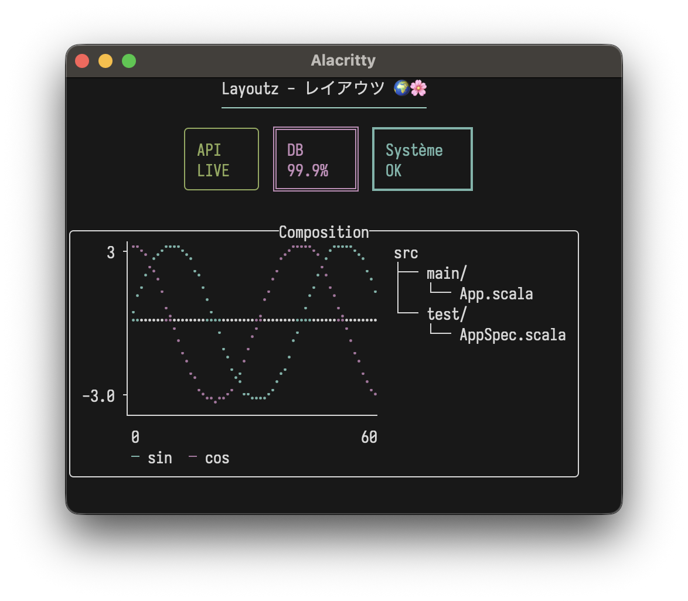

<p align="center">
  
</p>

#  layoutz
**Simple, beautiful CLI output 🪶**

A lightweight, zero-dep lib to build compositional ANSI strings, terminal plots, and interactive Elm-style TUIs in pure Scala.
Extend the `Element` trait to create your own primitives - no component-library limitations.

## Features
- Pure Scala, zero-deps — cross-platform: JVM, JS, Native
- Elm-style TUI's w/ [LayoutzApp](#interactive-apps)
- [Layout primitives](#elements) + tables, trees, lists, CJK-aware + [HasBorder](#border-styles) typeclass
- [Colors](#colors) and [ANSI styles](#styles)
- Built-in terminal [charts & plots](#charts--plots)
- [Widgets](#progress-spinners--form-widgets) — text input, spinners, progress bars
- Batteries included [commands](#commands) — async tasks, file I/O, HTTP, timers, key input

<p align="center">

<br>
<sub><a href="examples/NavLoadApp.scala">interactive task list</a> • <a href="examples/SimpleGame.scala">simple game</a></sub>
</p>

## Table of Contents
- [Installation](#installation)
- [Quick Start](#quick-start)
- [Core Concepts](#core-concepts)
- [Elements](#elements)
- [Colors & Styles](#colors)
- [Border Styles](#border-styles)
- [Charts & Plots](#charts--plots)
- [Interactive Apps](#interactive-apps)
- [Examples](#examples)

## Installation
On MavenCentral, cross-built for Scala 2.12, 2.13, 3.x (JVM, JS and Native):
```scala
"xyz.matthieucourt" %% "layoutz" % "0.6.0"
```
```bash
scala-cli repl --scala 3 --dep xyz.matthieucourt:layoutz_3:0.6.0
```
```scala
import layoutz._
```

## Quick Start

There are two usage paths with this little package:

**(1/2) Static rendering**

Beautiful + compositional strings

<details>
<summary>show code</summary>

```scala
import layoutz._

val demo = layout(
  underline("─", Color.BrightCyan)("Layoutz - レイアウツ 🌍🌸").center(),
  row(
    statusCard("API", "LIVE").border(Border.Round).color(Color.Green),
    statusCard("DB", "99.9%").border(Border.Double).color(Color.BrightMagenta),
    statusCard("Système", "OK").border(Border.Thick).color(Color.Cyan)
  ).center(),
  "",
  box("Composition")(
    columns(
      plot(width = 30, height = 8)(
        Series((0 to 60).map(i => (i.toDouble, math.sin(i * 0.15) * 3)), "sin") .color(Color.Cyan),
        Series((0 to 60).map(i => (i.toDouble, math.cos(i * 0.15) * 3)), "cos") .color(Color.Magenta)
      ),
      tree("src")(
        tree("main")(tree("App.scala")),
        tree("test")(tree("AppSpec.scala"))
      )
    )
  ).border(Border.Round).center()
)

demo.putStrLn
```

</details>
<p align="center">
  
</p>

**(2/2) Interactive apps**

Build Elm-style TUIs

```scala
import layoutz._

object CounterApp extends LayoutzApp[Int, String] {
  def init = 0

  def update(msg: String, count: Int) = msg match {
    case "inc" => count + 1
    case "dec" => count - 1
    case _     => count
  }

  def subscriptions(count: Int) =
    Sub.onKeyPress {
      case Key.Char('+') => Some("inc")
      case Key.Char('-') => Some("dec")
      case _             => None
    }

  def view(count: Int) = layout(
    section("Counter")(s"Count: $count"),
    br,
    ul("Press `+` or `-`")
  )
}

CounterApp.run
```
<p align="center">
  
</p>

## Why layoutz?
- We have `s"..."`, and [full-blown](https://github.com/oyvindberg/tui-scala) TUI libraries - but there is a gap in-between.
- With LLM's, boilerplate code that formats & "pretty-prints" is **_cheaper than ever_**...
- Thus, **_more than ever_**, "string formatting code" is spawning, and polluting domain logic
- Ultimately, **layoutz** is just a tiny, declarative DSL to combat this
- On the side, **layoutz** also has an Elm-style runtime to bring these arbitrary "Elements" to life: much like a flipbook.
   - The runtime has some little niceties built-in like common cmd's for file I/O, HTTP-requests, and a key input handler
- But at the end of the day, you can use **layoutz** merely to structure Strings (without any of the TUI stuff)

## Core Concepts

Every piece of content is an `Element`. Elements are immutable and composable.

```scala
layout(elem1, elem2, elem3)   // vertical
row(elem1, elem2)             // horizontal
elem.render                   // -> String
elem.putStrLn                 // render + print
```

Implement `Element` to create custom components that compose with all built-ins.

### Fluent API

Some typesetting elements work as both nouns ("an underline") and verbs ("to underline something").
For these, layoutz offers a fluent syntax with transformations available in infix position via dot-completion.
Both styles produce the same case classes and render identically:

Nested style:
```scala
margin(">>")(underline()("Hello\nWorld!"))
```

Fluent style:
```scala
"Hello\nWorld!".underline.margin(">>")
```

Both render:
```
>> Hello
>> World!
>> ──────
```

Available: `.center()`, `.pad()`, `.wrap()`, `.truncate()`, `.underline()`, `.margin()`, `.color()`, `.bg()`, `.style()`, `.border()`

## Elements

### Text, Layout & Spacing

```scala
"Simple text"                                // Implicit Text conversion
layout("First", "Second", "Third")           // Vertical join
row("Left", "Middle", "Right")               // Horizontal join
columns(layout("A", "B"), layout("C", "D"))  // Side-by-side columns
section("Config")(kv("env" -> "prod"))       // Titled section
br                                           // Line break
hr                                           // Horizontal rule ──────
hr.width(10).char("~")                       // ~~~~~~~~~~
space(10)                                    // Horizontal spacing
empty                                        // No-op (conditional rendering)
vr(3)                                        // Vertical rule │
```

### Key-Value Pairs, Tables

```scala
kv("name" -> "Alice", "role" -> "admin")

table(
  headers = Seq("Name", "Age", "City"),
  rows = Seq(
    Seq("Alice", "30", "New York"),
    Seq("Bob", "25"),
    Seq("Charlie", "35", "London", "Extra")
  )
)
```
```
name : Alice
role : admin

┌─────────┬─────┬─────────┐
│ Name    │ Age │ City    │
├─────────┼─────┼─────────┤
│ Alice   │ 30  │ New York│
│ Bob     │ 25  │         │
│ Charlie │ 35  │ London  │
└─────────┴─────┴─────────┘
```

### Lists

```scala
ol("Setup", ol("Install deps", ol("npm", "pip"), "Configure"), "Deploy")

ul("Backend", ul("API", ul("REST", "GraphQL"), "DB"), "Frontend")

ul("→")("Custom", "Bullets")
```
```
1. Setup
  a. Install deps
    i. npm
    ii. pip
  b. Configure
2. Deploy

• Backend
  ◦ API
    ▪ REST
    ▪ GraphQL
  ◦ DB
• Frontend

→ Custom
→ Bullets
```

### Trees

```scala
tree("Project")(
  tree("src")(
    tree("main")(tree("App.scala")),
    tree("test")(tree("AppSpec.scala"))
  )
)
```
```
Project
└── src/
    ├── main/
    │   └── App.scala
    └── test/
        └── AppSpec.scala
```

### Boxes, Cards & Banners

```scala
box("Summary")(kv("total" -> "42"))
box()(kv("total" -> "42"))
statusCard("CPU", "45%")
banner("System Dashboard").border(Border.Double)
```
```
┌──Summary───┐
│ total : 42 │
└────────────┘

┌────────────┐
│ total : 42 │
└────────────┘

┌───────┐
│ CPU   │
│ 45%   │
└───────┘

╔═══════════════════╗
║ System Dashboard  ║
╚═══════════════════╝
```

### Progress, Spinners & Form Widgets

```scala
inlineBar("Download", 0.75)
spinner("Loading...", frame = 3)
spinner("Work", frame = 0, SpinnerStyle.Line)

textInput("Username", "alice", "Enter name", active = true)
SingleChoice("Mood?", Seq("great", "okay", "meh"), selected = 0, active = true)
MultiChoice("Colors?", Seq("Red", "Blue"), selected = Set(0), cursor = 1, active = true)
```
```
Download [███████████████─────] 75%
⠸ Loading...
|| Work

> Username: alice_
> Mood?
  ► ● great
    ○ okay
    ○ meh
```
Spinner styles: `Dots` (default), `Line`, `Clock`, `Bounce`

### Underline, Margin, Padding & Truncation

```scala
"Title".underline()
"Custom".underline("=")

layout(
  "Ooops!",
  row("val result: Int = ", underline("^")("getString()")),
  "Expected Int, found String"
).margin("[error]")

"content".pad(2)

"Very long text that will be cut off".truncate(15)
"Custom ellipsis example text here".truncate(20, "…")
```
```
Title
─────
Custom
══════

[error] Ooops!
[error] val result: Int =  getString()
[error]                    ^^^^^^^^^^^
[error] Expected Int, found String

This is a ve...
Custom ellipsis ex…
```

### Text Formatting

```scala
"TITLE".center(20)
"Left".leftAlign(20)
"Right".rightAlign(20)
"Long text here that should wrap".wrap(20)
"Spread this out".justify(30)
```

### Custom Elements

Implement `Element` to create reusable components:
```scala
case class Square(size: Int) extends Element {
  def render: String = {
    if (size < 2) return ""
    val width = size * 2 - 2
    val top = "┌" + ("─" * width) + "┐"
    val middle = (1 to size - 2).map(_ => "│" + (" " * width) + "│")
    val bottom = "└" + ("─" * width) + "┘"
    (top +: middle :+ bottom).mkString("\n")
  }
}

row(Square(2), Square(4), Square(6))
```
```
┌──┐ ┌──────┐ ┌──────────┐
└──┘ │      │ │          │
     │      │ │          │
     └──────┘ │          │
              │          │
              └──────────┘
```

### Working with Collections
```scala
case class User(name: String, role: String)
val users = Seq(User("Alice", "Admin"), User("Bob", "User"), User("Tom", "User"))

section("Users by Role")(
  layout(
    users.groupBy(_.role).map { case (role, roleUsers) =>
      box(role)(ul(roleUsers.map(_.name): _*))
    }.toSeq: _*
  )
)
```

## Colors

Foreground with `.color`, background with `.bg`:

```scala
Color.Red("Error!")
"text".color(Color.BrightCyan)
"Error!".bg(Color.Red)
Color.Red.bg("Error!")
"ALERT".bg(Color.Red).color(Color.White).style(Style.Bold)
box()("warning").bg(Color.Yellow)
```

<p align="center">
  
</p>

```scala
Color.Black
Color.Red
Color.Green
Color.Yellow
Color.Blue
Color.Magenta
Color.Cyan
Color.White
Color.BrightBlack             // Bright 8
Color.BrightRed
Color.BrightGreen
Color.BrightYellow
Color.BrightBlue
Color.BrightMagenta
Color.BrightCyan
Color.BrightWhite
Color.Full(196)               // 256-color palette (0-255)
Color.True(255, 128, 0)       // 24-bit RGB
Color.NoColor                 // Conditional no-op
```

```scala
import layoutz._

/* 256-color palette gradient */
val palette = tightRow((16 to 231 by 7).map(i => "█".color(Color.Full(i))): _*)

/* RGB gradients */
val redToBlue = tightRow((0 to 255 by 8).map(i => "█".color(Color.True(i, 100, 255 - i))): _*)
val greenFade = tightRow((0 to 255 by 8).map(i => "█".color(Color.True(0, 255 - i, i))): _*)
val rainbow = tightRow((0 to 255 by 8).map { i =>
  val r = if (i < 128) i * 2 else 255
  val g = if (i < 128) 255 else (255 - i) * 2
  val b = if (i > 128) (i - 128) * 2 else 0
  "█".color(Color.True(r, g, b))
}: _*)

layout(palette, redToBlue, greenFade, rainbow)
```

<p align="center">
  
</p>

### Styles
```scala
"text".style(Style.Bold)
"text".color(Color.Red).style(Style.Bold)
"text".style(Style.Bold ++ Style.Italic ++ Style.Underline)
```

<p align="center">
  
</p>

```scala
Style.Bold
Style.Dim
Style.Italic
Style.Underline
Style.Blink
Style.Reverse
Style.Hidden
Style.Strikethrough
Style.NoStyle                 // conditional no-op
Style.Bold ++ Style.Italic    // combine with ++
```

<p align="center">
  
</p>

## Border Styles
```scala
Border.Single                              // ┌─┐ (default)
Border.Double                              // ╔═╗
Border.Thick                               // ┏━┓
Border.Round                               // ╭─╮
Border.Ascii                               // +-+
Border.Block                               // ███
Border.Dashed                              // ┌╌┐
Border.Dotted                              // ┌┈┐
Border.InnerHalfBlock                      // ▗▄▖
Border.OuterHalfBlock                      // ▛▀▜
Border.Markdown                            // |-|
Border.Custom(corner = "+", horizontal = "=", vertical = "|")
Border.None                                // no borders

// Applied via .border()
box("Title")("content").border(Border.Round)
table(h, r).border(Border.Thick)

// HasBorder typeclass for generic code
def makeThick[T: HasBorder](element: T): T = element.border(Border.Thick)
```

## Charts & Plots

#### Line Plot
```scala
val sinePoints = (0 to 100).map(i => (i.toDouble, math.sin(i * 0.1) * 10))
plot(width = 40, height = 10)(
  Series(sinePoints, "sine").color(Color.Cyan)
)
```
<p align="center">
  
</p>

Multiple series:
```scala
val sin = (0 to 50).map(i => (i.toDouble, math.sin(i * 0.15) * 5))
val cos = (0 to 50).map(i => (i.toDouble, math.cos(i * 0.15) * 5))

plot(width = 50, height = 12)(
  Series(sin, "sin(x)").color(Color.BrightCyan),
  Series(cos, "cos(x)").color(Color.BrightMagenta)
)
```

<p align="center">
  
</p>

Options: `width`, `height`, `showAxes`, `showOrigin`

#### Horizontal Chart
```scala
chart("Web" -> 10, "Mobile" -> 20, "API" -> 15)
```

#### Pie Chart
```scala
pie()(Slice(50, "A"), Slice(30, "B"), Slice(20, "C"))
```
<p align="center">
  
</p>

#### Bar Chart
```scala
bar(width = 40, height = 10)(
  Bar(85, "Mon"), Bar(120, "Tue"), Bar(95, "Wed")
)
```
<p align="center">
  
</p>

Custom colors:
```scala
bar()(
  Bar(100, "Sales").color(Color.Magenta),
  Bar(80, "Costs").color(Color.BrightRed),
  Bar(20, "Profit").color(Color.Cyan)
)
```
<p align="center">
  
</p>

#### Stacked Bar Chart
```scala
stackedBar(width = 40, height = 10)(
  StackedBar(Seq(Bar(30, "Q1"), Bar(20, "Q2"), Bar(25, "Q3")), "2022"),
  StackedBar(Seq(Bar(35, "Q1"), Bar(25, "Q2"), Bar(30, "Q3")), "2023"),
  StackedBar(Seq(Bar(40, "Q1"), Bar(30, "Q2"), Bar(35, "Q3")), "2024")
)
```
<p align="center">
  
</p>

#### Sparkline
```scala
sparkline(Seq(1, 4, 2, 8, 5, 7, 3, 6))
sparkline(Seq(10, 20, 15, 30, 25, 40, 35)).color(Color.Cyan)
```
<p align="center">
  
</p>

#### Box Plot
```scala
boxPlot(height = 12)(
  BoxData("A", min = 10, q1 = 25, median = 50, q3 = 75, max = 90).color(Color.Cyan),
  BoxData("B", min = 20, q1 = 40, median = 55, q3 = 70, max = 85).color(Color.Magenta),
  BoxData("C", min = 5, q1 = 30, median = 45, q3 = 60, max = 95).color(Color.Yellow)
)
```
<p align="center">
  
</p>

#### Heatmap
```scala
heatmap(Seq(
  Seq(1.0, 2.0, 3.0),
  Seq(4.0, 5.0, 6.0),
  Seq(7.0, 8.0, 9.0)
))

/* With labels and settings */
Heatmap(
  HeatmapData(
    rows = Seq(
      Seq(12.0, 15.0, 22.0, 28.0, 30.0, 25.0, 18.0),
      Seq(14.0, 18.0, 25.0, 32.0, 35.0, 28.0, 20.0),
      Seq(10.0, 13.0, 20.0, 26.0, 28.0, 22.0, 15.0)
    ),
    rowLabels = Seq("Mon", "Tue", "Wed"),
    colLabels = Seq("6am", "9am", "12pm", "3pm", "6pm", "9pm", "12am")
  ),
  cellWidth = 5
)
```
<p align="center">
  
</p>

Options: `cellWidth`, `cellHeight`, `showLegend`, row/column labels via `HeatmapData`.

## Interactive Apps

`LayoutzApp` uses the [Elm Architecture](https://guide.elm-lang.org/architecture/) where your
view is simply a `layoutz.Element`

```scala
trait LayoutzApp[State, Message] {
  def init: (State, Cmd[Message])
  def update(msg: Message, state: State): (State, Cmd[Message])
  def subscriptions(state: State): Sub[Message]
  def view(state: State): Element
}
```

Three daemon threads coordinate rendering (~50ms), tick/timers, and input capture. State updates flow through `update` synchronously.

```scala
app.run(
  tickIntervalMs   = 100,              // Subscription polling rate
  renderIntervalMs = 50,               // Screen refresh rate
  clearOnStart     = true,             // Clear screen on launch
  clearOnExit      = true,             // Clear screen on quit
  showQuitMessage  = false,            // Display quit hint
  quitMessage      = "Ctrl+Q to quit", // Custom quit text
  quitKey          = Key.Ctrl('Q'),    // Quit on this key
  alignment        = Alignment.Left    // Left | Center | Right
)
```

Implicit conversion: return just state instead of `(state, Cmd.none)`:
```scala
def update(msg: Msg, state: State) = msg match {
  case Increment => state.copy(count = state.count + 1)
  case LoadData  => (state.copy(loading = true), Cmd.file.read("data.txt", DataLoaded))
}
```

### Key Types
```scala
// Printable
Key.Char(c: Char)

// Editing
Key.Enter
Key.Backspace
Key.Tab
Key.Escape
Key.Delete

// Navigation
Key.Up
Key.Down
Key.Left
Key.Right
Key.Home
Key.End
Key.PageUp
Key.PageDown

// Modifiers
Key.Ctrl(c: Char)                                // Ctrl+A, Ctrl+S, etc.
Key.Unknown(code: Int)                           // Unrecognized input
```

### Subscriptions

```scala
Sub.none                                           // No subscriptions
Sub.onKeyPress { case Key.Char('q') => Some(Quit)  // Keyboard input
                 case _ => None }
Sub.time.everyMs(intervalMs, msg)                  // Periodic ticks
Sub.file.watch(path, onChange)                     // File changes
Sub.http.pollMs(url, intervalMs, onResponse)       // HTTP polling
Sub.batch(sub1, sub2, ...)                         // Combine multiple
```

```scala
def subscriptions(state: State) = Sub.batch(
  Sub.time.everyMs(100, Tick),
  Sub.file.watch("config.json", ConfigChanged),
  Sub.onKeyPress { case Key.Char('q') => Some(Quit); case _ => None }
)
```

### Commands

```scala
Cmd.none                                         // No-op (default)
Cmd.exit                                         // Exit the application
Cmd.batch(cmd1, cmd2, ...)                       // Execute multiple commands
Cmd.task(expr)(toMsg)                            // Async task, result as Either
Cmd.fire(effect)                                 // Fire and forget
Cmd.afterMs(delayMs, msg)                        // One-shot delayed message
Cmd.showCursor                                   // Show terminal cursor
Cmd.hideCursor                                   // Hide terminal cursor
Cmd.setTitle(title)                              // Set terminal window title
Cmd.file.read(path, onResult)                    // Read file
Cmd.file.write(path, content, onResult)          // Write file
Cmd.file.ls(path, onResult)                      // List directory
Cmd.file.cwd(onResult)                           // Get working directory
Cmd.http.get(url, onResult, headers)             // HTTP GET
Cmd.http.post(url, body, onResult, headers)      // HTTP POST
```

## Examples

See [examples](EXAMPLES.md) for full interactive app examples:
- Self-terminating loading bar
- File viewer with auto-reload
- Stopwatch timer
- Custom side effects with `Cmd.task`
- API poller
- Multi-endpoint monitor
- HTTP fetch on demand
- Complex task manager
- Form input widgets

## Inspiration
- [ScalaTags](https://github.com/com-lihaoyi/scalatags) by Li Haoyi
- Go's [bubbletea](https://github.com/charmbracelet/bubbletea)
- Countless templating libs via osmosis
