<div align="right">
  <sub><em>part of <a href="https://github.com/mattlianje/d4"></a> <a href="https://github.com/mattlianje/d4">d4</a></em></sub>
</div>

<p align="center">
  
</p>

#  layoutz
**Simple, beautiful CLI output 🪶**

A lightweight, zero-dep lib to build compositional ANSI strings, terminal plots, and interactive Elm-style TUI's in pure Scala.

Also in [Haskell](https://github.com/mattlianje/layoutz/tree/master/layoutz-hs), [OCaml](https://github.com/mattlianje/layoutz/tree/master/layoutz-ocaml)

## Features
- Pure Scala, zero-dependencies (JVM, Native, JS)
- Elm-style TUIs
- Layout primitives, tables, trees, lists, CJK-aware
- Colors, ANSI styles, rich formatting
- Terminal charts and plots
- Widgets: text input, spinners, progress bars
- Extend `Element` and easily create new primitives
   - (No component library limitations)
- Built-in commands (file I/O, HTTP requests, clipboard handling)

<p align="center">
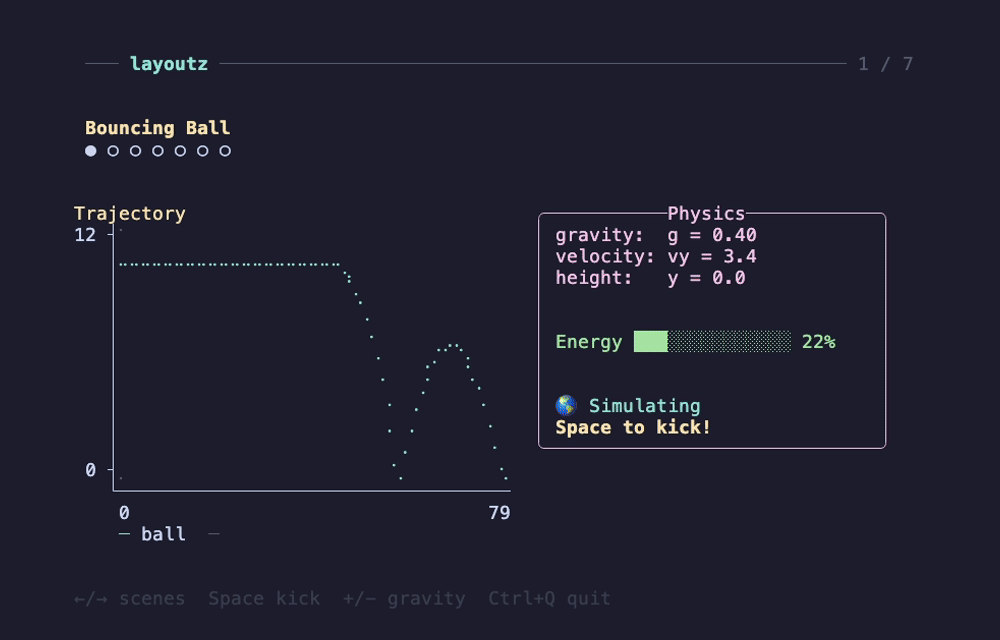
<br>
<sub><a href="examples/ShowcaseApp.scala">ShowcaseApp.scala</a></sub>
</p>

Layoutz also lets you easily drop animations into build scripts or any processes that use Stdout:

<p align="center">
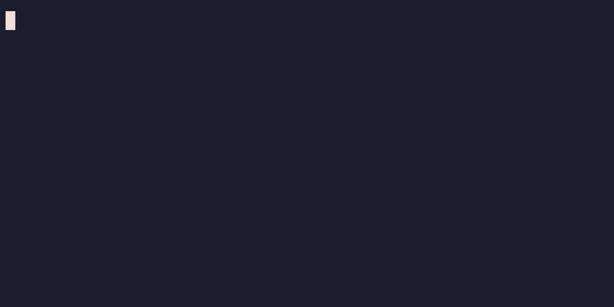
<br>
<sub><a href="examples/InlineDemo.scala">InlineDemo.scala</a></sub>
</p>

## Table of Contents
- [Installation](#installation)
- [Quick Start](#quick-start)
- [Why layoutz?](#why-layoutz)
- [Core Concepts](#core-concepts)
- [Border Styles](#border-styles)
- [Elements](#elements)
- [Colors & Styles](#colors)
- [Charts & Plots](#charts--plots)
- [Interactive Apps](#interactive-apps)
- [Prompts (Ask)](#prompts-ask)
- [Progress (loader)](#progress-loader)
- [Examples](#examples)
- [Contributing](#contributing)
- [Inspiration](#inspiration)

## Installation
On MavenCentral, cross-built for Scala 2.12, 2.13, 3.x (JVM, JS and Native):
```scala
"xyz.matthieucourt" %% "layoutz" % "0.7.0"
```
```bash
scala-cli repl --scala 3 --dep xyz.matthieucourt:layoutz_3:0.7.0
```
```scala
import layoutz._
```

## Quick Start

Three usage paths.

**(1/3) Static rendering**: pretty, composable strings.

A few primitives composed:

```scala
import layoutz._

val demo = layout(
  row(
    "Layoutz".style(Style.Bold),
    underline("^", Color.Cyan)("DEMO")
  ).center(),
  br,
  row(
    statusCard("Users", "1.2K"),
    statusCard("API", "UP").border(Border.Double),
    statusCard("CPU", "23%").border(Border.Thick).color(Color.Red),
    table(
      Seq("Name", "Role", "Skills"),
      Seq(
        Seq("Gegard", "Pugilist",
          ul("Armenian", ul("bad", ul("man")))),
        Seq("Eve", "QA", "Testing")
      )
    ).border(Border.Round).style(Style.Reverse)
  )
)

demo.putStrLn
```
<p align="center">
  
</p>

<!-- hidden for now: "scales to" demo
<details>
<summary>And here's what it scales to: colored error report, plot, nested layouts</summary>

```scala
import layoutz._

/* Model your domain as usual */
case class TypeError(
    file: String,
    line: Int,
    prefix: String,
    bad: String,
    expected: String,
    found: String,
    hint: String
)

/* Bridge to layoutz with tiny pure functions using layoutz `Element`s */
def typeError(e: TypeError): Element = {
  val ln = e.line.toString
  val bar = "│".color(Color.Cyan)
  layout(
    rowTight(
      "── TYPE MISMATCH ".color(Color.Cyan),
      s"${e.file}:${e.line}".style(Style.Dim),
      " ────────".color(Color.Cyan)
    ),
    rowTight(ln.color(Color.Cyan), space, bar, space, e.prefix, e.bad),
    rowTight(
      space(ln.length + 1),
      bar,
      space,
      space(e.prefix.length),
      ("^" * e.bad.length + " ").color(Color.Red),
      "expected ",
      e.expected.color(Color.Green),
      ", found ",
      e.found.color(Color.Red)
    ),
    rowTight(
      space(ln.length + 1),
      bar,
      space,
      "hint: ".color(Color.Cyan),
      e.hint
    )
  )
}

/* Compose and nest at will */
val demo = layout(
  underline("─", Color.BrightCyan)("Layoutz - レイアウツ 🌍🌸").center(),
  row(
    statusCard("API", "LIVE").border(Border.Round).color(Color.Green),
    statusCard("DB", "99.9%").border(Border.Double).color(Color.BrightMagenta),
    statusCard("Système", "OK").border(Border.Thick).color(Color.Cyan)
  ).center(),
  "",
  box("Composition")(
    columns(
      plot(width = 30, height = 8)(
        Series((0 to 60).map(i => (i.toDouble, math.sin(i * 0.15) * 3)), "sin").color(Color.Cyan),
        Series((0 to 60).map(i => (i.toDouble, math.cos(i * 0.15) * 3)), "cos").color(Color.Magenta)
      ),
      tree("src")(
        tree("main")(
          tree("App.scala")
        ),
        tree("test")(
          tree("AppTest.scala")
        )
      )
    )
  ).border(Border.Round).center(),
  "",
  typeError(
    TypeError(
      "Foo.scala",
      42,
      "val x: Int = ",
      "getName()",
      "Int",
      "String",
      "try `.toInt`"
    )
  )
)

/* Get pretty strings with `render` */
println(demo.render)
```

</details>
<p align="center">
  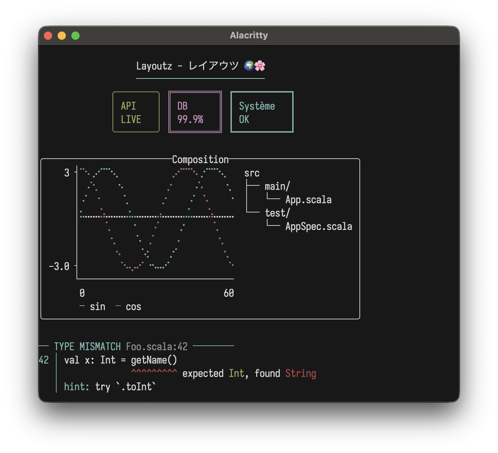
</p>
-->

**(2/3) Interactive apps**

Build Elm-style TUIs

```scala
import layoutz._

object CounterApp extends LayoutzApp[Int, String] {
  def init = 0

  def update(msg: String, count: Int) = msg match {
    case "inc" => count + 1
    case "dec" => count - 1
    case _     => count
  }

  def subscriptions(count: Int) =
    Sub.onKeyPress {
      case Key.Char('+') => Some("inc")
      case Key.Char('-') => Some("dec")
      case _             => None
    }

  def view(count: Int) = layout(
    section("Counter")(s"Count: $count"),
    br,
    ul("Press `+` or `-`")
  )
}

CounterApp.run
```
<p align="center">
  
</p>

**(3/3) Prompts (Ask)**

One-shot CLI prompts (inputs, choosers, filters, file pickers, spinners) that collapse to a single line as you answer them.

```scala
import layoutz._

val name     = Ask.input("Name › ", placeholder = "anonymous")
val realm    = Ask.choose("Choose a realm", Seq("The Shire", "Rivendell", "Mirkwood"))
val packs    = Ask.chooseMany("Pack provisions", Seq("lembas", "pipe-weed", "rope"), limit = 3)
val member   = Ask.filter("Search a companion › ", Seq("Bilbo", "Gandalf", "Thorin"))
val riddle   = Ask.write("Pose a riddle", placeholder = "This thing all things devours…")
val quest    = Ask.confirm("Venture on the quest?", default = true)
val smaug    = Ask.spin("Awaking Smaug…") { Thread.sleep(1500); "ready" }
```
<p align="center">

<br>
<sub><a href="examples/AskDemo.scala">AskDemo.scala</a></sub>
</p>

## Why layoutz?
We have `s"..."`, and [full-blown](https://github.com/oyvindberg/tui-scala) TUI libraries - but there is a gap in-between.

With LLM's, boilerplate code that formats & "pretty-prints" is **_cheaper than ever_**...
Thus, **_more than ever_**, "string formatting code" is spawning, and polluting domain logic. 

Ultimately, **layoutz** is just a tiny, declarative DSL to combat this (and on the side it has a humble runtime to animate your strings, much like a flipbook,
with sime niceties like common cmd's for handling keyboard input, HTTP requests and file I/O)

But at the end of the day, you can use **layoutz** merely to structure Strings (without any of the TUI stuff)

## Core Concepts

Every piece of content is an `Element`. Elements are immutable and composable.

```scala
layout(elem1, elem2, elem3)   // vertical
row(elem1, elem2)             // horizontal
elem.render                   // gives a String
elem.putStrLn                 // prints to console
```

Implement `Element` to create custom components that compose with all built-ins.

### Fluent API

Some typesetting elements work as both nouns ("an underline") and verbs ("to underline something").
For these, layoutz offers a fluent syntax with transformations available in infix position via dot-completion.
Both styles produce the same case classes and render identically:

```scala
/* Nested style */
margin(">>")(underline()("Hello\nWorld!"))

/* Fluent style */
"Hello\nWorld!".underline.margin(">>")

// Both render:
// >> Hello
// >> World!
// >> ──────
```

Available methods:
```
.center()
.pad()
.wrap()
.truncate()
.underline()
.margin()
.color()
.colorBg()
```

## Border Styles

Applied via `.border()` to any element with the `HasBorder` typeclass (`box`, `statusCard`, `table`):
```scala
box("Title")("content").border(Border.Round)
table(h, r).border(Border.Thick)

// HasBorder typeclass for generic code
def makeThick[T: HasBorder](element: T): T = element.border(Border.Thick)
```

```scala
Border.Single                              // ┌─┐ (default)
Border.Double                              // ╔═╗
Border.Thick                               // ┏━┓
Border.Round                               // ╭─╮
Border.Ascii                               // +-+
Border.Block                               // ███
Border.Dashed                              // ┌╌┐
Border.Dotted                              // ┌┈┐
Border.InnerHalfBlock                      // ▗▄▖
Border.OuterHalfBlock                      // ▛▀▜
Border.Markdown                            // |-|
Border.Custom(corner = "+", horizontal = "=", vertical = "|")
Border.None                                // no borders
```

## Elements

### Layout

#### Stacking & rows
```scala
layout("First", "Second", "Third")
// First
// Second
// Third

row("Left", "Middle", "Right")
// Left Middle Right

columns(layout("A", "B"), layout("C", "D"))
// A  C
// B  D
```

#### Spacing & rules
```scala
layout("Line 1", br, "Line 2")

hr                         // ──────────────...
hr.char("~")               // custom char
hr.width(10).char("=")     // ==========

vr(3)
space(10)
empty
```

#### Text transforms
```scala
"TITLE".center(20)     // │        TITLE       │
"Left".leftAlign(20)   // │Left                │
"Right".rightAlign(20) // │               Right│

"Spread this out".justify(30)
// │Spread         this        out│

"Long text here that should wrap".wrap(20)
// Long text here that
// should wrap

"Very long text that will be cut off".truncate(15)    // Very long te...
"Custom ellipsis example text here".truncate(20, "…") // Custom ellipsis exa…

"content".pad(2)
// │           │
// │           │
// │  content  │
// │           │
// │           │

"Title".underline()
// Title
// ─────
"Custom".underline("=")
// Custom
// ══════

layout(
  "Ooops!",
  row("val result: Int = ", underline("^")("getString()")),
  "Expected Int, found String"
).margin("[error]")
// [error] Ooops!
// [error] val result: Int =  getString()
// [error]                    ^^^^^^^^^^^
// [error] Expected Int, found String
```
<!-- pics hidden for now: pix/example-vr.png, pix/example-compiler.png -->

### Content

#### Basics
```scala
"Simple text"

section("Config")(kv("env" -> "prod"))
// === Config ===
// env: prod

kv("name" -> "Alice", "role" -> "admin")
// name: Alice
// role: admin
```

#### Boxes, cards & banners
```scala
box("Summary")(kv("total" -> "42"))
// ┌──Summary──┐
// │ total: 42 │
// └───────────┘

box("Fancy")("content").border(Border.Double)
// ╔══Fancy══╗
// ║ content ║
// ╚═════════╝

box("Smooth")("content").border(Border.Round)
// ╭──Smooth──╮
// │ content  │
// ╰──────────╯

row(statusCard("CPU", "45%"), statusCard("MEM", "2.1G"))
// ┌───────┐ ┌────────┐
// │ CPU   │ │ MEM    │
// │ 45%   │ │ 2.1G   │
// └───────┘ └────────┘

banner("System Dashboard").border(Border.Double)
// ╔══════════════════╗
// ║ System Dashboard ║
// ╚══════════════════╝
```

#### Lists & trees
```scala
ul("Backend", ul("API", ul("REST", "GraphQL"), "DB"), "Frontend")
// • Backend
//   ◦ API
//     ▪ REST
//     ▪ GraphQL
//   ◦ DB
// • Frontend

ol("Setup", ol("Install deps", ol("npm", "pip"), "Configure"), "Deploy")
// 1. Setup
//   a. Install deps
//     i. npm
//     ii. pip
//   b. Configure
// 2. Deploy

tree("Project")(
  tree("src")(
    tree("main")(tree("App.scala")),
    tree("test")(tree("AppTest.scala"))
  )
)
// Project
// └── src/
//     ├── main/
//     │   └── App.scala
//     └── test/
//         └── AppTest.scala
```

#### Table
```scala
table(
  headers = Seq("Name", "Age", "City"),
  rows = Seq(
    Seq("Alice", "30", "New York"),
    Seq("Bob", "25"),
    Seq("Charlie", "35", "London")
  )
)
// ┌─────────┬─────┬──────────┐
// │ Name    │ Age │ City     │
// ├─────────┼─────┼──────────┤
// │ Alice   │ 30  │ New York │
// │ Bob     │ 25  │          │
// │ Charlie │ 35  │ London   │
// └─────────┴─────┴──────────┘
```

#### Progress & spinners
```scala
inlineBar("Download", 0.75)
// Download [███████████████─────] 75%

spinner("Loading", frame, SpinnerStyle.Dots)   // ⠋ ⠙ ⠹ ⠸ ⠼ ⠴ ⠦ ⠧ ⠇ ⠏
spinner("Loading", frame, SpinnerStyle.Line)   // | / - \
spinner("Loading", frame, SpinnerStyle.Clock)  // 🕐 🕑 🕒 🕓 🕔 🕕 🕖 🕗 🕘 🕙 🕚 🕛
spinner("Loading", frame, SpinnerStyle.Bounce) // ⠁ ⠂ ⠄ ⠂
spinner("Loading", frame, SpinnerStyle.Earth)  // 🌍 🌎 🌏
spinner("Loading", frame, SpinnerStyle.Moon)   // 🌑 🌒 🌓 🌔 🌕 🌖 🌗 🌘
spinner("Loading", frame, SpinnerStyle.Grow)   // ▏ ▎ ▍ ▌ ▋ ▊ ▉ █ ▉ ▊ ▋ ▌ ▍ ▎
spinner("Loading", frame, SpinnerStyle.Arrow)  // ← ↖ ↑ ↗ → ↘ ↓ ↙
```

#### Inline Image: `kitty.image`

You can inline raster images via the [kitty graphics protocol](https://sw.kovidgoyal.net/kitty/graphics-protocol/).

Layoutz **KittyImage** s compose with all the other built in elements so you can drop them into boxes, tables etc.
```scala
layout(
  row(
    box("the gracie hunter")(kitty.image("pix/sakuraba.png", cols = 35, rows = 14)),
    box("stats")(kv("flying" -> "yes", "opponent" -> "grounded", "rules" -> "PRIDE"))
  )
).putStrLn
```
<p align="center">
  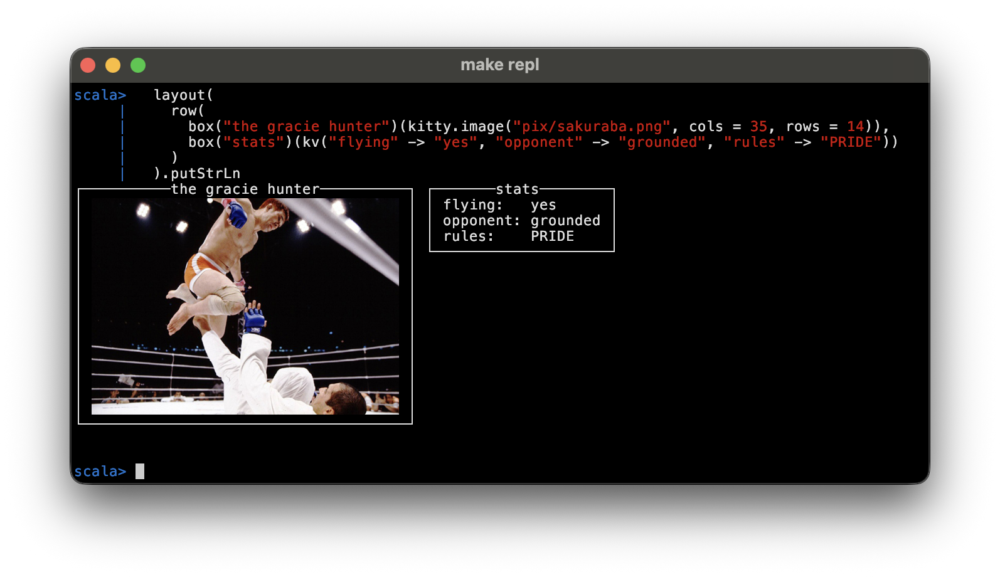
</p>

You can also build an image straight from raw RGBA pixels with `kittyRGBA`:
```scala
val (w, h) = (96, 96)
val pixels = Array.tabulate(w * h * 4) { i =>
  val p = i / 4; val x = p % w; val y = p / w
  (i % 4 match {
    case 0 => x * 255 / w
    case 1 => y * 255 / h
    case 2 => 255 - (x * 255 / w)
    case _ => 255
  }).toByte
}

val pic = kittyRGBA(pixels, pxW = w, pxH = h, cols = 18, rows = 9)

box("gradient")(pic).putStrLn
```
<p align="center">
  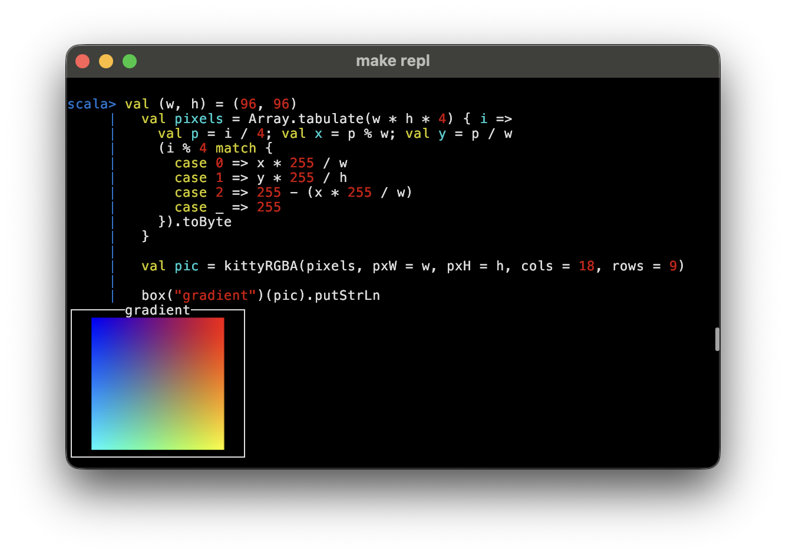
</p>

You needs a kitty-graphics-capable terminal (kitty, WezTerm, Ghostty)..


### Widgets

#### Form Widgets

```scala
textInput("Username", "alice", "Enter name", active = true)
SingleChoice("Mood?", Seq("great", "okay", "meh"), selected = 0, active = true)
MultiChoice("Colors?", Seq("Red", "Blue"), selected = Set(0), cursor = 1, active = true)
// > Username: alice_
// > Mood?
//   ► ● great
//     ○ okay
//     ○ meh
```

### Escape Hatches

#### Custom Elements

Implement `Element` to create reusable components:
```scala
case class Square(size: Int) extends Element {
  def render: String = {
    if (size < 2) return ""
    val width = size * 2 - 2
    val top = "┌" + ("─" * width) + "┐"
    val middle = (1 to size - 2).map(_ => "│" + (" " * width) + "│")
    val bottom = "└" + ("─" * width) + "┘"
    (top +: middle :+ bottom).mkString("\n")
  }
}

row(Square(2), Square(4), Square(6))
// ┌──┐ ┌──────┐ ┌──────────┐
// └──┘ │      │ │          │
//      │      │ │          │
//      └──────┘ │          │
//               │          │
//               └──────────┘
```
<!-- pic hidden for now: pix/example-custom.png -->

#### Working with Collections
```scala
case class User(name: String, role: String)
val users = Seq(User("Alice", "Admin"), User("Bob", "User"), User("Tom", "User"))

section("Users by Role")(
  layout(
    users.groupBy(_.role).map { case (role, roleUsers) =>
      box(role)(ul(roleUsers.map(_.name): _*))
    }.toSeq: _*
  )
)
```

## Colors

Foreground with `.color`, background with `.bg`:

```scala
Color.Red("Error!")
"text".color(Color.BrightCyan)
"Error!".bg(Color.Red)
Color.Red.bg("Error!")
"ALERT".bg(Color.Red).color(Color.White).style(Style.Bold)
box()("warning").bg(Color.Yellow)
```

<p align="center">
  
</p>

```scala
Color.Black
Color.Red
Color.Green
Color.Yellow
Color.Blue
Color.Magenta
Color.Cyan
Color.White
Color.BrightBlack
Color.BrightRed
Color.BrightGreen
Color.BrightYellow
Color.BrightBlue
Color.BrightMagenta
Color.BrightCyan
Color.BrightWhite
Color.Full(196)               // 256-color palette (0-255)
Color.True(255, 128, 0)       // 24-bit RGB
Color.NoColor                 // Conditional no-op
```

```scala
import layoutz._

val palette = tightRow((16 to 231 by 7).map(i => "█".color(Color.Full(i))): _*)

val redToBlue = tightRow((0 to 255 by 8).map(i => "█".color(Color.True(i, 100, 255 - i))): _*)
val greenFade = tightRow((0 to 255 by 8).map(i => "█".color(Color.True(0, 255 - i, i))): _*)
val rainbow = tightRow((0 to 255 by 8).map { i =>
  val r = if (i < 128) i * 2 else 255
  val g = if (i < 128) 255 else (255 - i) * 2
  val b = if (i > 128) (i - 128) * 2 else 0
  "█".color(Color.True(r, g, b))
}: _*)

layout(palette, redToBlue, greenFade, rainbow)
```

<p align="center">
  
</p>

### Styles
```scala
"text".style(Style.Bold)
"text".color(Color.Red).style(Style.Bold)
"text".style(Style.Bold ++ Style.Italic ++ Style.Underline)
```

<p align="center">
  
</p>

```scala
Style.Bold
Style.Dim
Style.Italic
Style.Underline
Style.Blink
Style.Reverse
Style.Hidden
Style.Strikethrough
Style.NoStyle                 // conditional no-op
Style.Bold ++ Style.Italic    // combine with ++
```

<p align="center">
  
</p>

## Charts & Plots

#### Line Plot
```scala
val sinePoints = (0 to 100).map(i => (i.toDouble, math.sin(i * 0.1) * 10))
plot(width = 40, height = 10)(
  Series(sinePoints, "sine").color(Color.Cyan)
)
```
<p align="center">
  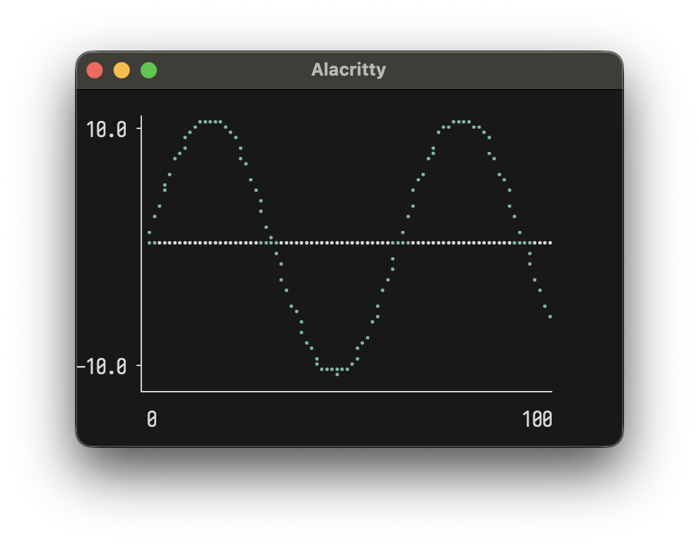
</p>

Multiple series:
```scala
val sin = (0 to 50).map(i => (i.toDouble, math.sin(i * 0.15) * 5))
val cos = (0 to 50).map(i => (i.toDouble, math.cos(i * 0.15) * 5))

plot(width = 50, height = 12)(
  Series(sin, "sin(x)").color(Color.BrightCyan),
  Series(cos, "cos(x)").color(Color.BrightMagenta)
)
```

<p align="center">
  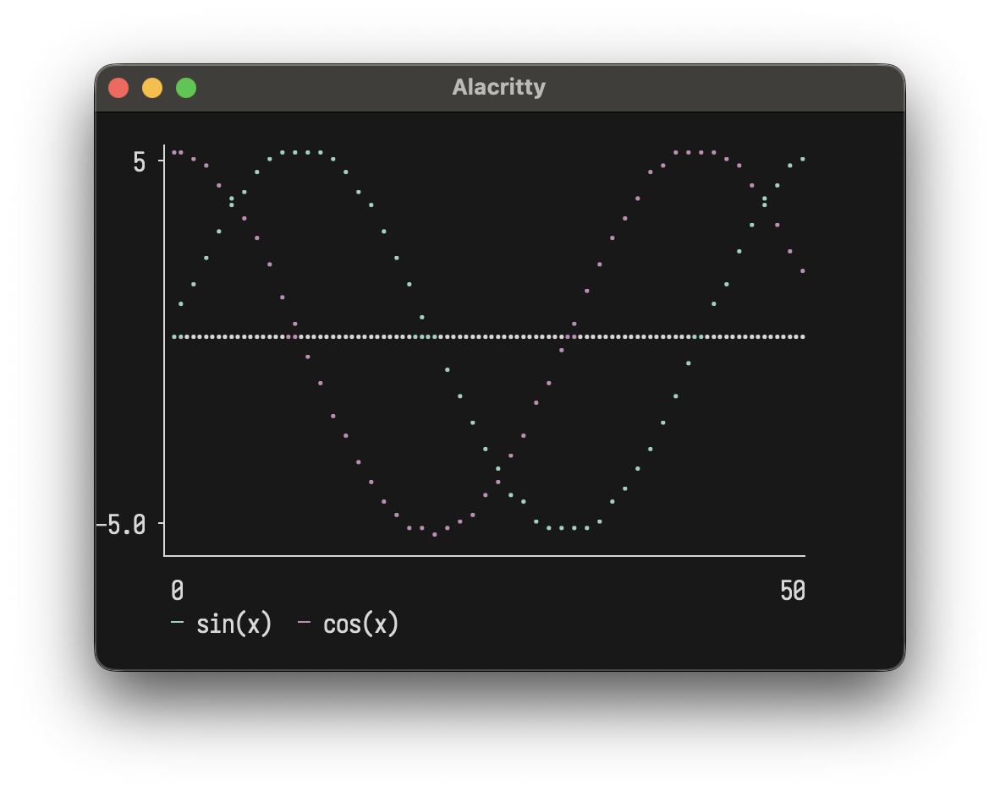
</p>

Options: `width`, `height`, `showAxes`, `showOrigin`

#### Horizontal Chart
```scala
chart("Web" -> 10, "Mobile" -> 20, "API" -> 15)
```

#### Pie Chart
```scala
pie()(
  Slice(50, "Liquor"),
  Slice(20, "Protein"),
  Slice(10, "Water"),
  Slice(20, "Fun")
)
```
<p align="center">
  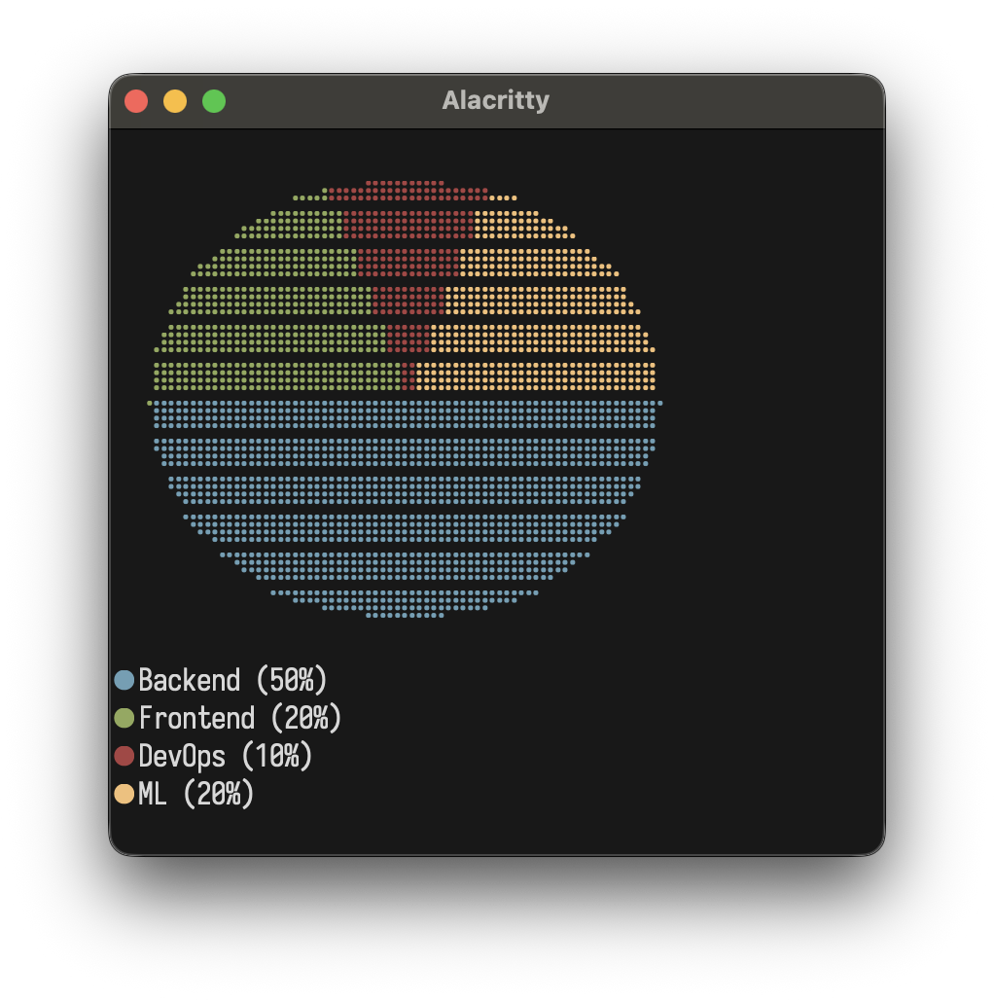
</p>

#### Bar Chart
```scala
bar(width = 40, height = 10)(
  Bar(100, "Mon"), Bar(120, "Tue"), Bar(110, "Wed"),
  Bar(85, "Thu"), Bar(115, "Fri")
)
```
<p align="center">
  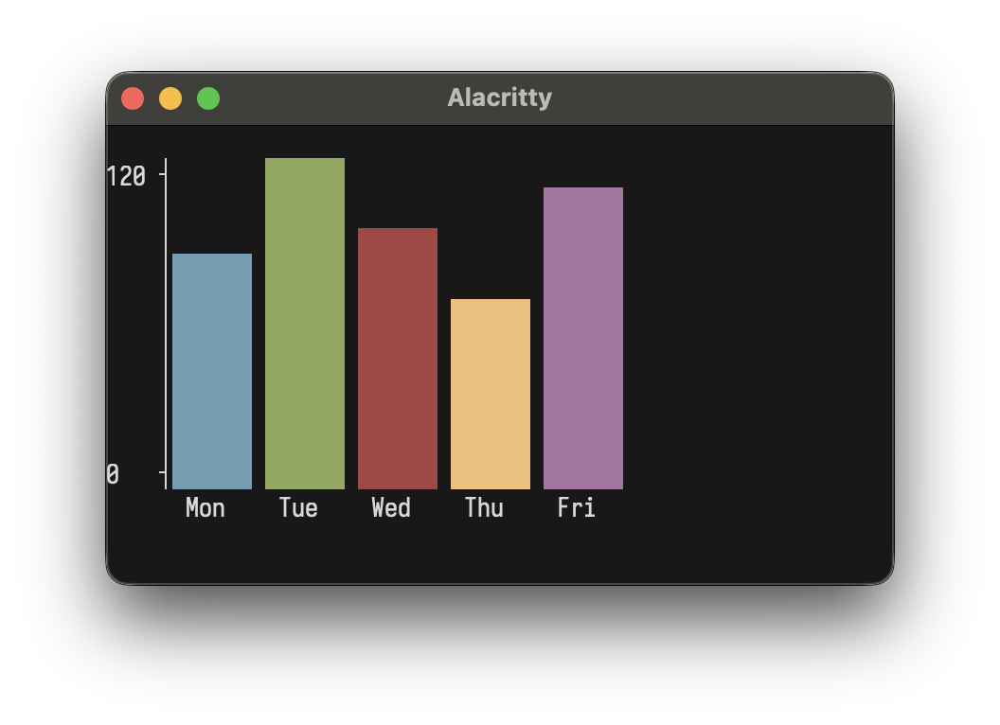
</p>

Custom colors:
```scala
bar()(
  Bar(100, "Sales").color(Color.Magenta),
  Bar(80, "Costs").color(Color.BrightRed),
  Bar(20, "Profit").color(Color.Cyan)
)
```
<p align="center">
  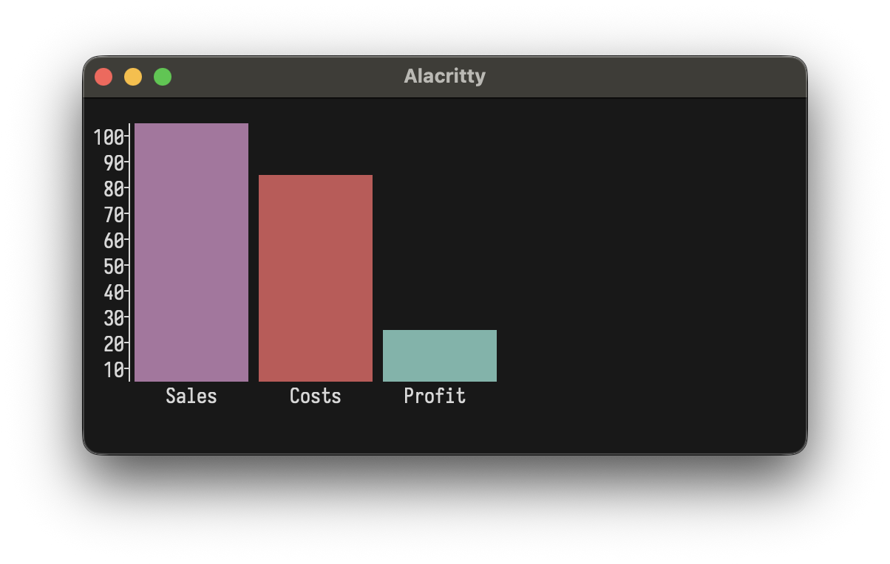
</p>

#### Stacked Bar Chart
```scala
stackedBar(width = 40, height = 10)(
  StackedBar(Seq(Bar(30, "Q1"), Bar(20, "Q2"), Bar(25, "Q3")), "2022"),
  StackedBar(Seq(Bar(35, "Q1"), Bar(25, "Q2"), Bar(30, "Q3")), "2023"),
  StackedBar(Seq(Bar(40, "Q1"), Bar(30, "Q2"), Bar(35, "Q3")), "2024")
)
```
<p align="center">
  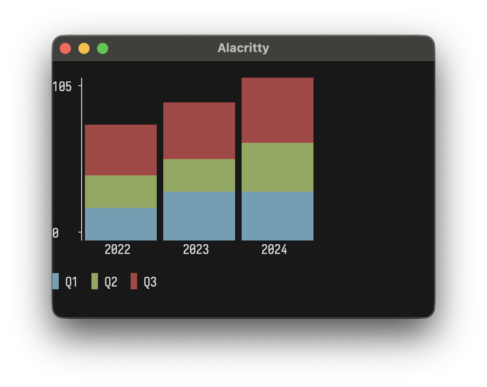
</p>

#### Sparkline
```scala
sparkline(Seq(1, 4, 2, 8, 5, 7, 3, 6))
sparkline(Seq(10, 20, 15, 30, 25, 40, 35)).color(Color.Cyan)
```
<p align="center">
  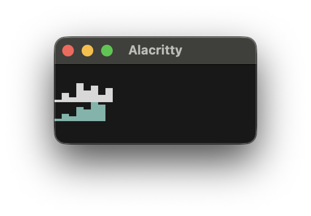
</p>

#### Box Plot
```scala
boxPlot(height = 12)(
  BoxData("A", min = 10, q1 = 25, median = 50, q3 = 75, max = 90).color(Color.Cyan),
  BoxData("B", min = 20, q1 = 40, median = 55, q3 = 70, max = 85).color(Color.Magenta),
  BoxData("C", min = 5, q1 = 30, median = 45, q3 = 60, max = 95).color(Color.Yellow)
)
```
<p align="center">
  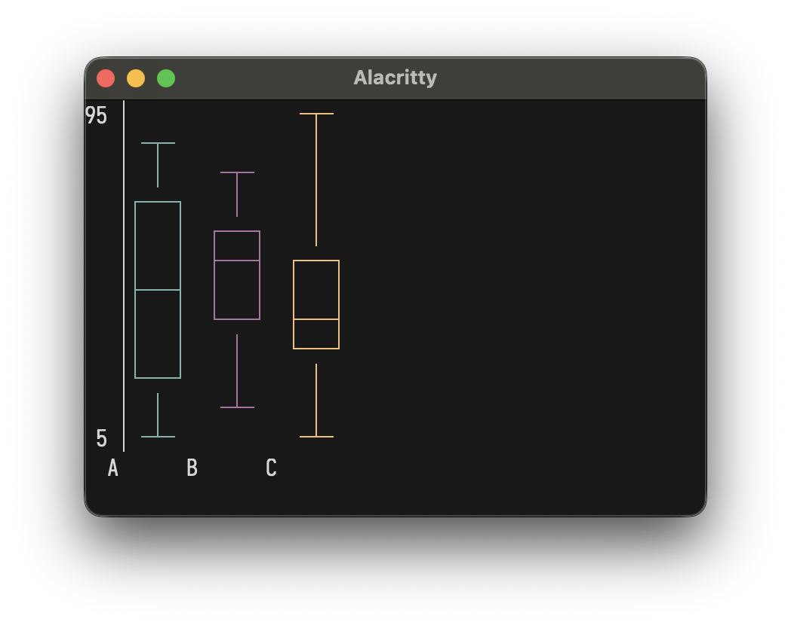
</p>

#### Heatmap
```scala
heatmap(Seq(
  Seq(1.0, 2.0, 3.0),
  Seq(4.0, 5.0, 6.0),
  Seq(7.0, 8.0, 9.0)
))

Heatmap(
  HeatmapData(
    rows = Seq(
      Seq(12.0, 15.0, 22.0, 28.0, 30.0, 25.0, 18.0),
      Seq(14.0, 18.0, 25.0, 32.0, 35.0, 28.0, 20.0),
      Seq(10.0, 13.0, 20.0, 26.0, 28.0, 22.0, 15.0)
    ),
    rowLabels = Seq("Mon", "Tue", "Wed"),
    colLabels = Seq("6am", "9am", "12pm", "3pm", "6pm", "9pm", "12am")
  ),
  cellWidth = 5
)
```
<p align="center">
  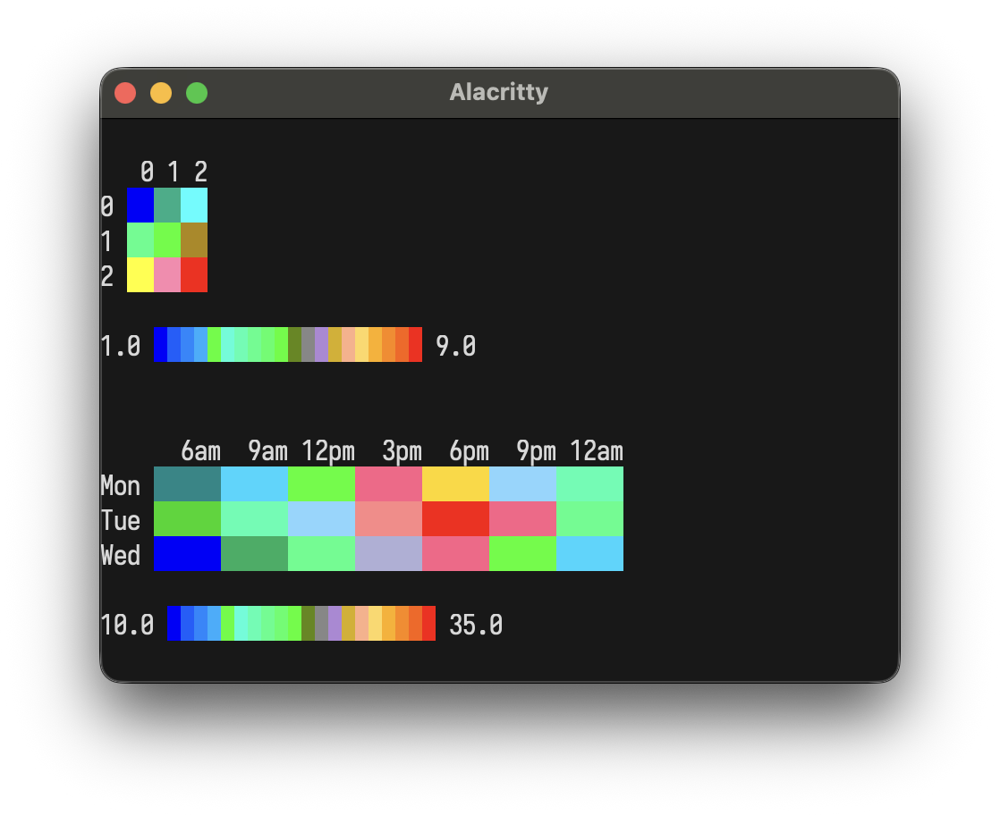
</p>


## Interactive Apps

`LayoutzApp` uses the [Elm Architecture](https://guide.elm-lang.org/architecture/) where your
view is a `layoutz.Element`

> [!WARNING]
> `LayoutzApp` is currently JVM + Native only

```scala
trait LayoutzApp[State, Message] {
  def init: (State, Cmd[Message])
  def update(msg: Message, state: State): (State, Cmd[Message])
  def subscriptions(state: State): Sub[Message]
  def view(state: State): Element
}
```

Three daemon threads coordinate rendering (~50ms), tick/timers, and input capture. State updates flow through `update` synchronously. Rendering uses incremental line-diffing: only changed lines are redrawn, eliminating flicker.

```scala
app.run(
  tickIntervalMs   = 100,              // Subscription polling rate
  renderIntervalMs = 50,               // Screen refresh rate
  clearOnStart     = true,             // Clear screen on launch
  clearOnExit      = true,             // Clear screen on quit
  showQuitMessage  = false,            // Display quit hint
  quitMessage      = "Ctrl+Q to quit", // Custom quit text
  quitKey          = Key.Ctrl('Q'),    // Quit on this key
  alignment        = Alignment.Left    // Left | Center | Right
)
```

Implicit conversion: return just state instead of `(state, Cmd.none)`:
```scala
def update(msg: Msg, state: State) = msg match {
  case Increment => state.copy(count = state.count + 1)
  case LoadData  => (state.copy(loading = true), Cmd.file.read("data.txt", DataLoaded))
}
```

### Key Types
```scala
// Printable
Key.Char(c: Char)

// Editing
Key.Enter
Key.Backspace
Key.Tab
Key.Escape
Key.Delete

// Navigation
Key.Up
Key.Down
Key.Left
Key.Right
Key.Home
Key.End
Key.PageUp
Key.PageDown

// Modifiers
Key.Ctrl(c: Char)        // Ctrl+A, Ctrl+S, etc.
Key.Unknown(code: Int)   // Unrecognized input
```

### Subscriptions

```scala
Sub.none                                           // No subscriptions
Sub.onKeyPress { case Key.Char('q') => Some(Quit)  // Keyboard input
                 case _ => None }
Sub.time.everyMs(intervalMs, msg)                  // Periodic ticks
Sub.file.watch(path, onChange)                     // File changes
Sub.http.pollMs(url, intervalMs, onResponse)       // HTTP polling
Sub.batch(sub1, sub2, ...)                         // Combine multiple
```

```scala
def subscriptions(state: State) = Sub.batch(
  Sub.time.everyMs(100, Tick),
  Sub.file.watch("config.json", ConfigChanged),
  Sub.onKeyPress { case Key.Char('q') => Some(Quit); case _ => None }
)
```

### Commands

```scala
Cmd.none                                         // No-op (default)
Cmd.exit                                         // Exit the application
Cmd.batch(cmd1, cmd2, ...)                       // Execute multiple commands
Cmd.task(expr)(toMsg)                            // Async task, result as Either
Cmd.fire(effect)                                 // Fire and forget
Cmd.afterMs(delayMs, msg)                        // One-shot delayed message
Cmd.showCursor                                   // Show terminal cursor
Cmd.hideCursor                                   // Hide terminal cursor
Cmd.setTitle(title)                              // Set terminal window title
Cmd.file.read(path, onResult)                    // Read file
Cmd.file.write(path, content, onResult)          // Write file
Cmd.file.ls(path, onResult)                      // List directory
Cmd.file.cwd(onResult)                           // Get working directory
Cmd.http.get(url, onResult, headers)             // HTTP GET
Cmd.http.post(url, body, onResult, headers)      // HTTP POST
Cmd.clipboard.read(onResult)                     // Read clipboard
Cmd.clipboard.write(content, onResult)           // Write clipboard
```

## Prompts (Ask)

You often want to have one-shot CLI prompts, spinners, filters, file pickers etc in your Scala
programs ... and dropping down into "Elm-territory" and thinking about things as a flipbook
each time can get a bit tedious.

This is why **layoutz** offers one-shot CLI actions with `Ask.*`


```scala
import layoutz._

val name   = Ask.input("Name › ", placeholder = "anonymous")
val ok     = Ask.confirm("Venture on the quest?", default = true)
val realm  = Ask.choose("Choose a realm", Seq("Shire", "Rivendell", "Mirkwood"))
val packs  = Ask.chooseMany("Provisions", Seq("lembas", "pipe-weed", "rope"), limit = 3)
val riddle = Ask.write("Pose a riddle", placeholder = "All things it devours…")
val member = Ask.filter("Search > ", Seq("Bilbo", "Balin", "Dwalin", "Thorin"))
val path   = Ask.file(start = ".")
val answer = Ask.spin("Awaking Smaug…") { Thread.sleep(1500); 42 }

Ask.pager(longString)
```

<p align="center">

<br>
<sub><a href="examples/AskMini.scala">AskMini.scala</a></sub>
</p>

```
Call                                      Returns
----                                      -------
Ask.input(prompt, placeholder, initial)   Option[String]
Ask.confirm(q, default)                   Boolean          
Ask.choose(prompt, items)                 Option[A] 
Ask.chooseMany(prompt, items, limit)      Option[Seq[A]]
Ask.write(prompt, placeholder)            Option[String]   
Ask.filter(prompt, items)                 Option[A]
Ask.file(start, height)                   Option[String]
Ask.pager(content, height, lineNumbers)   Unit
Ask.spin(label) { task }                  A
```


## Progress (loader)

Wrap any iterable or iterator: a bounded `Iterable` gets a live bar, an unbounded
`Iterator` gets a spinner with a running count. Loop as usual:

```scala
for (file <- loader("Resizing", imageFiles))       resize(file)
for (row  <- loader(rows))                          insert(row)
for (line <- loader.stream("Tailing", logLines()))  index(line)
```

Chain a style to change the look: `.blocks` (default), `.bar`, `.ascii`,
`.dots`, `.line`, `.pipes`, or `.styled(...)` for a custom one:

```scala
for (id  <- loader("Reindexing", docIds).ascii)  reindex(id)
for (url <- loader("Crawling", urls).styled(fill = '▰', empty = '▱', color = Color.BrightMagenta))
  fetch(url)
```

Every built-in style, then an unbounded stream:

```scala
import layoutz._

for (_ <- loader("Blocks ", 1 to 60).blocks) Thread.sleep(16)
for (_ <- loader("Dots   ", 1 to 60).dots)   Thread.sleep(16)
for (_ <- loader("Line   ", 1 to 60).line)   Thread.sleep(16)
for (_ <- loader("Pipes  ", 1 to 60).pipes)  Thread.sleep(16)
for (_ <- loader("Bar    ", 1 to 60).bar)    Thread.sleep(16)
for (_ <- loader("Ascii  ", 1 to 60).ascii)  Thread.sleep(16)

// Unknown size: spinner + running count
val it = Iterator.from(1).take(90)
for (_ <- loader.stream("Streaming", it)) Thread.sleep(45)
```

<p align="center">

<br>
<sub><a href="examples/LoaderExample.scala">LoaderExample.scala</a></sub>
</p>

## Examples

Interactive TUI apps built with `LayoutzApp` and its `Cmd` / `Sub` effects. Each is a runnable file:

- [CounterApp.scala](examples/CounterApp.scala): minimal counter, the smallest complete app
- [FileViewer.scala](examples/FileViewer.scala): watch and display file contents (`Cmd.file.read`, `Sub.file.watch`)
- [StopwatchApp.scala](examples/StopwatchApp.scala): start/pause timer driven by `Sub.time.everyMs`
- [SideEffectApp.scala](examples/SideEffectApp.scala): async work with `Cmd.task`, fire-and-forget with `Cmd.fire`
- [ApiPoller.scala](examples/ApiPoller.scala): poll an endpoint with `Sub.http.pollMs`
- [MultiMonitor.scala](examples/MultiMonitor.scala): monitor several APIs at once with `Sub.batch`
- [HttpFetcher.scala](examples/HttpFetcher.scala): fetch on demand with `Cmd.http.get`
- [ClipboardApp.scala](examples/ClipboardApp.scala): copy/paste with `Cmd.clipboard`
- [FormExample.scala](examples/FormExample.scala): text input and choice widgets
- [NavLoadApp.scala](examples/NavLoadApp.scala): task manager with navigation, progress tracking, stateful emojis
- [SimpleGame.scala](examples/SimpleGame.scala): grid game, collect gems and avoid enemies

<p align="center">
  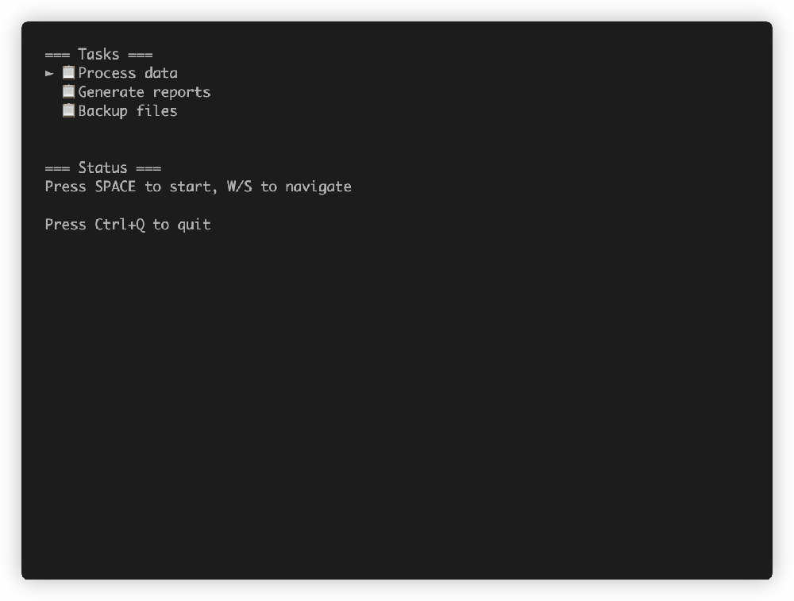
  <br>
  <sub><a href="examples/NavLoadApp.scala">NavLoadApp.scala</a></sub>
</p>

<p align="center">
  
  <br>
  <sub><a href="examples/SimpleGame.scala">SimpleGame.scala</a></sub>
</p>

## Contributing

You need [Mill](https://mill-build.org) and a JDK (11+).

```bash
make test          # run all tests (JVM, JS, Native)
make compile       # compile all platforms
make repl          # Scala 3 REPL with layoutz loaded
make fmt           # scalafmt
```

Fork, make your change, `make test`, open a PR. Keep it zero-dep.

## Inspiration
- [ScalaTags](https://github.com/com-lihaoyi/scalatags) by Li Haoyi
- Go's [bubbletea](https://github.com/charmbracelet/bubbletea)
- Countless templating libs via osmosis
