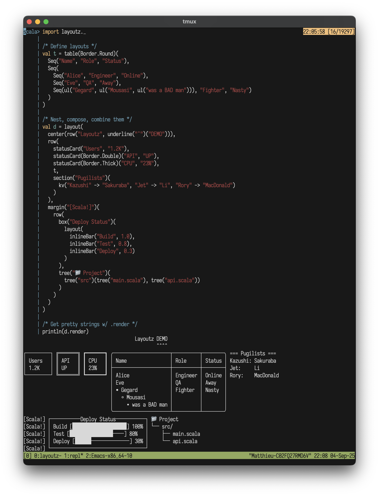

<p align="center">
  
</p>

#  layoutz
**Simple, beautiful CLI output 🪶**

Build declarative and composable sections, trees, tables, dashboards, and interactive Elm-style apps for your consoles. Part of [d4](https://github.com/mattlianje/d4)

## Features
- Zero dependencies, use **Layoutz.scala** like a header-file
- Effortless composition of elements
- Rich text formatting: alignment, wrapping, justification, underlines
- Lists, trees, tables, charts, progress bars, spinners, and more
- Thread-safe, purely functional rendering
- Use `LayoutzApp` trait for Elm-style interactive terminal applications

<p align="center">
  
</p>

## Installation
**layoutz** is on MavenCentral and cross-built for Scala, 2.12, 2.13, 3.x
```scala
"xyz.matthieucourt" %% "layoutz" % "0.1.0"
```
Or try in REPL:
```bash
scala-cli repl --scala 3 --dep xyz.matthieucourt:layoutz_3:0.1.0
```

All you need:
```scala
import layoutz._
```

## Quickstart
```scala
val demo = layout(
  center(underline("Test Dashboard", "^")),
  br,
  row(
    statusCard("API", "LIVE", Border.Double),
    statusCard("DB", "99.9%"),
    statusCard("Cache", "READY", Border.Thick)
  ),
  br,
  box("Services", Border.Round)(
    ul("Production",
      ul("→")("auth-service"),
      "Staging",
      ul("test-api",
        ul("more nest"))),
    br,
    inlineBar("Health", 0.94)
  )
).render
```
```
           Test Dashboard
           ^^^^^^^^^^^^^^

╔════════╗ ┌─────────┐ ┏━━━━━━━━━┓
║ API    ║ │ DB      │ ┃ Cache   ┃
║ LIVE   ║ │ 99.9%   │ ┃ READY   ┃
╚════════╝ └─────────┘ ┗━━━━━━━━━┛

╭─────────────Services──────────────╮
│ • Production                      │
│   → auth-service                  │
│ • Staging                         │
│   ◦ test-api                      │
│     ▪ more nest                   │
│                                   │
│ Health [██████████████████──] 94% │
╰───────────────────────────────────╯
```

## Motivation
- We have `s"..."`, and full-blown TUI libraries - but there is a gap in-between.
- With LLM's, boilerplate code that formats & "pretty-prints" is **_cheaper than ever_**...
- Thus, **_more than ever_**, "string formatting code" is spawning, and polluting domain logic
- Utlimately, **layoutz** is just a tiny, declarative DSL to combat this

## Core concepts
- Every piece of content is an `Element`
- Elements are **immutable** and **composable** - you build complex layouts by combining simple elements.
- A `layout` is just a special element that arranges other elements **vertically** with consistent spacing:
```scala
layout(elem1, elem2, elem3)  /* Joins with "\n" */
```
Call `.render` on an element to get a String

The power comes from **uniform composition**, since everything is an `Element`, everything can be combined with everything else.

## Elements
All components implementing the Element interface you can use in your layouts...

### Text: `Text` *(optional)*
**layoutz** implicitly converts Strings to `Text` elements - the `Text()` wrapper is technically redundant:
```scala
"Simple text" // <- automatically converted to Text element
Text("Simple text") // <- you don't need to do this
```

### Line Break: `br`
Add extra line-break "\n" with `br`:
```scala
layout("Line 1", br, "Line 2")
```

### Section: `section`
```scala
section("Config")(kv("env" -> "prod"))
section("Status", "-")(kv("health" -> "ok"))
section("Report", "#", 5)(kv("items" -> "42"))
```
```
=== Config ===
env : prod

--- Status ---
health : ok

##### Report #####
items : 42
```

### Layout (vertical): `layout`
```scala
layout("First", "Second", "Third")
```
```
First
Second
Third
```

### Row (horizontal): `row`
```scala
row("Left", "Middle", "Right")
```
```
Left Middle Right
```

### Columns: `columns`

```scala
columns(
  layout("Tasks", ul("Setup", "Code", ul("more stuff"))),
  layout("Status", "foo", "bar", "baz")
)

```
```
Tasks           Status
• Setup         foo
• Code          bar
  ◦ more stuff  baz
```

### Horizontal rule: `hr`
```scala
hr
hr("~", 10)
```
```
──────────────────────────────────────────────────
~~~~~~~~~
```

### Key-value pairs: `kv`
```scala
kv("name" -> "Alice", "role" -> "admin")
```
```
name : Alice
role : admin
```

### Table: `table`
```scala
table(
  headers = Seq("Name", "Status"),
  rows = Seq(Seq("Alice", "Online"), Seq("Bob", "Away"))
)
```
```
┌───────┬────────┐
│ Name  │ Status │
├───────┼────────┤
│ Alice │ Online │
│ Bob   │ Away   │
└───────┴────────┘
```


### Ordered Lists: `ol`
Automatically numbered lists
```scala
ol("First step", "Second step", "Third step")
```
```
1. First step
2. Second step
3. Third step
```

Hierarchical nested numbering
```scala
ol("Setup",
  ol("Install tools", "Configure IDE"),
  "Development", 
  ol("Write code", ol("Unit tests", "Integration tests")),
  "Deploy")
```
```
1. Setup
  a. Install tools
  b. Configure IDE
2. Development
  a. Write code
    i. Unit tests
    ii. Integration tests
3. Deploy
```

Mix with other elements
```scala
ol("Initialize project",
  ul("Create repo", "Setup CI/CD"),
  inlineBar("Progress", 0.6))
```
```
1. Initialize project
2. • Create repo
   • Setup CI/CD
3. Progress [████████████────────] 60%
```

### Unordered Lists: `ul`
Clean unordered lists with custom bullets
```scala
ul("Feature A", "Feature B", "Feature C")
ul("→")("Item 1", "Item 2")
```
```
• Feature A
• Feature B
• Feature C

→ Item 1
→ Item 2
```

Nested lists with auto-styling
```scala
ul("Backend",
  ul("API", "Database"),
  "Frontend", 
  ul("Components", ul("Header", ul("Footer"))))
```
```
• Backend
  ◦ API
  ◦ Database
• Frontend
  ◦ Components
    ▪ Header
      ‣ Footer
```

Mix with other elements
```scala
ul("System Status",
  "CPU: 45%",
  inlineBar("Memory", 0.78),
  statusCard("Health", "OK"))
```
```
• System Status
• CPU: 45%
• Memory [███████████████▌─────] 78%
• ┌─────────┐
  │ Health  │
  │ OK      │
  └─────────┘
```

### Underline: `underline`
Add underlines to any element
```scala
underline("Important Title")
underline("Custom", "=")
```
```
Important Title
───────────────

Custom
══════
```

### Box: `box`
With title:
```scala
box("Summary")(kv("total" -> "42"))
```
```
┌──Summary───┐
│ total : 42 │
└────────────┘
```

Without title:
```scala
box(kv("total" -> "42"))
```
```
┌────────────┐
│ total : 42 │
└────────────┘
```

### Status card: `statusCard`
```scala
statusCard("CPU", "45%")
```
```
┌───────┐
│ CPU   │
│ 45%   │
└───────┘
```

### Progress bar: `inlineBar`
```scala
inlineBar("Download", 0.75)
```
```
Download [███████████████─────] 75%
```

### Spinner: `spinner`
```scala
spinner("Loading...", frame = 3)
spinner("Processing", frame = 0, SpinnerStyle.Line)
```
```
⠸ Loading...
|| Processing
```
Styles: `Dots` (default), `Line`, `Clock`, `Bounce`

### Diff block: `diffBlock`
```scala
diffBlock(
  added = Seq("new feature"),
  removed = Seq("old code")
)
```
```
Changes:
- old code
+ new feature
```

### Tree: `tree`/`branch`/`leaf`
```scala
tree("Project")(
  branch("src",
    branch("main", leaf("App.scala")),
    branch("test", leaf("AppSpec.scala"))
  )
)
```
```
Project
└── src/
    ├── main/
    │   └── App.scala
    └── test/
        └── AppSpec.scala
```

### Banner: `banner`
```scala
banner("System Dashboard", Border.Double)
```
```
╔═══════════════════╗
║ System Dashboard  ║
╚═══════════════════╝
```

### Chart: `chart`
```scala
chart(
  "Web" -> 10,
  "Mobile" -> 20,
  "API" -> 15
)
```
```
Web            │████████████████ 10.0
Mobile         │████████████████████████████████ 20.0
API            │███████████████████████████ 15.0
```

### Badge: `badge`
```scala
badge("New")
badge("v2.0", BadgeStyle.Success)
badge("Error", BadgeStyle.Error)
```
```
[New]
[v2.0]
[Error]
```

### Text Input: `textInput`
```scala
textInput("Username", "alice", "Enter your username", active = true)
textInput("Password", "", "Enter password", active = false)
```
```
Username: alice_
Password: [Enter password]
```

### Space: `space`
Add horizontal spacing
```scala
layout("Left", space(10), "Right")
```
```
Left          Right
```

### Margin: `margin`
Add left margin with custom or status prefixes
```scala
margin("    ")("Indented content")
margin.error()("Error message")
margin.warn()("Warning message") 
margin.success()("Success message")
margin.info()("Info message")
```
```
    Indented content
❌  Error message
⚠️   Warning message
✅  Success message
ℹ️   Info message
```

## Text Formatting & Layout

### Alignment: `center`/`leftAlign`/`rightAlign`
Align text within a specified width
```scala
center("TITLE", 20)
leftAlign("Left side", 20)
rightAlign("Right side", 20)
```
```
        TITLE  
Left side           
          Right side
```

Works with multiline text:
```scala
center("Line 1\nLine 2", 15)
```
```
   Line 1   
   Line 2   
```

### Text Wrapping: `wrap`
Wrap long text at word boundaries
```scala
wrap("This is a very long line that should be wrapped at word boundaries", 20)
```
```
This is a very long
line that should be
wrapped at word
boundaries
```

### Text Justification: `justify`/`justifyAll`
Distribute spaces to fit exact width
```scala
justify("All the lines\nmaybe the last", 20).render
justifyAll("All the lines\nmaybe the last", 20).render
```
```
All     the    lines
maybe the last

All     the    lines
maybe    the    last
```

### Border Styles
Elements like `box`, `table`, and `banner` support different `Border` options:

**Single** (default):
```scala
box("Title", Border.Single)("")
```
```
┌─Title─┐
│       │
└───────┘
```

**Double**:
```scala
banner("Welcome", Border.Double)
```
```
╔═════════╗
║ Welcome ║
╚═════════╝
```

**Thick**:
```scala
table(headers, rows, Border.Thick)
```
```
┏━━━━━━━┳━━━━━━━━┓
┃ Name  ┃ Status ┃
┣━━━━━━━╋━━━━━━━━┫
┃ Alice ┃ Online ┃
┗━━━━━━━┻━━━━━━━━┛
```

**Round**:
```scala
box("Info", Border.Round)("")
```
```
╭─Info─╮
│      │
╰──────╯
```

**Custom**:
```scala
box("Alert", Border.Custom(
  corner = "+", 
  horizontal = "=", 
  vertical = "|"
))("")
```
```
+=Alert=+
|       |
+=======+
```

## Working with collections
The full power of Scala functional collections is at your fingertips to render your strings with **layoutz**
```scala
case class User(name: String, role: String)
val users = Seq(User("Alice", "Admin"), User("Bob", "User"), User("Tom", "User"))

val usersByRole = users.groupBy(_.role)
section("Users by Role")(
  layout(
    usersByRole.map { case (role, roleUsers) =>
      box(role)(
        ul(roleUsers.map(_.name): _*)
      )
    }.toSeq: _*
  )
)
```
```
=== Users by Role ===
┌──Admin──┐
│ • Alice │
└─────────┘

┌──User──┐
│ • Bob  │
│ • Tom  │
└────────┘
```

## Interactive Apps
Build **Elm-style terminal applications** with the `LayoutzApp` architecture.

### The Elm Architecture
The [Elm Architecture](https://guide.elm-lang.org/architecture/) creates unidirectional data flow: User Input -> Messages -> State Updates -> View Rendering.

### `LayoutzApp[State, Message]`
You implement four methods:
- `init: State` - Initial state when app starts
- `view(state: State): Element` - Render current state to UI elements  
- `onKey(key: Key): Option[Message]` - Convert keyboard input to optional messages
- `update(message: Message, state: State): State` - Apply message to state, return new state

The `.run()` method handles the event loop, terminal management, and threading automatically.

### Message Loop


### Key Types
**Layoutz** comes with a Key ADT built-in

Basic char input, ex: `'a'`, `'1'`, space: `' '`
```scala
case class CharKey(c: Char)
```
Special keys:
```scala
case object EnterKey, BackspaceKey, TabKey, EscapeKey
```

Navigation keys:
```scala
case object ArrowUpKey, ArrowDownKey, ArrowLeftKey, ArrowRightKey  
```

Shortcuts (e.g `"Ctrl+S"`, `"Ctrl+Q"`)
```scala
case class SpecialKey(name: String)
```

Auto-generated at 100ms intervals so you can refresh your animations:
```scala
case object ProgressTickKey, SpinnerTickKey
```

### Input Patterns
Basic commands:
```scala
def onKey(k: Key): Option[Message] = k match {
  case CharKey('q')         => Some(Quit)
  case ArrowUpKey           => Some(MoveUp)
  case EnterKey             => Some(Confirm)
  case SpecialKey("Ctrl+S") => Some(Save)
  case _                    => None
}
```

Text input:
```scala
def onKey(k: Key): Option[Message] = k match {
  case CharKey(c) if c.isPrintable => Some(AddChar(c))
  case BackspaceKey                => Some(DeleteChar) 
  case EnterKey                    => Some(SubmitText)
  case _                           => None
}
```

Handling state dependent logic:
```scala
def onKey(k: Key): Option[Message] = k match {
  case CharKey(c) => Some(HandleChar(c))
  case EnterKey   => Some(HandleEnter)
  case _          => None
}

def update(msg: Message, state: AppState): AppState = msg match {
  case HandleChar(c) =>
    if (state.inputMode) state.copy(text = state.text + c)
    else if (c == 'q') state.copy(shouldExit = true)
    else state
    
  case HandleEnter =>
    if (state.inputMode) submitText(state) 
    else selectCurrent(state)
}
```

### Simple Example
```scala
object CounterApp extends LayoutzApp[Int, String] {
  def init = 0
  
  def update(msg: String, count: Int) = msg match {
    case "inc" => count + 1
    case "dec" => count - 1
    case _     => count
  }
  
  def onKey(k: Key) = k match {
    case CharKey('+') => Some("inc")
    case CharKey('-') => Some("dec") 
    case _            => None
  }
  
  def view(count: Int) = section("Counter")(s"Count: $count")
}

CounterApp.run()
```

### Complex Example
A task manager with navigation, progress tracking, and stateful emojis.
```scala
case class TaskState(
  tasks: List[String], 
  selected: Int, 
  isLoading: Boolean, 
  completed: Set[Int],
  progress: Double,
  startTime: Long,
  spinnerFrame: Int
)

sealed trait TaskMessage
case object MoveUp extends TaskMessage
case object MoveDown extends TaskMessage  
case object StartTask extends TaskMessage
case object ProgressTick extends TaskMessage
case object SpinnerTick extends TaskMessage

object TaskApp extends LayoutzApp[TaskState, TaskMessage] {
  def init = TaskState(
    tasks = List("Process data", "Generate reports", "Backup files"),
    selected = 0, isLoading = false, completed = Set.empty,
    progress = 0.0, startTime = 0, spinnerFrame = 0
  )
  
  def update(msg: TaskMessage, state: TaskState) = msg match {
    case MoveUp if !state.isLoading =>
      val newSelected = if (state.selected > 0) state.selected - 1 else state.tasks.length - 1
      state.copy(selected = newSelected)
      
    case MoveDown if !state.isLoading =>
      val newSelected = if (state.selected < state.tasks.length - 1) state.selected + 1 else 0
      state.copy(selected = newSelected)
      
    case StartTask if !state.isLoading => 
      state.copy(isLoading = true, progress = 0.0, startTime = System.currentTimeMillis())
      
    case ProgressTick if state.isLoading =>
      val elapsed = System.currentTimeMillis() - state.startTime
      val newProgress = math.min(1.0, elapsed / 3000.0)  // 3 seconds
      
      if (newProgress >= 1.0) {
        state.copy(isLoading = false, completed = state.completed + state.selected, progress = 1.0)
      } else {
        state.copy(progress = newProgress)
      }
      
    case SpinnerTick => state.copy(spinnerFrame = state.spinnerFrame + 1)
    case _ => state
  }
  
  def onKey(k: Key) = k match {
    case CharKey('w') | ArrowUpKey   => Some(MoveUp)
    case CharKey('s') | ArrowDownKey => Some(MoveDown)
    case CharKey(' ') | EnterKey     => Some(StartTask)
    case ProgressTickKey             => Some(ProgressTick)
    case SpinnerTickKey              => Some(SpinnerTick)
    case _                          => None
  }
  
  def view(state: TaskState) = {
    val taskList = state.tasks.zipWithIndex.map { case (task, index) =>
      val emoji = if (state.completed.contains(index)) "✅" 
                 else if (state.isLoading && index == state.selected) "⚡" 
                 else "📋"
      val marker = if (index == state.selected) "►" else " "
      s"$marker $emoji $task"
    }
    
    val status = if (state.isLoading) {
      layout(
        spinner("Processing", state.spinnerFrame),
        inlineBar("Progress", state.progress),
        f"${state.progress * 100}%.0f%% complete"
      )
    } else {
      layout("Press SPACE to start, W/S to navigate")
    }
    
    layout(
      section("Tasks")(Layout(taskList.map(Text))),
      br,
      section("Status")(status)
    )
  }
}

TaskApp.run()
```

The architecture guarantees that the same state always produces the same UI, making apps predictable and easy to test. The runtime handles all threading and automatically sends `ProgressTickKey`/`SpinnerTickKey` for animations.


## Inspiration
- [ScalaTags](https://github.com/com-lihaoyi/scalatags) by Li Haoyi
- Countless templating libraries via osmosis ...
