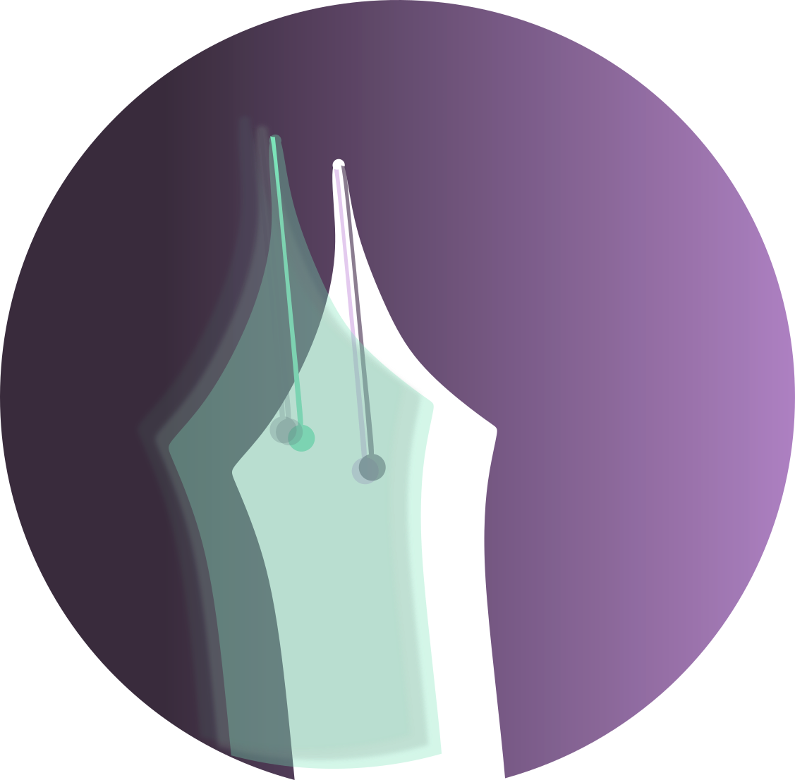
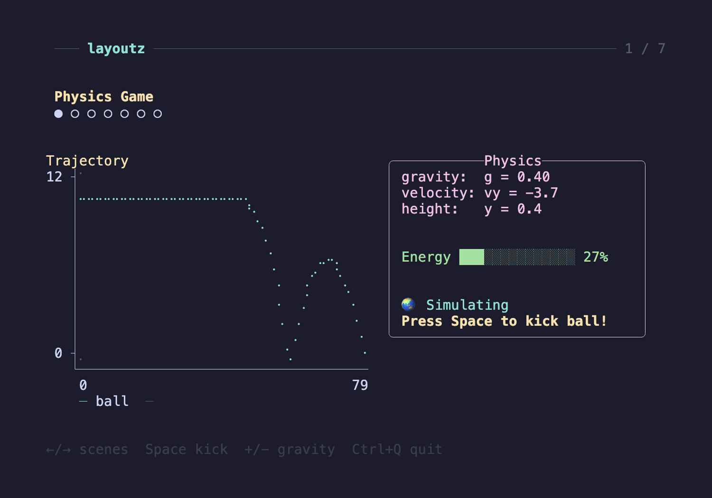
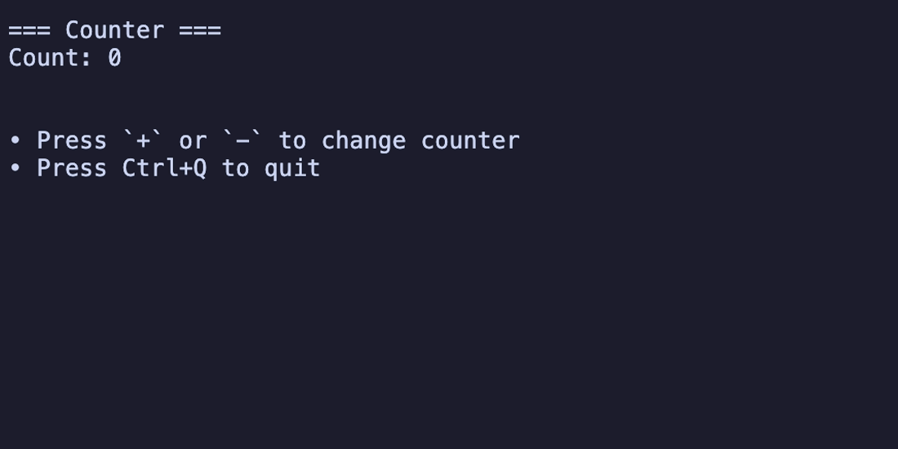
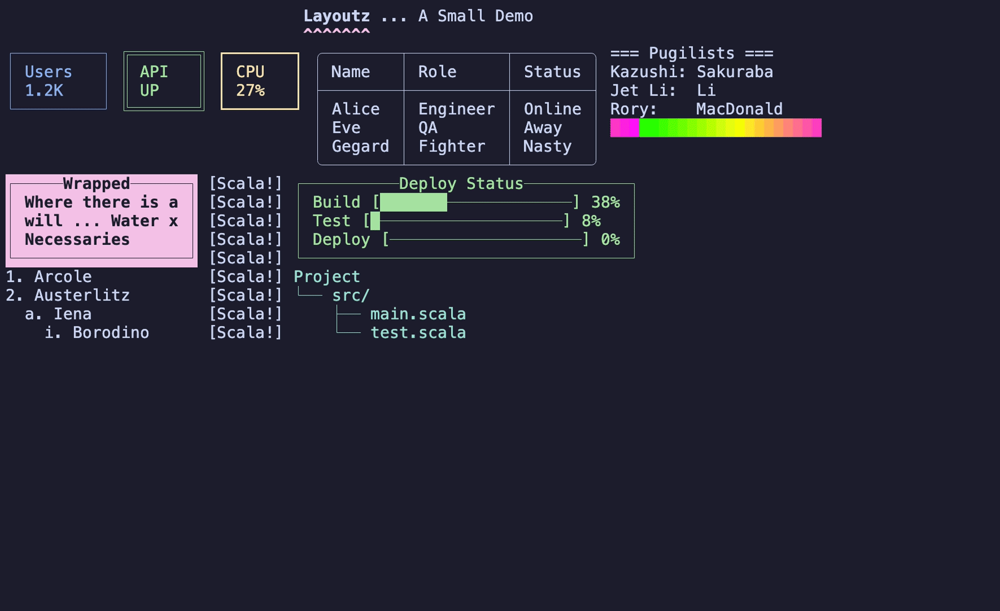
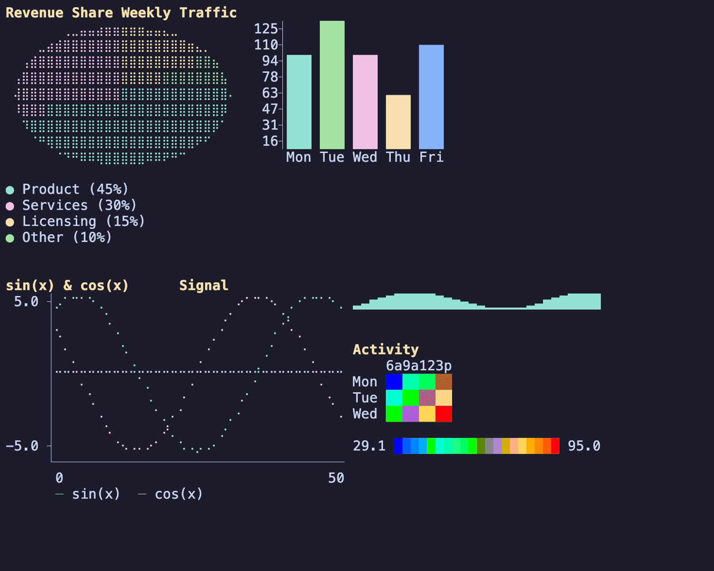
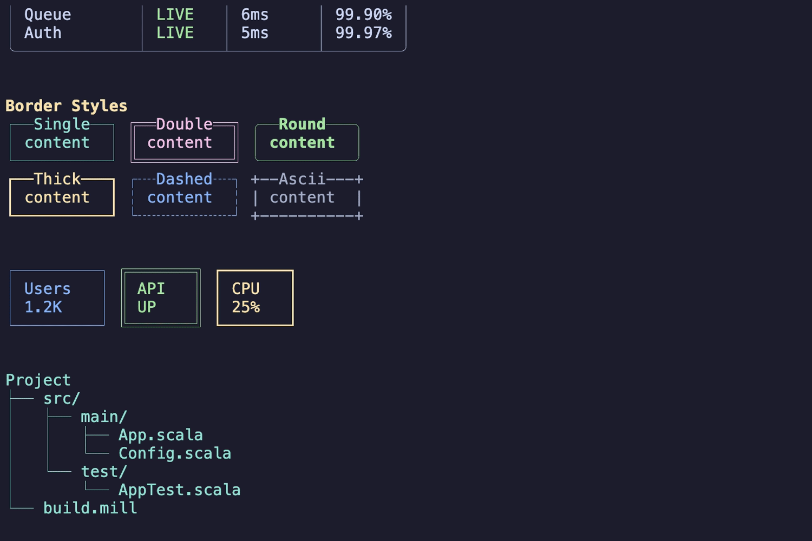
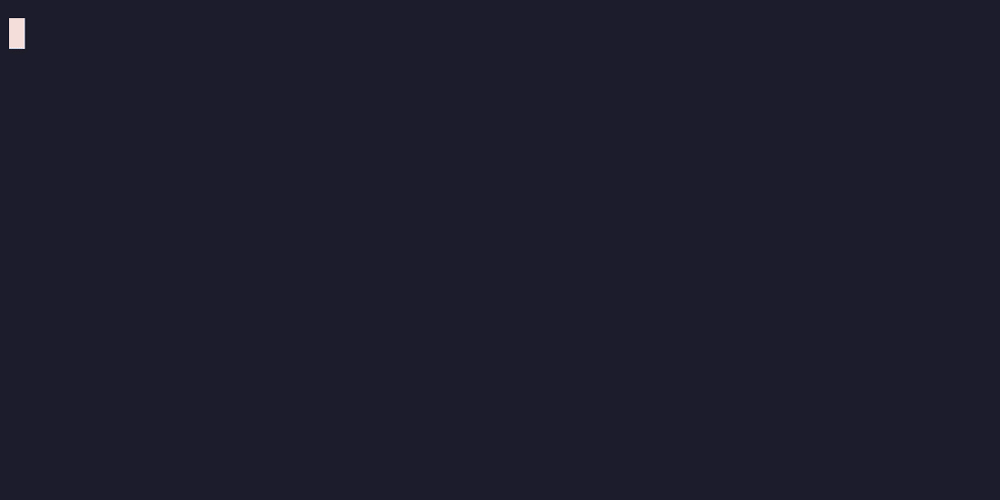
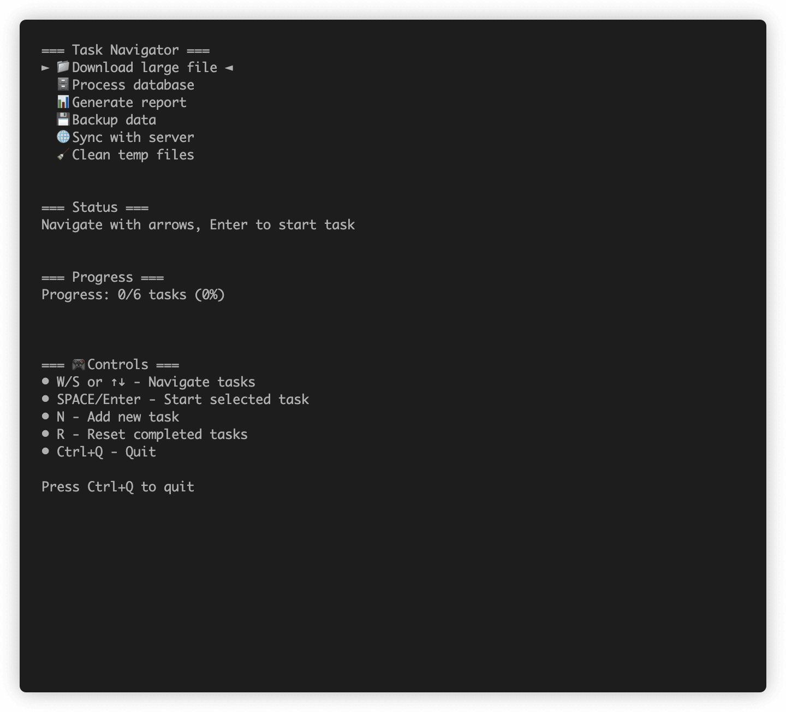

---
hide:
  - navigation
  - toc
---

<div class="hero" markdown>



# Layoutz

<p class="tagline">Simple, beautiful CLI output</p>

- **Zero dependencies** — pure layout engine, no ncurses, no termbox
- **Elm-style TUI runtime** — `init` / `update` / `view` architecture
- **Charts, plots & data viz** — bar charts, sparklines, heatmaps, braille plots
- **Multi-platform** — JVM, Native, JS (Scala) &bull; Haskell &bull; OCaml &bull; TypeScript

```scala
//> using dep "xyz.matthieucourt::layoutz:0.7.0"
import layoutz._
println(layout(section("Hello")(ul("world"))).render)
```



</div>

---

<div class="demo-section" markdown>

## The Elm Architecture for Your Terminal



A full interactive counter app — `init`, `update`, `subscriptions`, `view`. That's it.

=== "Scala"

    ```scala
    import layoutz._

    object CounterApp extends LayoutzApp[Int, String] {
      def init = (0, Cmd.none)

      def update(msg: String, count: Int) = msg match {
        case "inc" => (count + 1, Cmd.none)
        case "dec" => (count - 1, Cmd.none)
        case _     => (count, Cmd.none)
      }

      def subscriptions(count: Int) =
        Sub.onKeyPress {
          case Key.Char('+') => Some("inc")
          case Key.Char('-') => Some("dec")
          case _             => None
        }

      def view(count: Int) = layout(
        section("Counter")(s"Count: $count"),
        br,
        ul("Press `+` or `-` to change counter"),
        ul("Press Ctrl+Q to quit")
      )
    }
    ```

=== "Haskell"

    ```haskell
    data CounterMsg = Inc | Dec

    counterApp :: LayoutzApp Int CounterMsg
    counterApp = LayoutzApp
      { appInit = (0, CmdNone)

      , appUpdate = \msg count -> case msg of
          Inc -> (count + 1, CmdNone)
          Dec -> (count - 1, CmdNone)

      , appSubscriptions = \_state ->
          subKeyPress $ \key -> case key of
            KeyChar '+' -> Just Inc
            KeyChar '-' -> Just Dec
            _           -> Nothing

      , appView = \count ->
          layout
            [ section "Counter" [text $ "Count: " <> show count]
            , br
            , ul ["Press '+' or '-'", "Press ESC to quit"]
            ]
      }

    main :: IO ()
    main = runApp counterApp
    ```

</div>

---

<div class="demo-section" markdown>

## Compose Layouts Like Building Blocks



Tables, status cards, progress bars, trees, colour gradients — nest and compose them freely.

=== "Scala"

    ```scala
    import layoutz._

    val t = table(
      Seq("Name", "Role", "Status"),
      Seq(
        Seq("Alice", "Engineer", "Online"),
        Seq("Eve", "QA", "Away"),
        Seq(ul("Gegard", ul("Mousasi")), "Fighter", "Nasty")
      )
    ).border(Border.Round)

    val d = layout(
      row(
        underlineColored("^", Color.BrightMagenta)("Layoutz").style(Style.Bold),
        "... A Small Demo (ちいさい)"
      ).center(),
      row(
        statusCard("Users", "1.2K").color(Color.BrightBlue),
        statusCard("API", "UP").border(Border.Double).color(Color.BrightGreen),
        statusCard("CPU", "23%").border(Border.Thick).color(Color.BrightYellow),
        t,
        section("Pugilists")(
          layout(
            kv("Kazushi" -> "Sakuraba", "Jet 李連杰" -> "Li", "Rory" -> "MacDonald"),
            tightRow((0 to 255 by 12).map { i =>
              val r = if (i < 128) i * 2 else 255
              val g = if (i < 128) 255 else (255 - i) * 2
              val b = if (i > 128) (i - 128) * 2 else 0
              "█".color(Color.True(r, g, b))
            }: _*)
          )
        )
      ),
      row(
        layout(
          box("Wrapped")(wrap("Where there is a will...", 20))
            .color(Color.BrightMagenta).style(Style.Reverse ++ Style.Bold),
          ol("Arcole", "Austerlitz", ol("Iéna", ol("Бородино")))
        ),
        margin("[Scala!]")(
          box("Deploy Status")(
            inlineBar("Build", 1.0), inlineBar("Test", 0.8), inlineBar("Deploy", 0.3)
          ).color(Color.Green),
          tree("📁 Project")(tree("src")(tree("main.scala"), tree("test.scala")))
            .color(Color.Cyan)
        )
      )
    )

    println(d.render)
    ```

=== "Haskell"

    ```haskell
    import Layoutz

    t = withBorder BorderRound $ table ["Name", "Role", "Status"]
        [ ["Alice", "Engineer", "Online"]
        , ["Eve", "QA", "Away"]
        , [ul ["Gegard", ul ["Mousasi"]], "Fighter", "Nasty"]
        ]

    d = layout
        [ center $ row
            [ withStyle StyleBold $ underlineColored "^" ColorBrightMagenta $ text "Layoutz"
            , "... A Small Demo (ちいさい)" ]
        , row
            [ withColor ColorBrightBlue $ statusCard "Users" "1.2K"
            , withColor ColorBrightGreen $ withBorder BorderDouble $ statusCard "API" "UP"
            , withColor ColorBrightYellow $ withBorder BorderThick $ statusCard "CPU" "23%"
            , t
            , section "Pugilists"
                [ layout
                    [ kv [("Kazushi", "Sakuraba"), ("Jet 李連杰", "Li"), ("Rory", "MacDonald")]
                    , tightRow $ map (\i ->
                        let r = if i < 128 then i * 2 else 255
                            g = if i < 128 then 255 else (255 - i) * 2
                            b = if i > 128 then (i - 128) * 2 else 0
                        in withColor (ColorTrue r g b) $ text "█") [0, 12..255]
                    ]
                ]
            ]
        , row
            [ layout
                [ withColor ColorBrightMagenta $ withStyle (StyleReverse <> StyleBold) $
                    box "Wrapped" [ wrap 20 "Where there is a will..." ]
                , ol [ "Arcole", "Austerlitz", ol [ "Iéna", ol ["Бородино"] ] ] ]
            , margin "[Haskell!]"
                [ withColor ColorGreen $ box "Deploy Status"
                    [ inlineBar "Build" 1.0, inlineBar "Test" 0.8, inlineBar "Deploy" 0.3 ]
                , withColor ColorCyan $ tree "📁 Project"
                    [ branch "src" [ leaf "main.hs", leaf "test.hs" ] ]
                ]
            ]
        ]

    main :: IO ()
    main = putStrLn $ render d
    ```

=== "OCaml"

    ```ocaml
    open Layoutz

    let t =
      table ~headers:[ s "Name"; s "Role"; s "Status" ]
        [ [ s "Alice"; s "Engineer"; s "Online" ]
        ; [ s "Eve"; s "QA"; s "Away" ]
        ; [ ul [ li ~c:[ li (s "Mousasi") ] (s "Gegard") ]; s "Fighter"; s "Nasty" ]
        ] |> borderRound

    let gradient =
      List.init 22 (fun i -> i * 12)
      |> List.map (fun i ->
        let r = if i < 128 then i * 2 else 255 in
        let g = if i < 128 then 255 else (255 - i) * 2 in
        let b = if i > 128 then (i - 128) * 2 else 0 in
        s "█" |> colorRGB r g b)

    let d = layout
      [ center (row
          [ underlineColored ~char:"^" ~color:Color.brightMagenta
              (s "Layoutz" |> styleBold)
          ; s "... A Small Demo (ちいさい)" ])
      ; row
          [ statusCard ~label:(s "Users") ~content:(s "1.2K") |> colorBrightBlue
          ; statusCard ~label:(s "API") ~content:(s "UP") |> borderDouble |> colorBrightGreen
          ; statusCard ~label:(s "CPU") ~content:(s "23%") |> borderThick |> colorBrightYellow
          ; t
          ; section ~title:"Pugilists"
              [ kv [ ("Kazushi", "Sakuraba"); ("Jet 李連杰", "Li"); ("Rory", "MacDonald") ]
              ; tightRow gradient ] ]
      ; row
          [ layout
              [ box ~title:"Wrapped"
                  [ wrap ~max_width:20 (s "Where there is a will...") ]
                |> colorBrightMagenta |> styleReverse ++ styleBold
              ; ol [ li (s "Arcole"); li (s "Austerlitz")
                   ; li ~c:[ li ~c:[ li (s "Бородино") ] (s "Iéna") ] (s "Wagram") ] ]
          ; margin ~prefix:"[OCaml!]" (layout
              [ box ~title:"Deploy Status"
                  [ inline_bar ~label:"Build" ~progress:1.0
                  ; inline_bar ~label:"Test" ~progress:0.8
                  ; inline_bar ~label:"Deploy" ~progress:0.3 ] |> colorGreen
              ; tree (node ~c:[ node ~c:[ node (s "main.ml"); node (s "test.ml") ]
                  (s "src") ] (s "📁 Project")) |> colorCyan ]) ] ]

    let () = print d
    ```

=== "TypeScript"

    ```typescript
    import { layout, section, kv, ul, ol, box, row, tightRow, table,
             center, underlineColored, statusCard, margin, inlineBar,
             tree, wrap, text, Border, Color, Style, colorTrue } from "./layoutz";

    const t = table(
      ["Name", "Role", "Status"],
      [ ["Alice", "Engineer", "Online"],
        ["Eve", "QA", "Away"],
        [ul("Gegard", ul("Mousasi")), "Fighter", "Nasty"] ]
    ).border(Border.Round);

    const gradient = Array.from({ length: 22 }, (_, idx) => {
      const i = idx * 12;
      const r = i < 128 ? i * 2 : 255;
      const g = i < 128 ? 255 : (255 - i) * 2;
      const b = i > 128 ? (i - 128) * 2 : 0;
      return text("█").color(colorTrue(r, g, b));
    });

    const d = layout(
      center(row(
        underlineColored("^", Color.BrightMagenta)("Layoutz").styles(Style.Bold),
        "... A Small Demo (ちいさい)"
      )),
      row(
        statusCard("Users", "1.2K").color(Color.BrightBlue),
        statusCard("API", "UP").border(Border.Double).color(Color.BrightGreen),
        statusCard("CPU", "23%").border(Border.Thick).color(Color.BrightYellow),
        t,
        section("Pugilists")(layout(
          kv(["Kazushi", "Sakuraba"], ["Jet 李連杰", "Li"], ["Rory", "MacDonald"]),
          tightRow(...gradient)
        ))
      ),
      row(
        layout(
          box("Wrapped")(wrap(20)("Where there is a will..."))
            .color(Color.BrightMagenta).styles(Style.Reverse, Style.Bold),
          ol("Arcole", "Austerlitz", ol("Iéna", ol("Бородино")))
        ),
        margin("[TypeScript!]")(
          box("Deploy Status")(layout(
            inlineBar("Build", 1.0), inlineBar("Test", 0.8), inlineBar("Deploy", 0.3)
          )).color(Color.Green),
          tree("📁 Project")(tree("src")(tree("main.ts"), tree("test.ts")))
            .color(Color.Cyan)
        )
      )
    );

    console.log(d.render());
    ```

</div>

---

<div class="demo-section" markdown>

## Charts & Plots



<p class="capability-list">
Pie charts &bull; Bar charts &bull; Stacked bars &bull; Braille scatter/line plots &bull;
Sparklines &bull; Box plots &bull; Histograms &bull; Heatmaps
</p>

=== "Scala"

    ```scala
    import layoutz._

    // Pie chart
    val pie1 = pie()(
      Slice(45, "Product").color(Color.BrightCyan),
      Slice(30, "Services").color(Color.BrightMagenta),
      Slice(15, "Licensing").color(Color.BrightYellow),
      Slice(10, "Other").color(Color.BrightGreen)
    )

    // Bar chart
    val bar1 = bar(width = 30, height = 8)(
      Bar(85, "Mon").color(Color.BrightCyan),
      Bar(120, "Tue").color(Color.BrightGreen),
      Bar(95, "Wed").color(Color.BrightMagenta)
    )

    // Braille scatter plot (sin & cos)
    val plot1 = plot(width = 40, height = 12)(
      Series((0 to 50).map(i => (i.toDouble, 5 * math.sin(i * 0.15))), "sin(x)")
        .color(Color.Cyan),
      Series((0 to 50).map(i => (i.toDouble, 5 * math.cos(i * 0.15))), "cos(x)")
        .color(Color.Magenta)
    )

    // Sparkline, heatmap, histogram
    val spark = sparkline(Seq(10, 25, 15, 30, 20, 35, 28)).color(Color.Cyan)

    val heat = heatmap(HeatmapData(
      Seq(Seq(10, 45, 80, 75), Seq(12, 50, 85, 70), Seq(8, 40, 90, 80)),
      rowLabels = Seq("Mon", "Tue", "Wed"),
      colLabels = Seq("6am", "12pm", "6pm", "12am")
    ))

    val hist = histogram(Seq(1.2, 2.3, 1.8, 2.1, 3.0, 2.5, 1.5, 2.8), bins = 5)

    layout(row(pie1, bar1), plot1, row("Signal: ", spark), heat).putStrLn
    ```

=== "Haskell"

    ```haskell
    import Layoutz

    pie1 = pie 28 9
      [ slice 45 "Product"   `withColor` ColorBrightCyan
      , slice 30 "Services"  `withColor` ColorBrightMagenta
      , slice 15 "Licensing" `withColor` ColorBrightYellow
      , slice 10 "Other"     `withColor` ColorBrightGreen
      ]

    bar1 = bar 30 8
      [ barData 85  "Mon" `withColor` ColorBrightCyan
      , barData 120 "Tue" `withColor` ColorBrightGreen
      , barData 95  "Wed" `withColor` ColorBrightMagenta
      ]

    plot1 = plotChart 40 12
      [ series (map (\i -> (fromIntegral i, 5 * sin (fromIntegral i * 0.15))) [0..50])
          "sin(x)" `withColor` ColorCyan
      , series (map (\i -> (fromIntegral i, 5 * cos (fromIntegral i * 0.15))) [0..50])
          "cos(x)" `withColor` ColorMagenta
      ]

    spark = withColor ColorCyan $ sparkline [10, 25, 15, 30, 20, 35, 28]

    main = putStrLn $ render $ layout
      [ row [pie1, bar1], plot1, row [text "Signal: ", spark] ]
    ```

=== "OCaml"

    ```ocaml
    open Layoutz

    let pie1 = pie ~width:28 ~height:9
      [ slice ~value:45. ~label:"Product"  |> colorBrightCyan
      ; slice ~value:30. ~label:"Services" |> colorBrightMagenta
      ; slice ~value:15. ~label:"Licensing"|> colorBrightYellow
      ; slice ~value:10. ~label:"Other"    |> colorBrightGreen ]

    let bar1 = bar ~width:30 ~height:8
      [ bar_data ~value:85.  ~label:"Mon" |> colorBrightCyan
      ; bar_data ~value:120. ~label:"Tue" |> colorBrightGreen
      ; bar_data ~value:95.  ~label:"Wed" |> colorBrightMagenta ]

    let plot1 = plot_chart ~width:40 ~height:12
      [ series (List.init 51 (fun i ->
          (Float.of_int i, 5. *. sin (Float.of_int i *. 0.15))))
          ~label:"sin(x)" |> colorCyan
      ; series (List.init 51 (fun i ->
          (Float.of_int i, 5. *. cos (Float.of_int i *. 0.15))))
          ~label:"cos(x)" |> colorMagenta ]

    let spark = sparkline [10.; 25.; 15.; 30.; 20.; 35.; 28.] |> colorCyan

    let () = print @@ layout
      [ row [pie1; bar1]; plot1; row [s "Signal: "; spark] ]
    ```

=== "TypeScript"

    ```typescript
    import { layout, row, pie, bar, plot, sparkline, heatmap,
             Slice, Bar, Series, HeatmapData, Color } from "./layoutz";

    const pie1 = pie(
      Slice(45, "Product").color(Color.BrightCyan),
      Slice(30, "Services").color(Color.BrightMagenta),
      Slice(15, "Licensing").color(Color.BrightYellow),
      Slice(10, "Other").color(Color.BrightGreen)
    );

    const bar1 = bar({ width: 30, height: 8 })(
      Bar(85, "Mon").color(Color.BrightCyan),
      Bar(120, "Tue").color(Color.BrightGreen),
      Bar(95, "Wed").color(Color.BrightMagenta)
    );

    const plot1 = plot({ width: 40, height: 12 })(
      Series(Array.from({ length: 51 }, (_, i) =>
        [i, 5 * Math.sin(i * 0.15)]), "sin(x)").color(Color.Cyan),
      Series(Array.from({ length: 51 }, (_, i) =>
        [i, 5 * Math.cos(i * 0.15)]), "cos(x)").color(Color.Magenta)
    );

    const spark = sparkline([10, 25, 15, 30, 20, 35, 28]).color(Color.Cyan);

    console.log(layout(row(pie1, bar1), plot1, row("Signal: ", spark)).render());
    ```

</div>

---

<div class="demo-section" markdown>

## Tables & Borders



<p class="capability-list">
13 border styles &bull; Colored cells &bull; Nested elements &bull; Status cards &bull;
Key-value pairs &bull; Trees &bull; Ordered &amp; unordered lists
</p>

=== "Scala"

    ```scala
    import layoutz._

    // Table with colored cells
    val t = table(
      Seq("Service", "Status", "Latency"),
      Seq(
        Seq("API",   "LIVE".color(Color.BrightGreen), "12ms"),
        Seq("Cache", "WARN".color(Color.BrightYellow), "1ms"),
        Seq("Auth",  "LIVE".color(Color.BrightGreen), "5ms")
      )
    ).border(Border.Round)

    // Border styles: Single, Double, Round, Thick, Dashed, Dotted,
    //   Ascii, Block, Markdown, InnerHalfBlock, OuterHalfBlock, Custom
    val borders = row(
      box("Round")("...").border(Border.Round).color(Color.Green),
      box("Double")("...").border(Border.Double).color(Color.Magenta),
      box("Thick")("...").border(Border.Thick).color(Color.Yellow)
    )

    // Status cards, key-value pairs, trees
    val cards = row(
      statusCard("Users", "1.2K").color(Color.BrightBlue),
      statusCard("API", "UP").border(Border.Double).color(Color.BrightGreen)
    )

    val pairs = kv("Host" -> "localhost", "Port" -> "8080", "Env" -> "prod")

    val fileTree = tree("📁 src")(
      tree("main")(tree("App.scala"), tree("Config.scala")),
      tree("test")(tree("AppTest.scala"))
    ).color(Color.Cyan)

    layout(t, borders, cards, pairs, fileTree).putStrLn
    ```

=== "Haskell"

    ```haskell
    import Layoutz

    t = withBorder BorderRound $ table ["Service", "Status", "Latency"]
      [ ["API",   withColor ColorBrightGreen $ text "LIVE", "12ms"]
      , ["Cache", withColor ColorBrightYellow $ text "WARN", "1ms"]
      , ["Auth",  withColor ColorBrightGreen $ text "LIVE", "5ms"]
      ]

    borders = row
      [ withColor ColorGreen $ withBorder BorderRound $ box "Round" [text "..."]
      , withColor ColorMagenta $ withBorder BorderDouble $ box "Double" [text "..."]
      , withColor ColorYellow $ withBorder BorderThick $ box "Thick" [text "..."]
      ]

    cards = row
      [ withColor ColorBrightBlue $ statusCard "Users" "1.2K"
      , withColor ColorBrightGreen $ withBorder BorderDouble $ statusCard "API" "UP"
      ]

    fileTree = withColor ColorCyan $ tree "📁 src"
      [ branch "main" [leaf "App.hs", leaf "Config.hs"]
      , branch "test" [leaf "AppTest.hs"]
      ]

    main = putStrLn $ render $ layout [t, borders, cards, fileTree]
    ```

=== "OCaml"

    ```ocaml
    open Layoutz

    let t = table ~headers:[s "Service"; s "Status"; s "Latency"]
      [ [s "API";   s "LIVE" |> colorBrightGreen; s "12ms"]
      ; [s "Cache"; s "WARN" |> colorBrightYellow; s "1ms"]
      ; [s "Auth";  s "LIVE" |> colorBrightGreen; s "5ms"]
      ] |> borderRound

    let borders = row
      [ box ~title:"Round"  [s "..."] |> borderRound  |> colorGreen
      ; box ~title:"Double" [s "..."] |> borderDouble |> colorMagenta
      ; box ~title:"Thick"  [s "..."] |> borderThick  |> colorYellow ]

    let file_tree = tree (node ~c:[
        node ~c:[node (s "App.ml"); node (s "Config.ml")] (s "main");
        node ~c:[node (s "AppTest.ml")] (s "test")
      ] (s "📁 src")) |> colorCyan

    let () = print @@ layout [t; borders; file_tree]
    ```

=== "TypeScript"

    ```typescript
    import { layout, row, table, box, statusCard, kv, tree,
             Border, Color } from "./layoutz";

    const t = table(
      ["Service", "Status", "Latency"],
      [ ["API",   text("LIVE").color(Color.BrightGreen), "12ms"],
        ["Cache", text("WARN").color(Color.BrightYellow), "1ms"],
        ["Auth",  text("LIVE").color(Color.BrightGreen), "5ms"] ]
    ).border(Border.Round);

    const borders = row(
      box("Round")("...").border(Border.Round).color(Color.Green),
      box("Double")("...").border(Border.Double).color(Color.Magenta),
      box("Thick")("...").border(Border.Thick).color(Color.Yellow)
    );

    const fileTree = tree("📁 src")(
      tree("main")(tree("App.ts"), tree("Config.ts")),
      tree("test")(tree("AppTest.ts"))
    ).color(Color.Cyan);

    console.log(layout(t, borders, fileTree).render());
    ```

</div>

---

<div class="demo-section" markdown>

## Colors & Styles


<p class="capability-list">
16 standard colors &bull; 256-color palette &bull; 24-bit true color RGB &bull;
Bold, italic, underline, dim, reverse, strikethrough &bull; Background colors &bull; Composable styles
</p>

=== "Scala"

    ```scala
    import layoutz._

    // Text styles (composable with ++)
    "Bold".style(Style.Bold)
    "Bold+Italic".style(Style.Bold ++ Style.Italic)

    // 16 standard colors
    "Error".color(Color.Red)
    "Success".color(Color.BrightGreen)

    // 256-color palette
    tightRow((16 to 231 by 3).map(i => "█".color(Color.Full(i))): _*)

    // 24-bit true color RGB
    tightRow((0 to 255 by 4).map(i => "█".color(Color.True(255, i, 0))): _*)

    // Background colors
    " Alert ".bg(Color.Red).style(Style.Bold)
    " Success ".bg(Color.Green).style(Style.Bold)

    // Color as function
    val warn = Color.BrightYellow
    warn("Warning: check config").putStrLn
    ```

=== "Haskell"

    ```haskell
    import Layoutz

    -- Text styles (composable with <>)
    withStyle StyleBold $ text "Bold"
    withStyle (StyleBold <> StyleItalic) $ text "Bold+Italic"

    -- 16 standard colors
    withColor ColorRed $ text "Error"
    withColor ColorBrightGreen $ text "Success"

    -- 256-color palette
    tightRow $ map (\i -> withColor (ColorFull i) $ text "█") [16, 19..231]

    -- 24-bit true color RGB
    tightRow $ map (\i -> withColor (ColorTrue 255 i 0) $ text "█") [0, 4..255]

    -- Background colors
    withBg ColorRed $ withStyle StyleBold $ text " Alert "
    ```

=== "OCaml"

    ```ocaml
    open Layoutz

    (* Text styles *)
    s "Bold" |> styleBold
    s "Bold+Italic" |> styleBold |> styleItalic

    (* 16 standard colors *)
    s "Error" |> colorRed
    s "Success" |> colorBrightGreen

    (* 256-color palette *)
    tightRow (List.init 72 (fun i -> s "█" |> color256 (16 + i * 3)))

    (* 24-bit true color RGB *)
    tightRow (List.init 64 (fun i -> s "█" |> colorRGB 255 (i * 4) 0))

    (* Background colors *)
    s " Alert " |> bgRed |> styleBold
    ```

=== "TypeScript"

    ```typescript
    import { text, tightRow, Color, Style, color256, colorTrue } from "./layoutz";

    // Text styles (composable)
    text("Bold").styles(Style.Bold);
    text("Bold+Italic").styles(Style.Bold, Style.Italic);

    // 16 standard colors
    text("Error").color(Color.Red);
    text("Success").color(Color.BrightGreen);

    // 256-color palette
    tightRow(...Array.from({ length: 72 }, (_, i) =>
      text("█").color(color256(16 + i * 3))));

    // 24-bit true color RGB
    tightRow(...Array.from({ length: 64 }, (_, i) =>
      text("█").color(colorTrue(255, i * 4, 0))));

    // Background colors
    text(" Alert ").bg(Color.Red).styles(Style.Bold);
    ```

</div>

---

<div class="demo-section" markdown>

## Games, Animations, Dashboards

<div class="feature-grid" markdown>

<div class="feature-card" markdown>

<p><strong>Build games</strong> — real-time input, enemy AI, game loops</p>
</div>

<div class="feature-card" markdown>

<p><strong>Inline animations</strong> — for scripts and CI pipelines</p>
</div>

<div class="feature-card" markdown>

<p><strong>Interactive dashboards</strong> — keyboard navigation, live updates</p>
</div>

<div class="feature-card" markdown>

<p><strong>Task runners</strong> — progress bars, spinners, live status updates</p>
</div>

</div>

??? example "Game source code (Scala)"

    ```scala
    import layoutz._

    case class GameState(
      playerX: Int, playerY: Int,
      items: Set[(Int, Int)], score: Int,
      enemies: List[Enemy], lives: Int,
      level: Int, gameOver: Boolean
    )

    object SimpleGame extends LayoutzApp[GameState, GameMessage] {
      def init = (initialState, Cmd.none)

      def update(msg: GameMessage, state: GameState) = msg match {
        case GameMoveUp    => (processMove(state.copy(playerY = state.playerY - 1)), Cmd.none)
        case GameMoveDown  => (processMove(state.copy(playerY = state.playerY + 1)), Cmd.none)
        case GameMoveLeft  => (processMove(state.copy(playerX = state.playerX - 1)), Cmd.none)
        case GameMoveRight => (processMove(state.copy(playerX = state.playerX + 1)), Cmd.none)
        case GameTick      => (updateGameTick(state), Cmd.none)
        case RestartGame   => init
      }

      def subscriptions(state: GameState) = Sub.batch(
        Sub.time.everyMs(100, GameTick),
        Sub.onKeyPress {
          case Key.Char('w') | Key.Up    => Some(GameMoveUp)
          case Key.Char('s') | Key.Down  => Some(GameMoveDown)
          case Key.Char('a') | Key.Left  => Some(GameMoveLeft)
          case Key.Char('d') | Key.Right => Some(GameMoveRight)
          case Key.Char('r')             => Some(RestartGame)
          case _                         => None
        }
      )

      def view(state: GameState) = layout(
        section("🎮 Gem Collector")(/* game board */),
        section("Stats")(s"Score: ${state.score}", s"Lives: ${"💖" * state.lives}"),
        section("Controls")(ul("WASD to move", "R to restart"))
      )
    }
    ```

??? example "Game source code (Haskell)"

    ```haskell
    import Layoutz

    data GameState = GameState
      { playerX, playerY :: Int
      , items :: [(Int, Int)]
      , score, level, lives :: Int
      , enemies :: [Enemy]
      , gameOver :: Bool }

    simpleGame :: LayoutzApp GameState GameMsg
    simpleGame = LayoutzApp
      { appInit = (initialState, CmdNone)

      , appUpdate = \msg state -> (updateGame msg state, CmdNone)

      , appSubscriptions = \_state -> subBatch
          [ subEveryMs 100 Tick
          , subKeyPress $ \key -> case key of
              KeyChar 'w' -> Just MoveUp
              KeyChar 's' -> Just MoveDown
              KeyChar 'a' -> Just MoveLeft
              KeyChar 'd' -> Just MoveRight
              KeyChar 'r' -> Just Restart
              _           -> Nothing
          ]

      , appView = \state -> layout
          [ section "🎮 Gem Collector" [gameBoard state]
          , row [ section "Stats" [stats state]
                , section "Status" [text $ message state] ]
          , section "Controls"
              [ ul [ "WASD to move", "R to restart", "ESC to quit" ] ]
          ]
      }

    main :: IO ()
    main = runApp simpleGame
    ```

</div>

---

<div class="get-started" markdown>

## Get Started

=== "Scala"

    **scala-cli** (quickest):

    ```bash
    scala-cli run --dep "xyz.matthieucourt::layoutz:0.7.0" MyApp.scala
    ```

    **sbt / Mill**:

    ```scala
    // build.sbt
    libraryDependencies += "xyz.matthieucourt" %% "layoutz" % "0.7.0"
    ```

=== "Haskell"

    **cabal**:

    ```yaml
    # package.yaml / .cabal
    dependencies:
      - layoutz
    ```

    ```bash
    cabal update && cabal build
    ```

=== "OCaml"

    **opam + dune**:

    ```bash
    opam install layoutz
    ```

    ```ocaml
    ; dune file
    (executable
     (name demo)
     (libraries layoutz))
    ```

=== "TypeScript"

    **npm**:

    ```bash
    npm install layoutz
    ```

    ```typescript
    import { layout, section, ul } from "layoutz";
    console.log(layout(section("Hello")(ul("world"))).render());
    ```

<br>

[GitHub](https://github.com/mattlianje/layoutz){ .md-button .md-button--primary }

</div>
