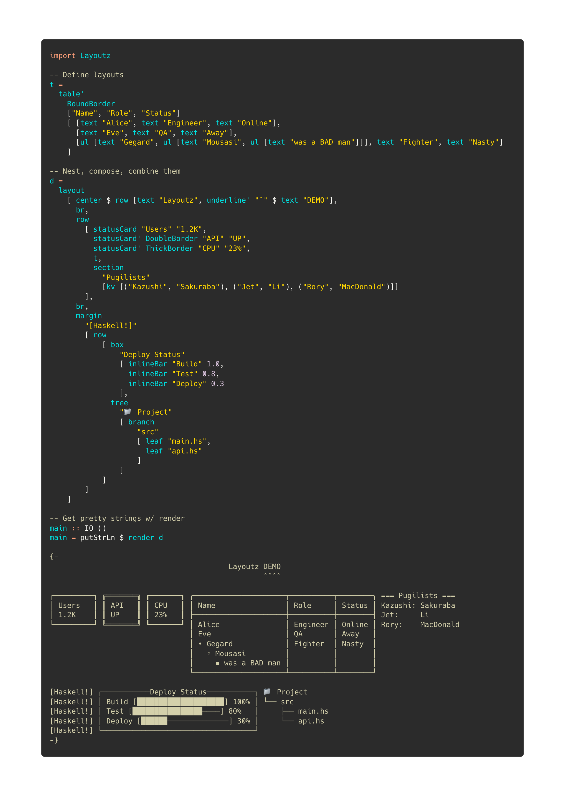

<p align="center">
  
</p>

#  layoutz

[](https://hackage.haskell.org/package/layoutz)
[](https://haskell.org)
[](LICENSE)

**Simple, beautiful CLI output for Haskell 🪶**

Build declarative and composable sections, trees, tables, dashboards for your Haskell applications.

## Features
- Zero dependencies, use `Layoutz.hs` like a header file
- Rich text formatting: alignment, underlines, padding, margins
- Lists, trees, tables, charts, banners...

## Installation

**From [Hackage](https://hackage.haskell.org/package/layoutz):**

```bash
cabal install layoutz
```

**In your project's `.cabal` file:**
```haskell
build-depends: layoutz
```

**Or in `package.yaml` (Stack):**
```yaml
dependencies:
  - layoutz
```

All you need:
```haskell
import Layoutz
```

## Quickstart

Beautiful, compositional text layouts:

```haskell
import Layoutz

demo = layout
  [ center $ row [text "Layoutz", underline' "ˆ" $ text "DEMO"]
  , br
  , row
    [ statusCard "Users" "1.2K"
    , statusCard' DoubleBorder "API" "UP"
    , statusCard' ThickBorder "CPU" "23%"
    , table' RoundBorder ["Name", "Role", "Status"] 
        [ [text "Alice", text "Engineer", text "Online"]
        , [text "Eve", text "QA", text "Away"]
        ]
    , section "Pugilists" [kv [("Kazushi", "Sakuraba"), ("Jet", "Li")]]
    ]
  ]

putStrLn $ render demo
```

```
                                Layoutz DEMO
                                        ˆˆˆˆ

┌─────────┐ ╔═══════╗ ┏━━━━━━━┓ ╭───────┬──────────┬────────╮ === Pugilists ===
│ Users   │ ║ API   ║ ┃ CPU   ┃ │ Name  │ Role     │ Status │ Kazushi: Sakuraba
│ 1.2K    │ ║ UP    ║ ┃ 23%   ┃ ├───────┼──────────┼────────┤ Jet:     Li
└─────────┘ ╚═══════╝ ┗━━━━━━━┛ │ Alice │ Engineer │ Online │
                                │ Eve   │ QA       │ Away   │
                                ╰───────┴──────────┴────────╯
```

## Core concepts
- Every piece of content is an `Element`
- Elements are **immutable** and **composable** - build complex layouts by combining simple elements
- A `layout` arranges elements **vertically**:
```haskell
layout [elem1, elem2, elem3]  -- Joins with "\n"
```
Call `render` on any element to get a string

The power comes from **uniform composition** - since everything has the `Element` typeclass, everything can be combined.

## Elements

### Text
```haskell
text "Simple text"
```
```
Simple text
```

### Line Break
Add line breaks with `br`:
```haskell
layout [text "Line 1", br, text "Line 2"]
```
```
Line 1

Line 2
```

### Section: `section`
```haskell
section "Config" [kv [("env", "prod")]]
section' "-" "Status" [kv [("health", "ok")]]
section'' "#" "Report" 5 [kv [("items", "42")]]
```
```
=== Config ===
env: prod

--- Status ---
health: ok

##### Report #####
items: 42
```

### Layout (vertical): `layout`
```haskell
layout [text "First", text "Second", text "Third"]
```
```
First
Second
Third
```

### Row (horizontal): `row`
```haskell
row [text "Left", text "Middle", text "Right"]
```
```
Left Middle Right
```

### Horizontal rule: `hr`
```haskell
hr
hr' "~"
hr'' "-" 10
```
```
──────────────────────────────────────────────────
~~~~~~~~~~~~~~~~~~~~~~~~~~~~~~~~~~~~~~~~~~~~~~~~~~
----------
```

### Key-value pairs: `kv`
```haskell
kv [("name", "Alice"), ("role", "admin")]
```
```
name: Alice
role: admin
```

### Table: `table`
Tables automatically handle alignment and borders:
```haskell
table ["Name", "Age", "City"] 
  [ [text "Alice", text "30", text "New York"]
  , [text "Bob", text "25", text ""]  -- Missing values handled
  , [text "Charlie", text "35", text "London"]
  ]
```
```
┌─────────┬─────┬─────────┐
│ Name    │ Age │ City    │
├─────────┼─────┼─────────┤
│ Alice   │ 30  │ New York│
│ Bob     │ 25  │         │
│ Charlie │ 35  │ London  │
└─────────┴─────┴─────────┘
```

### Unordered Lists: `ul`
Clean unordered lists with automatic nesting:
```haskell
ul [text "Feature A", text "Feature B", text "Feature C"]
```
```
• Feature A
• Feature B
• Feature C
```

Nested lists with auto-styling:
```haskell
ul [ text "Backend"
   , ul [text "API", text "Database"]
   , text "Frontend"
   , ul [text "Components", ul [text "Header", ul [text "Footer"]]]
   ]
```
```
• Backend
  ◦ API
  ◦ Database
• Frontend
  ◦ Components
    ▪ Header
      • Footer
```

### Underline: `underline`
Add underlines to any element:
```haskell
underline $ text "Important Title"
underline' "=" $ text "Custom"
```
```
Important Title
───────────────

Custom
══════
```

### Box: `box`
With title:
```haskell
box "Summary" [kv [("total", "42")]]
```
```
┌──Summary───┐
│ total: 42  │
└────────────┘
```

Without title:
```haskell
box "" [kv [("total", "42")]]
```
```
┌────────────┐
│ total: 42  │
└────────────┘
```

### Status card: `statusCard`
```haskell
statusCard "CPU" "45%"
```
```
┌───────┐
│ CPU   │
│ 45%   │
└───────┘
```

### Progress bar: `inlineBar`
```haskell
inlineBar "Download" 0.75
```
```
Download [███████████████─────] 75%
```

### Tree: `tree`
```haskell
tree "Project" 
  [ branch "src" 
      [ leaf "main.hs"
      , leaf "test.hs"
      ]
  , branch "docs"
      [ leaf "README.md"
      ]
  ]
```
```
Project
├── src
│   ├── main.hs
│   └── test.hs
└── docs
    └── README.md
```

### Chart: `chart`
```haskell
chart [("Web", 10), ("Mobile", 20), ("API", 15)]
```
```
Web    │████████████████████ 10
Mobile │████████████████████████████████████████ 20
API    │██████████████████████████████ 15
```

### Padding: `pad`
Add uniform padding around any element:
```haskell
pad 2 $ text "content"
```
```
        
        
  content  
        
        
```

### Centering: `center`
Smart auto-centering and manual width:
```haskell
center $ text "Auto-centered"     -- Uses layout context
center' 20 $ text "Manual width"  -- Fixed width
```
```
        Auto-centered        

    Manual width    
```

### Margin: `margin`
Use `margin` for colorful "compiler-style" prefixes:

```haskell
layout
  [ marginError [text "Type error: expected Int, got String"]
  , marginWarn [text "Unused variable 'temp'"] 
  , marginSuccess [text "Build completed successfully"]
  , marginInfo [text "Pro tip: Use layoutz for beautiful output"]
  ]
```
```
[error] Type error: expected Int, got String
[warn] Unused variable 'temp'
[success] Build completed successfully
[info] Pro tip: Use layoutz for beautiful output
```

## Border Styles
Elements like `box`, `table`, and `statusCard` support different border styles:

**NormalBorder** (default):
```haskell
box "Title" [text "content"]
```
```
┌──Title──┐
│ content │
└─────────┘
```

**DoubleBorder**:
```haskell
statusCard' DoubleBorder "API" "UP"
```
```
╔═══════╗
║ API   ║
║ UP    ║
╚═══════╝
```

**ThickBorder**:
```haskell
table' ThickBorder ["Name"] [[text "Alice"]]
```
```
┏━━━━━━━┓
┃ Name  ┃
┣━━━━━━━┫
┃ Alice ┃
┗━━━━━━━┛
```

**RoundBorder**:
```haskell
box' RoundBorder "Info" [text "content"]
```
```
╭──Info───╮
│ content │
╰─────────╯
```

## REPL

Drop into GHCi to experiment:
```bash
cabal repl
```

```haskell
λ> import Layoutz
λ> putStrLn $ render $ center $ box "Hello" [text "World!"]
┌──Hello──┐
│ World!  │
└─────────┘
λ> putStrLn $ render $ table ["A", "B"] [[text "1", text "2"]]
┌───┬───┐
│ A │ B │
├───┼───┤
│ 1 │ 2 │
└───┴───┘
```

## Inspiration
- Original Scala [layoutz](https://github.com/mattlianje/layoutz)
