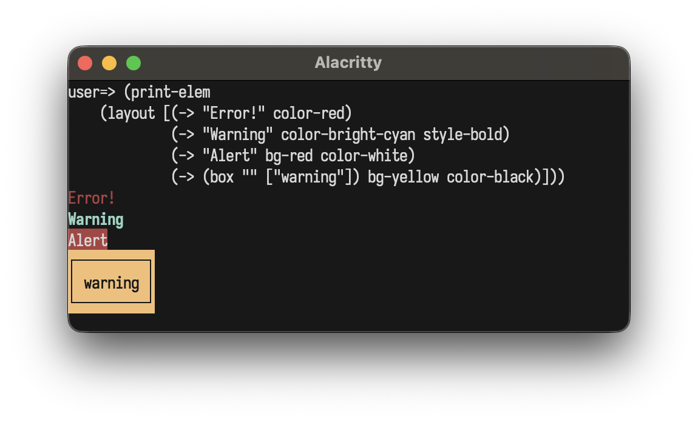

<p align="center">
  
</p>

#  layoutz

**Simple, beautiful CLI output**

A tiny, zero-dep lib for building composable ANSI strings, terminal plots, and interactive Elm-style TUIs in pure Clojure.

Part of [d4](https://github.com/mattlianje/d4) · Also in [Scala](https://github.com/mattlianje/layoutz), [OCaml](https://github.com/mattlianje/layoutz/tree/master/layoutz-ocaml), [Haskell](https://github.com/mattlianje/layoutz/tree/master/layoutz-hs)

## Features
- Zero dependencies
- Use [core.clj](src/layoutz/core.clj) like a header file
- Elm-style TUIs (`run-app`, `run-inline`)
- Layout primitives, tables, trees, lists, CJK-aware
- Colors, ANSI styles, rich formatting
- Terminal charts and plots
- Widgets: spinners, progress bars, text input
- Implement `Element` protocol to create new primitives
   - (No component library limitations)

<p align="center">

<br>
<sub><a href="src/layoutz/showcase.clj">showcase.clj</a></sub>
</p>

Layoutz also lets you easily drop animations into build scripts or any processes that use Stdout:

<p align="center">

<br>
<sub><a href="src/layoutz/inline_demo.clj">inline_demo.clj</a></sub>
</p>

## Table of Contents
- [Installation](#installation)
- [Quick Start](#quick-start)
- [Core Concepts](#core-concepts)
- [Border Styles](#border-styles)
- [Elements](#elements)
- [Colors & Styles](#colors--styles)
- [Charts & Plots](#charts--plots)
- [Custom Elements](#custom-elements)
- [Interactive Apps](#interactive-apps)

## Installation

```clojure
;; deps.edn
{:deps {xyz.matthieucourt/layoutz {:mvn/version "0.1.0"}}}

;; Leiningen
[xyz.matthieucourt/layoutz "0.1.0"]
```

Or just drop [core.clj](src/layoutz/core.clj) into your project like a header file.

## Quick Start

There are two usage paths:

**(1/2) Static rendering**

Beautiful + compositional strings

```clojure
(require '[layoutz.core :refer :all])

(def demo
  (layout
    [(center
       (row
         [(-> "Layoutz" style-bold)
          (underline-colored "DEMO" "^" bright-magenta)]))
     br
     (row
       [(status-card "Users" "1.2K")
        (-> (status-card "API" "UP") border-double)
        (-> (status-card "CPU" "23%") border-thick color-red)
        (-> (table ["Name" "Role" "Skills"]
                   [["Gegard" "Pugilist"
                     (ul [(li "Armenian"
                              :c [(li "bad"
                                      :c [(li "man")])])])]
                    ["Eve" "QA" "Testing"]])
            border-round style-reverse)])]))

(print-elem demo)
```
<p align="center">
  
</p>

**(2/2) Interactive apps**

Build Elm-style TUIs

```clojure
(require '[layoutz.core :refer :all])

(run-app
  {:init (fn [] [{:n 0} (cmd-none)])
   :update (fn [msg state]
             (case msg
               :inc [(update state :n inc) (cmd-none)]
               :dec [(update state :n dec) (cmd-none)]
               [state (cmd-none)]))
   :subscriptions (fn [_]
                    (sub-key-press
                      (fn [{:keys [type]}]
                        (case type :up :inc :down :dec nil))))
   :view (fn [{:keys [n]}]
           (layout
             [(section "Counter" (str "Count: " n))
              br
              (ul ["Press up/down" "Ctrl-Q to quit"])]))})
```

<p align="center">
  
</p>

## Why layoutz?
- With LLM's, ad-hoc strings are proliferating...
- Layoutz is a tiny DSL to combat this and let you compose Element s of ANSI strings
- On the side, **layoutz** has an Elm-style runtime to bring these arbitrary "Elements" to life: much like a flipbook

## Core Concepts

Every piece of content is an `Element`. Elements are immutable and composable.

```clojure
(layout [elem1 elem2 elem3])    ;; vertical
(row [elem1 elem2])             ;; horizontal
(render elem)                   ;; -> string
(print-elem elem)               ;; render + print
```

Styles and borders compose via `->`:
```clojure
(-> "Hello" border-round color-cyan style-bold)
```

Plain strings implement `Element` - use them directly everywhere.

## Border Styles

Applied via `->` to any element:
```clojure
(-> (box "Title" ["content"]) border-round)
(-> (table headers rows) border-thick)
```

```
border-normal                    ;; ┌─┐ (default)
border-double                    ;; ╔═╗
border-thick                     ;; ┏━┓
border-round                     ;; ╭─╮
border-ascii                     ;; +-+
border-block                     ;; ███
border-dashed                    ;; ┌╌┐
border-dotted                    ;; ┌┈┐
border-inner-half-block          ;; ▗▄▖
border-outer-half-block          ;; ▛▀▜
border-markdown                  ;; |-|
(border-custom "+" "=" "|")      ;; custom
border-none                      ;; no borders
(set-border :round elem)         ;; programmatic border selection
```

## Elements

### Text
```clojure
(s "hello")                          ;; short form
(text "hello")                       ;; verbose
"hello"                              ;; strings are elements
```

### Line Break: `br`
```clojure
(layout ["Line 1" br "Line 2"])
```

### Layout (vertical): `layout`
```clojure
(layout ["First" "Second" "Third"])
```
```
First
Second
Third
```

### Row (horizontal): `row`, `tight-row`
```clojure
(row ["Left" "Middle" "Right"])
(columns [(layout ["A" "B"]) (layout ["C" "D"])])  ;; side-by-side columns
```

### Horizontal Rule: `hr`, `hr'`
```clojure
hr                                   ;; default ──────────
(hr' :char "~")                      ;; custom char
(hr' :char "=" :width 10)            ;; custom char + width
```

### Vertical Rule: `vr`
```clojure
(vr)                                 ;; default: 10 high with │
(vr :height 5)
```

### Section: `section`
```clojure
(section "Config" (kv [["env" "prod"]]))
```
```
=== Config ===
env: prod
```

### Box: `box`
```clojure
(box "Summary" (kv [["total" "42"]]))
(-> (box "Fancy" ["content"]) border-double)
(-> (box "Smooth" ["content"]) border-round)
```
<p align="center">
  
</p>

### Status Card: `status-card`
```clojure
(row [(-> (status-card "CPU" "45%") color-green)
      (-> (status-card "MEM" "2.1G") color-cyan)])
```

<p align="center">
  
</p>

### Banner: `banner`
```clojure
(banner "System Dashboard")
```
<p align="center">
  
</p>

### Table: `table`
```clojure
(table ["Name" "Age" "City"]
       [["Alice" "30" "New York"]
        ["Bob" "25"]
        ["Charlie" "35" "London"]])
```

<p align="center">
  
</p>

### Key-Value: `kv`
```clojure
(kv [["name" "Alice"] ["role" "admin"]])
(kv {"name" "Alice" "role" "admin"})     ;; maps work too
```
```
name: Alice
role: admin
```

### Unordered List: `ul`
```clojure
(ul ["Backend"
     (li "API" :c [(li "REST") (li "GraphQL")])
     "Frontend"])
```
```
• Backend
• API
  • REST
  • GraphQL
• Frontend
```

### Ordered List: `ol`
```clojure
(ol [(li "Setup" :c [(li "Install deps") (li "Configure")])
     "Deploy"])
```
```
1. Setup
   a. Install deps
   b. Configure
2. Deploy
```

### Tree: `tree`
```clojure
(tree (node "Project"
            :c [(node "src"
                      :c [(node "main.clj")
                          (node "test.clj")])]))
```

<p align="center">
  
</p>

### Progress Bar: `inline-bar`
```clojure
(inline-bar "Download" 0.75)
```
```
Download [███████████████─────] 75%
```

### Chart: `chart`
```clojure
(chart [["Web" 10] ["Mobile" 20] ["API" 15]])
```

### Spinner: `spinner`
8 built-in styles:
```clojure
(spinner "Loading" :dots 0)          ;; ⠋ ⠙ ⠹ ⠸ ⠼ ⠴ ⠦ ⠧ ⠇ ⠏
(spinner "Loading" :line 0)          ;; | / - \
(spinner "Loading" :clock 0)         ;; 🕐 🕑 🕒 ...
(spinner "Loading" :bounce 0)        ;; ⠁ ⠂ ⠄ ⠂
(spinner "Loading" :earth 0)         ;; 🌍 🌎 🌏
(spinner "Loading" :moon 0)          ;; 🌑 🌒 🌓 🌔 🌕 🌖 🌗 🌘
(spinner "Loading" :grow 0)          ;; ▏ ▎ ▍ ▌ ▋ ▊ ▉ █
(spinner "Loading" :arrow 0)         ;; ← ↖ ↑ ↗ → ↘ ↓ ↙
```

### Alignment: `center`, `left-align`, `right-align`, `justify`, `justify-all`, `wrap`
```clojure
(center "Auto-centered")               ;; width from siblings
(center 30 "Fixed width")
(left-align 30 "Left")
(right-align 30 "Right")
(justify 30 "Spread this out")         ;; last line left-aligned
(justify-all 30 "Spread this out")     ;; all lines justified
(wrap 20 "Long text that should wrap")
```

### Underline: `underline-elem`, `underline-colored`
```clojure
(underline-elem "Title")
(underline-elem "=" "Custom")
```
```
Title
─────
Custom
══════
```

### Margin: `margin`, `margin-color`
```clojure
(margin "[error]"
  (layout ["Oops!"
           (row ["val result: Int = " (underline-elem "^" "getString()")])
           "Expected Int, found String"]))
```

<p align="center">
  
</p>

### Padding & Truncation: `pad`, `truncate`
```clojure
(pad 2 "content")
(truncate 15 "Very long text that will be cut off")
(truncate 20 "Custom ellipsis example text here" :ellipsis "…")
```

### Spacing: `space`, `empty-elem`
```clojure
(row ["Left" space "Right"])         ;; single space
(row ["Left" (space' 10) "Right"])   ;; 10 spaces
empty-elem                           ;; no-op (conditional rendering)
```

## Colors & Styles

Foreground with `color-*`, background with `bg-*`:

Compose via `->` threading:
```clojure
(print-elem
  (layout [(-> "Error!" color-red)
           (-> "Warning" color-bright-cyan style-bold)
           (-> "Alert" bg-red color-white)
           (-> (box "" ["warning"]) bg-yellow color-black)]))
```

<p align="center">
  
</p>

```
color-black    color-bright-black        (color-256 n)
color-red      color-bright-red          (color-rgb r g b)
color-green    color-bright-green
color-yellow   color-bright-yellow       bg-black ... bg-bright-white
color-blue     color-bright-blue         (bg-256 n)
color-magenta  color-bright-magenta      (bg-rgb r g b)
color-cyan     color-bright-cyan
color-white    color-bright-white
```

Raw color values for `margin-color`, `underline-colored`, `with-style`:
```clojure
red, cyan, (rgb 255 128 0), (c256 201)
```

### Styles
```clojure
(-> "text" style-bold)
(-> "text" style-bold style-italic style-underline-s)
```

```
style-bold          style-reverse
style-dim           style-hidden
style-italic        style-strikethrough
style-underline-s   style-blink
```

General styling with `with-style`:
```clojure
(with-style "text" :fg red :bg white :style ["1" "3"])
(with-style "text" :fg (rgb 255 128 0))
```

## Charts & Plots

### Sparkline
```clojure
(sparkline [1.0 3.0 5.0 7.0 2.0 4.0 8.0 1.0])
```
<p align="center">
  
</p>

### Line Plot
```clojure
(plot-line 40 10
  [(series (mapv (fn [i] [(double i) (Math/sin (* i 0.1))]) (range 100))
           "sine" bright-cyan)])
```
<p align="center">
  
</p>

Multiple series:
```clojure
(let [sin-pts (mapv (fn [i] (let [x (double i)] [x (* (Math/sin (* x 0.15)) 5)])) (range 50))
      cos-pts (mapv (fn [i] (let [x (double i)] [x (* (Math/cos (* x 0.15)) 5)])) (range 50))]
  (plot-line 50 12
    [(series sin-pts "sin(x)" bright-cyan)
     (series cos-pts "cos(x)" bright-magenta)]))
```

<p align="center">
  
</p>

### Horizontal Chart
```clojure
(chart [["Web" 10] ["Mobile" 20] ["API" 15]])
```

### Pie Chart
```clojure
(plot-pie 20 10
  [(slice 50 "Liquor")
   (slice 20 "Protein")
   (slice 10 "Water")
   (slice 20 "Fun")])
```
<p align="center">
  
</p>

### Bar Chart
```clojure
(plot-bar 40 10
  [(bar-item 100 "Mon") (bar-item 120 "Tue") (bar-item 110 "Wed")
   (bar-item 85 "Thu") (bar-item 115 "Fri")])
```
<p align="center">
  
</p>

Custom colors:
```clojure
(plot-bar 20 8
  [(bar-item 100 "Sales" bright-magenta)
   (bar-item 80 "Costs" bright-red)
   (bar-item 20 "Profit" bright-cyan)])
```
<p align="center">
  
</p>

### Stacked Bar Chart
```clojure
(plot-stacked-bar 40 10
  [(stacked-bar-group "2022"
     [(bar-item 30 "Q1") (bar-item 20 "Q2") (bar-item 25 "Q3")])
   (stacked-bar-group "2023"
     [(bar-item 35 "Q1") (bar-item 25 "Q2") (bar-item 30 "Q3")])
   (stacked-bar-group "2024"
     [(bar-item 40 "Q1") (bar-item 30 "Q2") (bar-item 35 "Q3")])])
```
<p align="center">
  
</p>

### Heatmap
```clojure
(plot-heatmap
  (heatmap-data [[1.0 2.0 3.0] [4.0 5.0 6.0] [7.0 8.0 9.0]]
                ["R1" "R2" "R3"]
                ["C1" "C2" "C3"]))

;; With labels and custom cell width
(plot-heatmap 5
  (heatmap-data
    [[12.0 15.0 22.0 28.0 30.0 25.0 18.0]
     [14.0 18.0 25.0 32.0 35.0 28.0 20.0]
     [10.0 13.0 20.0 26.0 28.0 22.0 15.0]]
    ["Mon" "Tue" "Wed"]
    ["6am" "9am" "12pm" "3pm" "6pm" "9pm" "12am"]))
```
<p align="center">
  
</p>

## Custom Elements

Implement the `Element` protocol to create reusable components:

```clojure
(defrecord Square [size]
  Element
  (render [_]
    (if (< size 2) ""
      (let [w      (- (* size 2) 2)
            top    (str "┌" (apply str (repeat w "─")) "┐")
            middle (repeat (- size 2)
                     (str "│" (apply str (repeat w " ")) "│"))
            bottom (str "└" (apply str (repeat w "─")) "┘")]
        (str/join "\n" (concat [top] middle [bottom])))))
  (elem-width [_] (* size 2))
  (elem-height [_] size))

(print-elem (row [(->Square 2) (->Square 4) (->Square 6)]))
```

<p align="center">
  
</p>

## Interactive Apps

The runtime uses the [Elm Architecture](https://guide.elm-lang.org/architecture/) where your view is simply a layoutz element.

```clojure
{:init          (fn [] [state (cmd-none)])            ;; initial state + startup command
 :update        (fn [msg state] [state (cmd-none)])   ;; pure state transitions
 :subscriptions (fn [state] (sub-none))               ;; event sources
 :view          (fn [state] "Hello")}                 ;; render to UI
```

Three daemon threads coordinate rendering (~30fps), tick/timers, and input capture. State updates flow through `:update` synchronously.

Press **Ctrl-Q** to exit (configurable).

### App Options

```clojure
(run-app app)                          ;; default options
(run-app app {:alignment :center})     ;; centered in terminal
(run-inline app)                       ;; animate in-place, no alt screen
```

`run-inline` renders below existing terminal output without clearing. Useful for progress bars in build scripts — use `(cmd-exit)` to quit programmatically.

### Key Types
```clojure
;; Printable
(key-char \a)       ;; {:type :char :char \a}

;; Editing
key-enter           ;; key-backspace, key-tab, key-escape, key-delete

;; Navigation
key-up              ;; key-down, key-left, key-right
key-home            ;; key-end, key-page-up, key-page-down

;; Modifiers
(key-ctrl \C)       ;; {:type :ctrl :char \C}
```

### Subscriptions

```clojure
(sub-none)                         ;; no subscriptions
(sub-key-press (fn [key] ...))     ;; keyboard input
(sub-every-ms 100 :tick)           ;; periodic ticks
(sub-batch sub1 sub2 ...)          ;; combine multiple
```

```clojure
(defn subscriptions [state]
  (sub-batch
    (sub-every-ms 100 :tick)
    (sub-key-press
      (fn [{:keys [type char]}]
        (case type
          :char (case char \q :quit nil)
          nil)))))
```

### Commands

```clojure
(cmd-none)                                       ;; no-op
(cmd-exit)                                       ;; exit the application
(cmd-batch cmd1 cmd2 ...)                        ;; execute multiple
(cmd-task (fn [] (spit "log.txt" "entry") nil))  ;; fire and forget IO
(cmd-task (fn [] (slurp "data.txt")))            ;; IO that returns a message
(cmd-after-ms 500 :delayed-msg)                  ;; one-shot delayed message
```

### Text Input Helper: `input-handle`
```clojure
(input-handle key field-id active-field current-value)
;; Returns new string value, or nil if unhandled
;; Handles :char (append) and :backspace (delete last)
```

## Development

PR's are very welcome, just keep it zero-dep. Many thanks, Matthieu.

```bash
make test         # run tests
make demo         # run demo
make tui-demo     # run interactive TUI demo
make inline-demo  # run inline loading demo
make showcase     # run showcase (all elements)
make repl         # start REPL with layoutz loaded
make fmt          # format code (cljfmt)
make fmt-check    # check formatting
make clean        # clean caches
```
